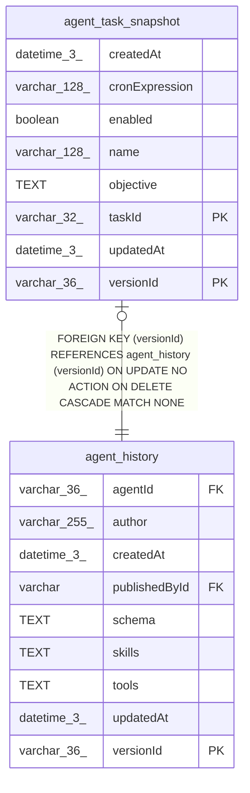

# agent_task_snapshot

## Description

<details>
<summary><strong>Table Definition</strong></summary>

```sql
CREATE TABLE "agent_task_snapshot" ("versionId" varchar(36) NOT NULL, "taskId" varchar(32) NOT NULL, "enabled" boolean NOT NULL, "name" varchar(128) NOT NULL, "objective" text NOT NULL, "cronExpression" varchar(128) NOT NULL, "createdAt" datetime(3) NOT NULL DEFAULT (STRFTIME('%Y-%m-%d %H:%M:%f', 'NOW')), "updatedAt" datetime(3) NOT NULL DEFAULT (STRFTIME('%Y-%m-%d %H:%M:%f', 'NOW')), CONSTRAINT "FK_1acedce6690392ef1611cca8b88" FOREIGN KEY ("versionId") REFERENCES "agent_history" ("versionId") ON DELETE CASCADE, PRIMARY KEY ("versionId", "taskId"))
```

</details>

## Columns

| Name | Type | Default | Nullable | Children | Parents | Comment |
| ---- | ---- | ------- | -------- | -------- | ------- | ------- |
| createdAt | datetime(3) | STRFTIME('%Y-%m-%d %H:%M:%f', 'NOW') | false |  |  |  |
| cronExpression | varchar(128) |  | false |  |  |  |
| enabled | boolean |  | false |  |  |  |
| name | varchar(128) |  | false |  |  |  |
| objective | TEXT |  | false |  |  |  |
| taskId | varchar(32) |  | false |  |  |  |
| updatedAt | datetime(3) | STRFTIME('%Y-%m-%d %H:%M:%f', 'NOW') | false |  |  |  |
| versionId | varchar(36) |  | false |  | [agent_history](agent_history.md) |  |

## Constraints

| Name | Type | Definition |
| ---- | ---- | ---------- |
| - (Foreign key ID: 0) | FOREIGN KEY | FOREIGN KEY (versionId) REFERENCES agent_history (versionId) ON UPDATE NO ACTION ON DELETE CASCADE MATCH NONE |
| sqlite_autoindex_agent_task_snapshot_1 | PRIMARY KEY | PRIMARY KEY (versionId, taskId) |
| taskId | PRIMARY KEY | PRIMARY KEY (taskId) |
| versionId | PRIMARY KEY | PRIMARY KEY (versionId) |

## Indexes

| Name | Definition |
| ---- | ---------- |
| sqlite_autoindex_agent_task_snapshot_1 | PRIMARY KEY (versionId, taskId) |

## Relations



---

> Generated by [tbls](https://github.com/k1LoW/tbls)
