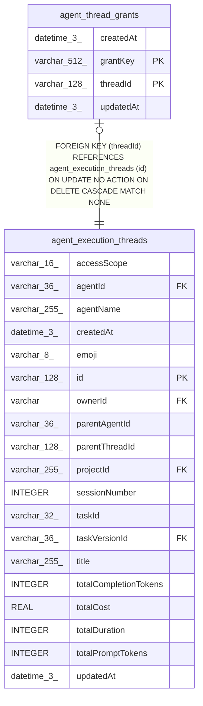

# agent_thread_grants

## Description

<details>
<summary><strong>Table Definition</strong></summary>

```sql
CREATE TABLE "agent_thread_grants" ("threadId" varchar(128) NOT NULL, "grantKey" varchar(512) NOT NULL, "createdAt" datetime(3) NOT NULL DEFAULT (STRFTIME('%Y-%m-%d %H:%M:%f', 'NOW')), "updatedAt" datetime(3) NOT NULL DEFAULT (STRFTIME('%Y-%m-%d %H:%M:%f', 'NOW')), CONSTRAINT "FK_10aad4b5b51d34aae8da90fd5cb" FOREIGN KEY ("threadId") REFERENCES "agent_execution_threads" ("id") ON DELETE CASCADE, PRIMARY KEY ("threadId", "grantKey"))
```

</details>

## Columns

| Name | Type | Default | Nullable | Children | Parents | Comment |
| ---- | ---- | ------- | -------- | -------- | ------- | ------- |
| createdAt | datetime(3) | STRFTIME('%Y-%m-%d %H:%M:%f', 'NOW') | false |  |  |  |
| grantKey | varchar(512) |  | false |  |  |  |
| threadId | varchar(128) |  | false |  | [agent_execution_threads](agent_execution_threads.md) |  |
| updatedAt | datetime(3) | STRFTIME('%Y-%m-%d %H:%M:%f', 'NOW') | false |  |  |  |

## Constraints

| Name | Type | Definition |
| ---- | ---- | ---------- |
| - (Foreign key ID: 0) | FOREIGN KEY | FOREIGN KEY (threadId) REFERENCES agent_execution_threads (id) ON UPDATE NO ACTION ON DELETE CASCADE MATCH NONE |
| grantKey | PRIMARY KEY | PRIMARY KEY (grantKey) |
| sqlite_autoindex_agent_thread_grants_1 | PRIMARY KEY | PRIMARY KEY (threadId, grantKey) |
| threadId | PRIMARY KEY | PRIMARY KEY (threadId) |

## Indexes

| Name | Definition |
| ---- | ---------- |
| sqlite_autoindex_agent_thread_grants_1 | PRIMARY KEY (threadId, grantKey) |

## Relations



---

> Generated by [tbls](https://github.com/k1LoW/tbls)
