# agents

## Description

<details>
<summary><strong>Table Definition</strong></summary>

```sql
CREATE TABLE "agents" ("id" varchar(36) PRIMARY KEY NOT NULL, "name" varchar(128) NOT NULL, "projectId" varchar(255) NOT NULL, "integrations" text NOT NULL DEFAULT ('[]'), "schema" text, "tools" text NOT NULL DEFAULT ('{}'), "skills" text NOT NULL DEFAULT ('{}'), "versionId" varchar(36), "createdAt" datetime(3) NOT NULL DEFAULT (STRFTIME('%Y-%m-%d %H:%M:%f', 'NOW')), "updatedAt" datetime(3) NOT NULL DEFAULT (STRFTIME('%Y-%m-%d %H:%M:%f', 'NOW')), "activeVersionId" varchar(36), CONSTRAINT "FK_940597dfe9753375309ce6aeea0" FOREIGN KEY ("activeVersionId") REFERENCES "agent_history" ("versionId") ON DELETE SET NULL ON UPDATE NO ACTION, CONSTRAINT "FK_a30d560207c4071d98aa03c179c" FOREIGN KEY ("projectId") REFERENCES "project" ("id") ON DELETE CASCADE ON UPDATE NO ACTION)
```

</details>

## Columns

| Name | Type | Default | Nullable | Children | Parents | Comment |
| ---- | ---- | ------- | -------- | -------- | ------- | ------- |
| activeVersionId | varchar(36) |  | true |  | [agent_history](agent_history.md) |  |
| createdAt | datetime(3) | STRFTIME('%Y-%m-%d %H:%M:%f', 'NOW') | false |  |  |  |
| id | varchar(36) |  | false | [agent_chat_subscriptions](agent_chat_subscriptions.md) [agent_checkpoints](agent_checkpoints.md) [agent_eval_dataset](agent_eval_dataset.md) [agent_execution_threads](agent_execution_threads.md) [agent_files](agent_files.md) [agent_history](agent_history.md) [agent_task_definition](agent_task_definition.md) [agent_task_run_lock](agent_task_run_lock.md) [agents_memory_entries](agents_memory_entries.md) [agents_memory_entry_cursors](agents_memory_entry_cursors.md) [agents_memory_entry_locks](agents_memory_entry_locks.md) [agents_memory_entry_sources](agents_memory_entry_sources.md) [agents_observation_cursors](agents_observation_cursors.md) [agents_observation_locks](agents_observation_locks.md) [agents_observations](agents_observations.md) |  |  |
| integrations | TEXT | '[]' | false |  |  |  |
| name | varchar(128) |  | false |  |  |  |
| projectId | varchar(255) |  | false |  | [project](project.md) |  |
| schema | TEXT |  | true |  |  |  |
| skills | TEXT | '{}' | false |  |  |  |
| tools | TEXT | '{}' | false |  |  |  |
| updatedAt | datetime(3) | STRFTIME('%Y-%m-%d %H:%M:%f', 'NOW') | false |  |  |  |
| versionId | varchar(36) |  | true |  |  |  |

## Constraints

| Name | Type | Definition |
| ---- | ---- | ---------- |
| - (Foreign key ID: 0) | FOREIGN KEY | FOREIGN KEY (projectId) REFERENCES project (id) ON UPDATE NO ACTION ON DELETE CASCADE MATCH NONE |
| - (Foreign key ID: 1) | FOREIGN KEY | FOREIGN KEY (activeVersionId) REFERENCES agent_history (versionId) ON UPDATE NO ACTION ON DELETE SET NULL MATCH NONE |
| id | PRIMARY KEY | PRIMARY KEY (id) |
| sqlite_autoindex_agents_1 | PRIMARY KEY | PRIMARY KEY (id) |

## Indexes

| Name | Definition |
| ---- | ---------- |
| IDX_a30d560207c4071d98aa03c179 | CREATE INDEX "IDX_a30d560207c4071d98aa03c179" ON "agents" ("projectId")  |
| IDX_agents_projectId | CREATE INDEX "IDX_agents_projectId" ON "agents" ("projectId")  |
| sqlite_autoindex_agents_1 | PRIMARY KEY (id) |

## Relations

```mermaid
erDiagram

"agents" }o--o| "agent_history" : "FOREIGN KEY (activeVersionId) REFERENCES agent_history (versionId) ON UPDATE NO ACTION ON DELETE SET NULL MATCH NONE"
"agent_chat_subscriptions" |o--|| "agents" : "FOREIGN KEY (agentId) REFERENCES agents (id) ON UPDATE NO ACTION ON DELETE CASCADE MATCH NONE"
"agent_checkpoints" }o--o| "agents" : "FOREIGN KEY (agentId) REFERENCES agents (id) ON UPDATE NO ACTION ON DELETE CASCADE MATCH NONE"
"agent_eval_dataset" }o--|| "agents" : "FOREIGN KEY (agentId) REFERENCES agents (id) ON UPDATE NO ACTION ON DELETE CASCADE MATCH NONE"
"agent_execution_threads" }o--|| "agents" : "FOREIGN KEY (agentId) REFERENCES agents (id) ON UPDATE NO ACTION ON DELETE CASCADE MATCH NONE"
"agent_files" }o--|| "agents" : "FOREIGN KEY (agentId) REFERENCES agents (id) ON UPDATE NO ACTION ON DELETE CASCADE MATCH NONE"
"agent_history" }o--|| "agents" : "FOREIGN KEY (agentId) REFERENCES agents (id) ON UPDATE NO ACTION ON DELETE CASCADE MATCH NONE"
"agent_task_definition" }o--|| "agents" : "FOREIGN KEY (agentId) REFERENCES agents (id) ON UPDATE NO ACTION ON DELETE CASCADE MATCH NONE"
"agent_task_run_lock" |o--|| "agents" : "FOREIGN KEY (agentId) REFERENCES agents (id) ON UPDATE NO ACTION ON DELETE CASCADE MATCH NONE"
"agents_memory_entries" }o--|| "agents" : "FOREIGN KEY (agentId) REFERENCES agents (id) ON UPDATE NO ACTION ON DELETE CASCADE MATCH NONE"
"agents_memory_entry_cursors" |o--|| "agents" : "FOREIGN KEY (agentId) REFERENCES agents (id) ON UPDATE NO ACTION ON DELETE CASCADE MATCH NONE"
"agents_memory_entry_locks" |o--|| "agents" : "FOREIGN KEY (agentId) REFERENCES agents (id) ON UPDATE NO ACTION ON DELETE CASCADE MATCH NONE"
"agents_memory_entry_sources" }o--|| "agents" : "FOREIGN KEY (agentId) REFERENCES agents (id) ON UPDATE NO ACTION ON DELETE CASCADE MATCH NONE"
"agents_observation_cursors" |o--|| "agents" : "FOREIGN KEY (agentId) REFERENCES agents (id) ON UPDATE NO ACTION ON DELETE CASCADE MATCH NONE"
"agents_observation_locks" |o--|| "agents" : "FOREIGN KEY (agentId) REFERENCES agents (id) ON UPDATE NO ACTION ON DELETE CASCADE MATCH NONE"
"agents_observations" }o--|| "agents" : "FOREIGN KEY (agentId) REFERENCES agents (id) ON UPDATE NO ACTION ON DELETE CASCADE MATCH NONE"
"agents" }o--|| "project" : "FOREIGN KEY (projectId) REFERENCES project (id) ON UPDATE NO ACTION ON DELETE CASCADE MATCH NONE"

"agents" {
  varchar_36_ activeVersionId FK
  datetime_3_ createdAt
  varchar_36_ id PK
  TEXT integrations
  varchar_128_ name
  varchar_255_ projectId FK
  TEXT schema
  TEXT skills
  TEXT tools
  datetime_3_ updatedAt
  varchar_36_ versionId
}
"agent_history" {
  varchar_36_ agentId FK
  varchar_255_ author
  datetime_3_ createdAt
  varchar publishedById FK
  TEXT schema
  TEXT skills
  TEXT tools
  datetime_3_ updatedAt
  varchar_36_ versionId PK
}
"agent_chat_subscriptions" {
  varchar_36_ agentId PK
  datetime_3_ createdAt
  varchar_255_ credentialId PK
  varchar_64_ integrationType PK
  varchar_255_ threadId PK
  datetime_3_ updatedAt
}
"agent_checkpoints" {
  varchar_255_ agentId FK
  datetime_3_ createdAt
  boolean expired
  varchar_255_ runId PK
  TEXT state
  datetime_3_ updatedAt
}
"agent_eval_dataset" {
  varchar_36_ agentId FK
  TEXT columnMapping
  datetime_3_ createdAt
  varchar createdById FK
  TEXT datasetRef
  varchar_32_ datasetSource
  TEXT description
  varchar_36_ id PK
  varchar_128_ name
  datetime_3_ updatedAt
}
"agent_execution_threads" {
  varchar_36_ agentId FK
  varchar_255_ agentName
  datetime_3_ createdAt
  varchar_8_ emoji
  varchar_128_ id PK
  varchar_36_ parentAgentId
  varchar_128_ parentThreadId
  varchar_255_ projectId FK
  INTEGER sessionNumber
  varchar_32_ taskId
  varchar_36_ taskVersionId FK
  varchar_255_ title
  INTEGER totalCompletionTokens
  REAL totalCost
  INTEGER totalDuration
  INTEGER totalPromptTokens
  datetime_3_ updatedAt
}
"agent_files" {
  varchar_36_ agentId FK
  TEXT binaryDataId
  datetime_3_ createdAt
  varchar_255_ fileName
  INTEGER fileSizeBytes
  varchar_16_ id PK
  varchar_255_ mimeType
  datetime_3_ updatedAt
}
"agent_task_definition" {
  varchar_36_ agentId FK
  datetime_3_ createdAt
  varchar_128_ cronExpression
  varchar_32_ id PK
  varchar_128_ name
  TEXT objective
  datetime_3_ updatedAt
}
"agent_task_run_lock" {
  varchar_36_ agentId PK
  datetime_3_ createdAt
  datetime_3_ heldUntil
  varchar holderId
  varchar_32_ taskId PK
  datetime_3_ updatedAt
}
"agents_memory_entries" {
  varchar_36_ agentId FK
  TEXT content
  varchar_64_ contentHash
  datetime_3_ createdAt
  TEXT embedding
  varchar_128_ embeddingModel
  varchar_36_ id PK
  datetime_3_ lastSeenAt
  TEXT metadata
  varchar_255_ resourceId FK
  varchar_16_ status
  varchar_36_ supersededBy FK
  datetime_3_ updatedAt
}
"agents_memory_entry_cursors" {
  varchar_36_ agentId PK
  datetime_3_ createdAt
  datetime_3_ lastIndexedObservationCreatedAt
  varchar_36_ lastIndexedObservationId
  varchar_255_ observationScopeId PK
  datetime_3_ updatedAt
}
"agents_memory_entry_locks" {
  varchar_36_ agentId PK
  datetime_3_ createdAt
  datetime_3_ heldUntil
  varchar_64_ holderId
  varchar_255_ resourceId PK
  datetime_3_ updatedAt
}
"agents_memory_entry_sources" {
  varchar_36_ agentId FK
  datetime_3_ createdAt
  varchar_64_ evidenceHash
  TEXT evidenceText
  varchar_36_ id PK
  varchar_36_ memoryEntryId FK
  varchar_36_ observationId FK
  varchar_255_ threadId FK
  datetime_3_ updatedAt
}
"agents_observation_cursors" {
  varchar_36_ agentId PK
  datetime_3_ createdAt
  datetime_3_ lastObservedAt
  varchar_36_ lastObservedMessageId
  varchar_255_ observationScopeId PK
  datetime_3_ updatedAt
}
"agents_observation_locks" {
  varchar_36_ agentId PK
  datetime_3_ createdAt
  datetime_3_ heldUntil
  varchar_64_ holderId
  varchar_255_ observationScopeId PK
  varchar_20_ taskKind PK
  datetime_3_ updatedAt
}
"agents_observations" {
  varchar_36_ agentId FK
  datetime_3_ createdAt
  varchar_36_ id PK
  varchar_16_ marker
  varchar_255_ observationScopeId FK
  varchar_36_ parentId FK
  varchar_16_ status
  varchar_36_ supersededBy FK
  TEXT text
  INTEGER tokenCount
  datetime_3_ updatedAt
}
"project" {
  datetime_3_ createdAt
  varchar creatorId FK
  TEXT customTelemetryTags
  varchar_512_ description
  TEXT icon
  varchar_36_ id PK
  varchar_255_ name
  varchar_36_ type
  datetime_3_ updatedAt
}
```



---

> Generated by [tbls](https://github.com/k1LoW/tbls)
