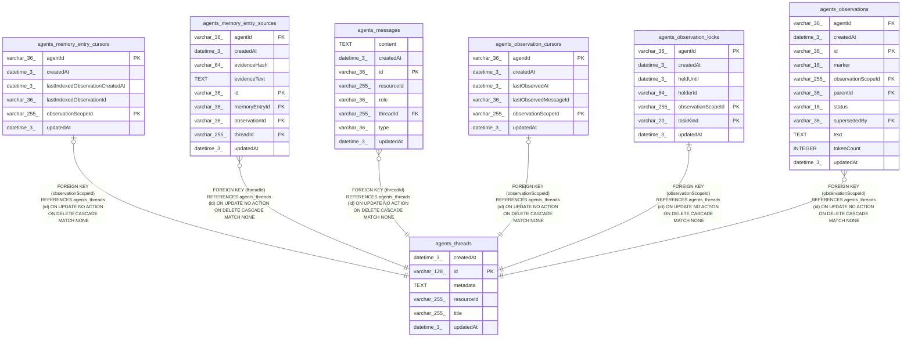

# agents_threads

## Description

<details>
<summary><strong>Table Definition</strong></summary>

```sql
CREATE TABLE "agents_threads" ("id" varchar(128) PRIMARY KEY NOT NULL, "resourceId" varchar(255) NOT NULL, "title" varchar(255), "metadata" text, "createdAt" datetime(3) NOT NULL DEFAULT (STRFTIME('%Y-%m-%d %H:%M:%f', 'NOW')), "updatedAt" datetime(3) NOT NULL DEFAULT (STRFTIME('%Y-%m-%d %H:%M:%f', 'NOW')))
```

</details>

## Columns

| Name | Type | Default | Nullable | Children | Parents | Comment |
| ---- | ---- | ------- | -------- | -------- | ------- | ------- |
| createdAt | datetime(3) | STRFTIME('%Y-%m-%d %H:%M:%f', 'NOW') | false |  |  |  |
| id | varchar(128) |  | false | [agents_memory_entry_cursors](agents_memory_entry_cursors.md) [agents_memory_entry_sources](agents_memory_entry_sources.md) [agents_messages](agents_messages.md) [agents_observation_cursors](agents_observation_cursors.md) [agents_observation_locks](agents_observation_locks.md) [agents_observations](agents_observations.md) |  |  |
| metadata | TEXT |  | true |  |  |  |
| resourceId | varchar(255) |  | false |  |  |  |
| title | varchar(255) |  | true |  |  |  |
| updatedAt | datetime(3) | STRFTIME('%Y-%m-%d %H:%M:%f', 'NOW') | false |  |  |  |

## Constraints

| Name | Type | Definition |
| ---- | ---- | ---------- |
| id | PRIMARY KEY | PRIMARY KEY (id) |
| sqlite_autoindex_agents_threads_1 | PRIMARY KEY | PRIMARY KEY (id) |

## Indexes

| Name | Definition |
| ---- | ---------- |
| IDX_54fa1b94f34a409beafae567a4 | CREATE INDEX "IDX_54fa1b94f34a409beafae567a4" ON "agents_threads" ("resourceId")  |
| sqlite_autoindex_agents_threads_1 | PRIMARY KEY (id) |

## Relations



---

> Generated by [tbls](https://github.com/k1LoW/tbls)
