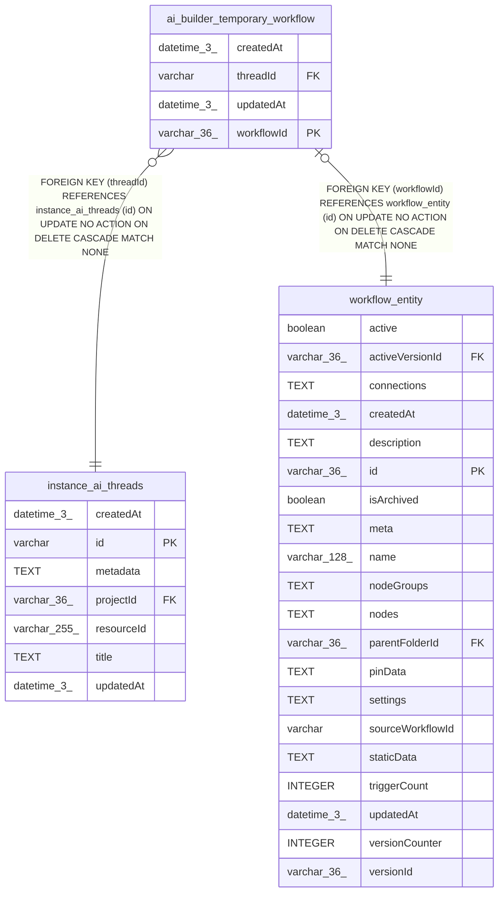

# ai_builder_temporary_workflow

## Description

<details>
<summary><strong>Table Definition</strong></summary>

```sql
CREATE TABLE "ai_builder_temporary_workflow" ("workflowId" varchar(36) PRIMARY KEY NOT NULL, "threadId" varchar NOT NULL, "createdAt" datetime(3) NOT NULL DEFAULT (STRFTIME('%Y-%m-%d %H:%M:%f', 'NOW')), "updatedAt" datetime(3) NOT NULL DEFAULT (STRFTIME('%Y-%m-%d %H:%M:%f', 'NOW')), CONSTRAINT "FK_85a87a1ba0f61999fe11dc56325" FOREIGN KEY ("workflowId") REFERENCES "workflow_entity" ("id") ON DELETE CASCADE, CONSTRAINT "FK_39b07732e819fb561d74c38763f" FOREIGN KEY ("threadId") REFERENCES "instance_ai_threads" ("id") ON DELETE CASCADE)
```

</details>

## Columns

| Name | Type | Default | Nullable | Children | Parents | Comment |
| ---- | ---- | ------- | -------- | -------- | ------- | ------- |
| createdAt | datetime(3) | STRFTIME('%Y-%m-%d %H:%M:%f', 'NOW') | false |  |  |  |
| threadId | varchar |  | false |  | [instance_ai_threads](instance_ai_threads.md) |  |
| updatedAt | datetime(3) | STRFTIME('%Y-%m-%d %H:%M:%f', 'NOW') | false |  |  |  |
| workflowId | varchar(36) |  | false |  | [workflow_entity](workflow_entity.md) |  |

## Constraints

| Name | Type | Definition |
| ---- | ---- | ---------- |
| - (Foreign key ID: 0) | FOREIGN KEY | FOREIGN KEY (threadId) REFERENCES instance_ai_threads (id) ON UPDATE NO ACTION ON DELETE CASCADE MATCH NONE |
| - (Foreign key ID: 1) | FOREIGN KEY | FOREIGN KEY (workflowId) REFERENCES workflow_entity (id) ON UPDATE NO ACTION ON DELETE CASCADE MATCH NONE |
| sqlite_autoindex_ai_builder_temporary_workflow_1 | PRIMARY KEY | PRIMARY KEY (workflowId) |
| workflowId | PRIMARY KEY | PRIMARY KEY (workflowId) |

## Indexes

| Name | Definition |
| ---- | ---------- |
| IDX_39b07732e819fb561d74c38763 | CREATE INDEX "IDX_39b07732e819fb561d74c38763" ON "ai_builder_temporary_workflow" ("threadId")  |
| sqlite_autoindex_ai_builder_temporary_workflow_1 | PRIMARY KEY (workflowId) |

## Relations



---

> Generated by [tbls](https://github.com/k1LoW/tbls)
