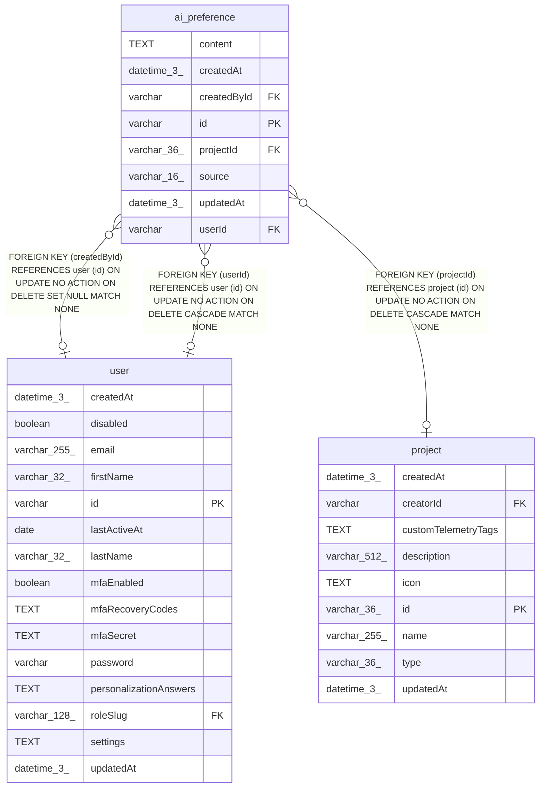

# ai_preference

## Description

<details>
<summary><strong>Table Definition</strong></summary>

```sql
CREATE TABLE "ai_preference" ("id" varchar PRIMARY KEY NOT NULL, "content" text NOT NULL, "userId" varchar, "projectId" varchar(36), "createdById" varchar, "createdAt" datetime(3) NOT NULL DEFAULT (STRFTIME('%Y-%m-%d %H:%M:%f', 'NOW')), "updatedAt" datetime(3) NOT NULL DEFAULT (STRFTIME('%Y-%m-%d %H:%M:%f', 'NOW')), "source" varchar(16) NOT NULL, CONSTRAINT "CHK_ai_preference_single_target" CHECK ((("userId" IS NULL OR "projectId" IS NULL))), CONSTRAINT "CHK_ai_preference_source" CHECK ("source" IN ('ui', 'aia', 'mcp')), CONSTRAINT "FK_e9059770c01bfda6062d78d9f8e" FOREIGN KEY ("userId") REFERENCES "user" ("id") ON DELETE CASCADE ON UPDATE NO ACTION, CONSTRAINT "FK_4ea340a1847ad0e40a0b0360fe4" FOREIGN KEY ("projectId") REFERENCES "project" ("id") ON DELETE CASCADE ON UPDATE NO ACTION, CONSTRAINT "FK_aeb2ce3354b55bd61c8d7e17169" FOREIGN KEY ("createdById") REFERENCES "user" ("id") ON DELETE SET NULL ON UPDATE NO ACTION)
```

</details>

## Columns

| Name | Type | Default | Nullable | Children | Parents | Comment |
| ---- | ---- | ------- | -------- | -------- | ------- | ------- |
| content | TEXT |  | false |  |  |  |
| createdAt | datetime(3) | STRFTIME('%Y-%m-%d %H:%M:%f', 'NOW') | false |  |  |  |
| createdById | varchar |  | true |  | [user](user.md) |  |
| id | varchar |  | false |  |  |  |
| projectId | varchar(36) |  | true |  | [project](project.md) |  |
| source | varchar(16) |  | false |  |  |  |
| updatedAt | datetime(3) | STRFTIME('%Y-%m-%d %H:%M:%f', 'NOW') | false |  |  |  |
| userId | varchar |  | true |  | [user](user.md) |  |

## Constraints

| Name | Type | Definition |
| ---- | ---- | ---------- |
| - | CHECK | CHECK ((("userId" IS NULL OR "projectId" IS NULL))) |
| - | CHECK | CHECK ("source" IN ('ui', 'aia', 'mcp')) |
| - (Foreign key ID: 0) | FOREIGN KEY | FOREIGN KEY (createdById) REFERENCES user (id) ON UPDATE NO ACTION ON DELETE SET NULL MATCH NONE |
| - (Foreign key ID: 1) | FOREIGN KEY | FOREIGN KEY (projectId) REFERENCES project (id) ON UPDATE NO ACTION ON DELETE CASCADE MATCH NONE |
| - (Foreign key ID: 2) | FOREIGN KEY | FOREIGN KEY (userId) REFERENCES user (id) ON UPDATE NO ACTION ON DELETE CASCADE MATCH NONE |
| id | PRIMARY KEY | PRIMARY KEY (id) |
| sqlite_autoindex_ai_preference_1 | PRIMARY KEY | PRIMARY KEY (id) |

## Indexes

| Name | Definition |
| ---- | ---------- |
| IDX_4ea340a1847ad0e40a0b0360fe | CREATE INDEX "IDX_4ea340a1847ad0e40a0b0360fe" ON "ai_preference" ("projectId")  |
| IDX_e9059770c01bfda6062d78d9f8 | CREATE INDEX "IDX_e9059770c01bfda6062d78d9f8" ON "ai_preference" ("userId")  |
| sqlite_autoindex_ai_preference_1 | PRIMARY KEY (id) |

## Relations



---

> Generated by [tbls](https://github.com/k1LoW/tbls)
