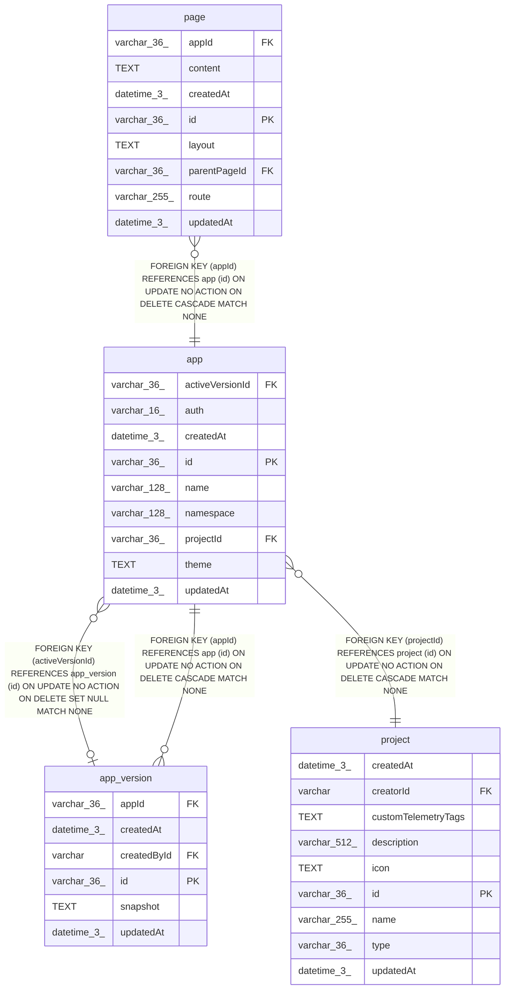

# app

## Description

<details>
<summary><strong>Table Definition</strong></summary>

```sql
CREATE TABLE "app" ("id" varchar(36) PRIMARY KEY NOT NULL, "name" varchar(128) NOT NULL, "namespace" varchar(128) NOT NULL, "theme" text, "projectId" varchar(36) NOT NULL, "createdAt" datetime(3) NOT NULL DEFAULT (STRFTIME('%Y-%m-%d %H:%M:%f', 'NOW')), "updatedAt" datetime(3) NOT NULL DEFAULT (STRFTIME('%Y-%m-%d %H:%M:%f', 'NOW')), "activeVersionId" varchar(36), "auth" varchar(16) NOT NULL DEFAULT ('public'), CONSTRAINT "CHK_app_auth" CHECK ("auth" IN ('public', 'n8n')), CONSTRAINT "FK_f84dd7eb539e46e0c233fa09b20" FOREIGN KEY ("projectId") REFERENCES "project" ("id") ON DELETE CASCADE ON UPDATE NO ACTION, CONSTRAINT "app_activeVersionId_foreign" FOREIGN KEY ("activeVersionId") REFERENCES "app_version" ("id") ON DELETE SET NULL)
```

</details>

## Columns

| Name | Type | Default | Nullable | Children | Parents | Comment |
| ---- | ---- | ------- | -------- | -------- | ------- | ------- |
| activeVersionId | varchar(36) |  | true |  | [app_version](app_version.md) |  |
| auth | varchar(16) | 'public' | false |  |  |  |
| createdAt | datetime(3) | STRFTIME('%Y-%m-%d %H:%M:%f', 'NOW') | false |  |  |  |
| id | varchar(36) |  | false | [app_version](app_version.md) [page](page.md) |  |  |
| name | varchar(128) |  | false |  |  |  |
| namespace | varchar(128) |  | false |  |  |  |
| projectId | varchar(36) |  | false |  | [project](project.md) |  |
| theme | TEXT |  | true |  |  |  |
| updatedAt | datetime(3) | STRFTIME('%Y-%m-%d %H:%M:%f', 'NOW') | false |  |  |  |

## Constraints

| Name | Type | Definition |
| ---- | ---- | ---------- |
| - | CHECK | CHECK ("auth" IN ('public', 'n8n')) |
| - (Foreign key ID: 0) | FOREIGN KEY | FOREIGN KEY (activeVersionId) REFERENCES app_version (id) ON UPDATE NO ACTION ON DELETE SET NULL MATCH NONE |
| - (Foreign key ID: 1) | FOREIGN KEY | FOREIGN KEY (projectId) REFERENCES project (id) ON UPDATE NO ACTION ON DELETE CASCADE MATCH NONE |
| id | PRIMARY KEY | PRIMARY KEY (id) |
| sqlite_autoindex_app_1 | PRIMARY KEY | PRIMARY KEY (id) |

## Indexes

| Name | Definition |
| ---- | ---------- |
| IDX_app_namespace | CREATE UNIQUE INDEX "IDX_app_namespace" ON "app" ("namespace")  |
| sqlite_autoindex_app_1 | PRIMARY KEY (id) |

## Relations



---

> Generated by [tbls](https://github.com/k1LoW/tbls)
