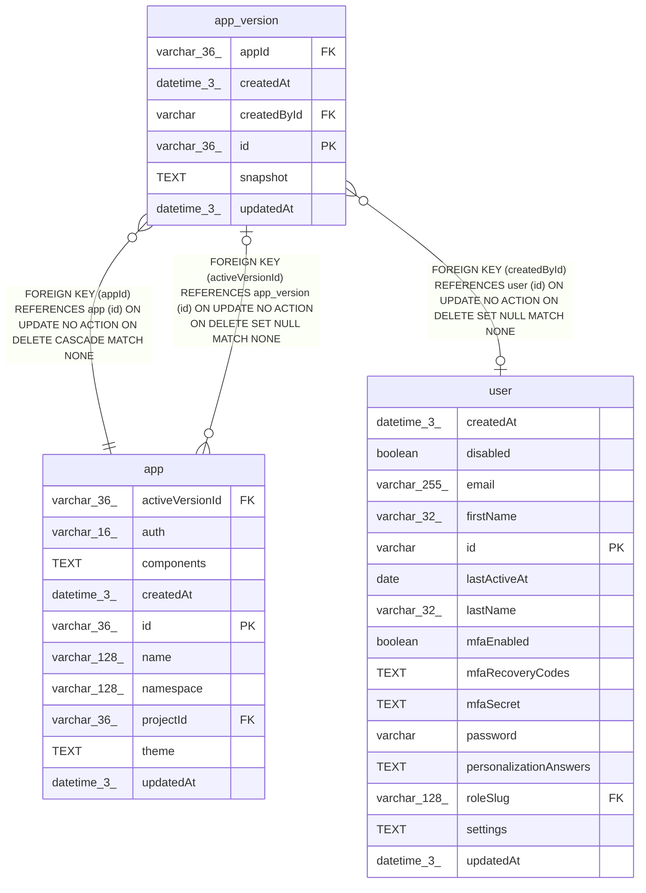

# app_version

## Description

<details>
<summary><strong>Table Definition</strong></summary>

```sql
CREATE TABLE "app_version" ("id" varchar(36) PRIMARY KEY NOT NULL, "appId" varchar(36) NOT NULL, "snapshot" text NOT NULL, "createdById" varchar, "createdAt" datetime(3) NOT NULL DEFAULT (STRFTIME('%Y-%m-%d %H:%M:%f', 'NOW')), "updatedAt" datetime(3) NOT NULL DEFAULT (STRFTIME('%Y-%m-%d %H:%M:%f', 'NOW')), CONSTRAINT "FK_e9aeab5b1db8dc77708231ae44e" FOREIGN KEY ("appId") REFERENCES "app" ("id") ON DELETE CASCADE, CONSTRAINT "FK_e4eab717688459a6681c9f67cff" FOREIGN KEY ("createdById") REFERENCES "user" ("id") ON DELETE SET NULL)
```

</details>

## Columns

| Name | Type | Default | Nullable | Children | Parents | Comment |
| ---- | ---- | ------- | -------- | -------- | ------- | ------- |
| appId | varchar(36) |  | false |  | [app](app.md) |  |
| createdAt | datetime(3) | STRFTIME('%Y-%m-%d %H:%M:%f', 'NOW') | false |  |  |  |
| createdById | varchar |  | true |  | [user](user.md) |  |
| id | varchar(36) |  | false | [app](app.md) |  |  |
| snapshot | TEXT |  | false |  |  |  |
| updatedAt | datetime(3) | STRFTIME('%Y-%m-%d %H:%M:%f', 'NOW') | false |  |  |  |

## Constraints

| Name | Type | Definition |
| ---- | ---- | ---------- |
| - (Foreign key ID: 0) | FOREIGN KEY | FOREIGN KEY (createdById) REFERENCES user (id) ON UPDATE NO ACTION ON DELETE SET NULL MATCH NONE |
| - (Foreign key ID: 1) | FOREIGN KEY | FOREIGN KEY (appId) REFERENCES app (id) ON UPDATE NO ACTION ON DELETE CASCADE MATCH NONE |
| id | PRIMARY KEY | PRIMARY KEY (id) |
| sqlite_autoindex_app_version_1 | PRIMARY KEY | PRIMARY KEY (id) |

## Indexes

| Name | Definition |
| ---- | ---------- |
| IDX_e9aeab5b1db8dc77708231ae44 | CREATE INDEX "IDX_e9aeab5b1db8dc77708231ae44" ON "app_version" ("appId")  |
| sqlite_autoindex_app_version_1 | PRIMARY KEY (id) |

## Relations



---

> Generated by [tbls](https://github.com/k1LoW/tbls)
