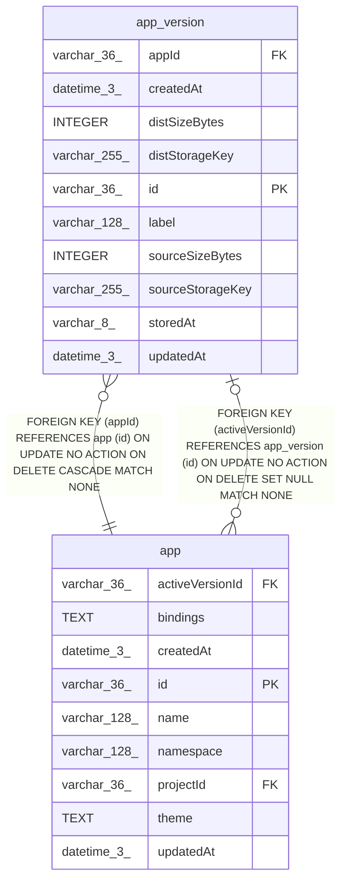

# app_version

## Description

<details>
<summary><strong>Table Definition</strong></summary>

```sql
CREATE TABLE "app_version" ("id" varchar(36) PRIMARY KEY NOT NULL, "appId" varchar(36) NOT NULL, "storedAt" varchar(8) NOT NULL, "sourceStorageKey" varchar(255) NOT NULL, "distStorageKey" varchar(255), "createdAt" datetime(3) NOT NULL DEFAULT (STRFTIME('%Y-%m-%d %H:%M:%f', 'NOW')), "updatedAt" datetime(3) NOT NULL DEFAULT (STRFTIME('%Y-%m-%d %H:%M:%f', 'NOW')), "sourceSizeBytes" integer NOT NULL DEFAULT (0), "distSizeBytes" integer, "label" varchar(128), CONSTRAINT "CHK_app_version_storedAt" CHECK (("storedAt" IN ('db', 'fs', 's3', 'az'))), CONSTRAINT "FK_e9aeab5b1db8dc77708231ae44e" FOREIGN KEY ("appId") REFERENCES "app" ("id") ON DELETE CASCADE ON UPDATE NO ACTION)
```

</details>

## Columns

| Name | Type | Default | Nullable | Children | Parents | Comment |
| ---- | ---- | ------- | -------- | -------- | ------- | ------- |
| appId | varchar(36) |  | false |  | [app](app.md) |  |
| createdAt | datetime(3) | STRFTIME('%Y-%m-%d %H:%M:%f', 'NOW') | false |  |  |  |
| distSizeBytes | INTEGER |  | true |  |  |  |
| distStorageKey | varchar(255) |  | true |  |  |  |
| id | varchar(36) |  | false | [app](app.md) |  |  |
| label | varchar(128) |  | true |  |  |  |
| sourceSizeBytes | INTEGER | 0 | false |  |  |  |
| sourceStorageKey | varchar(255) |  | false |  |  |  |
| storedAt | varchar(8) |  | false |  |  |  |
| updatedAt | datetime(3) | STRFTIME('%Y-%m-%d %H:%M:%f', 'NOW') | false |  |  |  |

## Constraints

| Name | Type | Definition |
| ---- | ---- | ---------- |
| - | CHECK | CHECK (("storedAt" IN ('db', 'fs', 's3', 'az'))) |
| - (Foreign key ID: 0) | FOREIGN KEY | FOREIGN KEY (appId) REFERENCES app (id) ON UPDATE NO ACTION ON DELETE CASCADE MATCH NONE |
| id | PRIMARY KEY | PRIMARY KEY (id) |
| sqlite_autoindex_app_version_1 | PRIMARY KEY | PRIMARY KEY (id) |

## Indexes

| Name | Definition |
| ---- | ---------- |
| IDX_e9aeab5b1db8dc77708231ae44 | CREATE INDEX "IDX_e9aeab5b1db8dc77708231ae44" ON "app_version" ("appId")  |
| sqlite_autoindex_app_version_1 | PRIMARY KEY (id) |

## Relations



---

> Generated by [tbls](https://github.com/k1LoW/tbls)
