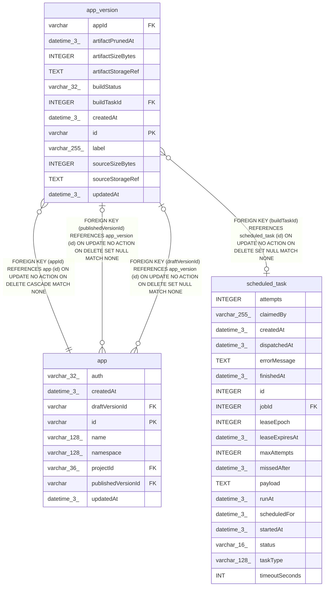

# app_version

## Description

<details>
<summary><strong>Table Definition</strong></summary>

```sql
CREATE TABLE "app_version" ("id" varchar PRIMARY KEY NOT NULL, "appId" varchar NOT NULL, "label" varchar(255), "sourceStorageRef" text NOT NULL, "sourceSizeBytes" integer NOT NULL, "artifactStorageRef" text, "artifactSizeBytes" integer, "artifactPrunedAt" datetime(3), "buildTaskId" integer, "buildStatus" varchar(32) NOT NULL DEFAULT ('queued'), "createdAt" datetime(3) NOT NULL DEFAULT (STRFTIME('%Y-%m-%d %H:%M:%f', 'NOW')), "updatedAt" datetime(3) NOT NULL DEFAULT (STRFTIME('%Y-%m-%d %H:%M:%f', 'NOW')), CONSTRAINT "CHK_app_version_buildStatus" CHECK ("buildStatus" IN ('queued', 'running', 'succeeded', 'failed')), CONSTRAINT "FK_e9aeab5b1db8dc77708231ae44e" FOREIGN KEY ("appId") REFERENCES "app" ("id") ON DELETE CASCADE, CONSTRAINT "FK_93f7f9719991a7e6c3ebd93145a" FOREIGN KEY ("buildTaskId") REFERENCES "scheduled_task" ("id") ON DELETE SET NULL)
```

</details>

## Columns

| Name | Type | Default | Nullable | Children | Parents | Comment |
| ---- | ---- | ------- | -------- | -------- | ------- | ------- |
| appId | varchar |  | false |  | [app](app.md) |  |
| artifactPrunedAt | datetime(3) |  | true |  |  |  |
| artifactSizeBytes | INTEGER |  | true |  |  |  |
| artifactStorageRef | TEXT |  | true |  |  |  |
| buildStatus | varchar(32) | 'queued' | false |  |  |  |
| buildTaskId | INTEGER |  | true |  | [scheduled_task](scheduled_task.md) |  |
| createdAt | datetime(3) | STRFTIME('%Y-%m-%d %H:%M:%f', 'NOW') | false |  |  |  |
| id | varchar |  | false | [app](app.md) |  |  |
| label | varchar(255) |  | true |  |  |  |
| sourceSizeBytes | INTEGER |  | false |  |  |  |
| sourceStorageRef | TEXT |  | false |  |  |  |
| updatedAt | datetime(3) | STRFTIME('%Y-%m-%d %H:%M:%f', 'NOW') | false |  |  |  |

## Constraints

| Name | Type | Definition |
| ---- | ---- | ---------- |
| - | CHECK | CHECK ("buildStatus" IN ('queued', 'running', 'succeeded', 'failed')) |
| - (Foreign key ID: 0) | FOREIGN KEY | FOREIGN KEY (buildTaskId) REFERENCES scheduled_task (id) ON UPDATE NO ACTION ON DELETE SET NULL MATCH NONE |
| - (Foreign key ID: 1) | FOREIGN KEY | FOREIGN KEY (appId) REFERENCES app (id) ON UPDATE NO ACTION ON DELETE CASCADE MATCH NONE |
| id | PRIMARY KEY | PRIMARY KEY (id) |
| sqlite_autoindex_app_version_1 | PRIMARY KEY | PRIMARY KEY (id) |

## Indexes

| Name | Definition |
| ---- | ---------- |
| IDX_93f7f9719991a7e6c3ebd93145 | CREATE INDEX "IDX_93f7f9719991a7e6c3ebd93145" ON "app_version" ("buildTaskId")  |
| IDX_e9aeab5b1db8dc77708231ae44 | CREATE INDEX "IDX_e9aeab5b1db8dc77708231ae44" ON "app_version" ("appId")  |
| sqlite_autoindex_app_version_1 | PRIMARY KEY (id) |

## Relations


```mermaid
erDiagram

"app_version" }o--|| "app" : "FOREIGN KEY (appId) REFERENCES app (id) ON UPDATE NO ACTION ON DELETE CASCADE MATCH NONE"
"app_version" }o--o| "scheduled_task" : "FOREIGN KEY (buildTaskId) REFERENCES scheduled_task (id) ON UPDATE NO ACTION ON DELETE SET NULL MATCH NONE"
"app" }o--o| "app_version" : "FOREIGN KEY (publishedVersionId) REFERENCES app_version (id) ON UPDATE NO ACTION ON DELETE SET NULL MATCH NONE"
"app" }o--o| "app_version" : "FOREIGN KEY (draftVersionId) REFERENCES app_version (id) ON UPDATE NO ACTION ON DELETE SET NULL MATCH NONE"

"app_version" {
  varchar appId FK
  datetime_3_ artifactPrunedAt
  INTEGER artifactSizeBytes
  TEXT artifactStorageRef
  varchar_32_ buildStatus
  INTEGER buildTaskId FK
  datetime_3_ createdAt
  varchar id PK
  varchar_255_ label
  INTEGER sourceSizeBytes
  TEXT sourceStorageRef
  datetime_3_ updatedAt
}
"app" {
  varchar_32_ auth
  datetime_3_ createdAt
  varchar draftVersionId FK
  varchar id PK
  varchar_128_ name
  varchar_128_ namespace
  varchar_36_ projectId FK
  varchar publishedVersionId FK
  datetime_3_ updatedAt
}
"scheduled_task" {
  INTEGER attempts
  varchar_255_ claimedBy
  datetime_3_ createdAt
  datetime_3_ dispatchedAt
  TEXT errorMessage
  datetime_3_ finishedAt
  INTEGER id
  INTEGER jobId FK
  INTEGER leaseEpoch
  datetime_3_ leaseExpiresAt
  INTEGER maxAttempts
  datetime_3_ missedAfter
  TEXT payload
  datetime_3_ runAt
  datetime_3_ scheduledFor
  datetime_3_ startedAt
  varchar_16_ status
  varchar_128_ taskType
  INT timeoutSeconds
}
```

---

> Generated by [tbls](https://github.com/k1LoW/tbls)
