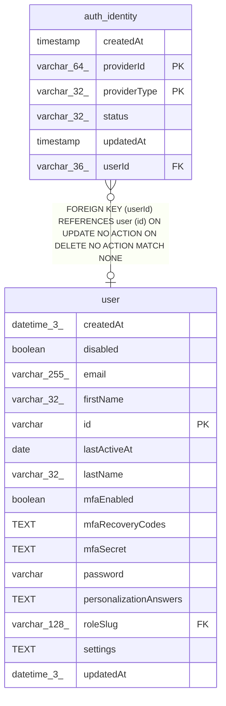

# auth_identity

## Description

<details>
<summary><strong>Table Definition</strong></summary>

```sql
CREATE TABLE "auth_identity" ("userId" varchar(36), "providerId" varchar(64) NOT NULL, "providerType" varchar(32) NOT NULL, "createdAt" timestamp NOT NULL DEFAULT (CURRENT_TIMESTAMP), "updatedAt" timestamp NOT NULL DEFAULT (CURRENT_TIMESTAMP), "status" varchar(32) NOT NULL DEFAULT ('active'), CONSTRAINT "CHK_auth_identity_status" CHECK ("status" IN ('active', 'suspended', 'revoked')), CONSTRAINT "FK_2325ca218e23aa2ef1acf60187e" FOREIGN KEY ("userId") REFERENCES "user" ("id") ON DELETE NO ACTION ON UPDATE NO ACTION, PRIMARY KEY ("providerId", "providerType"))
```

</details>

## Columns

| Name | Type | Default | Nullable | Children | Parents | Comment |
| ---- | ---- | ------- | -------- | -------- | ------- | ------- |
| createdAt | timestamp | CURRENT_TIMESTAMP | false |  |  |  |
| providerId | varchar(64) |  | false |  |  |  |
| providerType | varchar(32) |  | false |  |  |  |
| status | varchar(32) | 'active' | false |  |  |  |
| updatedAt | timestamp | CURRENT_TIMESTAMP | false |  |  |  |
| userId | varchar(36) |  | true |  | [user](user.md) |  |

## Constraints

| Name | Type | Definition |
| ---- | ---- | ---------- |
| - | CHECK | CHECK ("status" IN ('active', 'suspended', 'revoked')) |
| - (Foreign key ID: 0) | FOREIGN KEY | FOREIGN KEY (userId) REFERENCES user (id) ON UPDATE NO ACTION ON DELETE NO ACTION MATCH NONE |
| providerId | PRIMARY KEY | PRIMARY KEY (providerId) |
| providerType | PRIMARY KEY | PRIMARY KEY (providerType) |
| sqlite_autoindex_auth_identity_1 | PRIMARY KEY | PRIMARY KEY (providerId, providerType) |

## Indexes

| Name | Definition |
| ---- | ---------- |
| sqlite_autoindex_auth_identity_1 | PRIMARY KEY (providerId, providerType) |

## Relations


```mermaid
erDiagram

"auth_identity" }o--o| "user" : "FOREIGN KEY (userId) REFERENCES user (id) ON UPDATE NO ACTION ON DELETE NO ACTION MATCH NONE"

"auth_identity" {
  timestamp createdAt
  varchar_64_ providerId PK
  varchar_32_ providerType PK
  varchar_32_ status
  timestamp updatedAt
  varchar_36_ userId FK
}
"user" {
  datetime_3_ createdAt
  boolean disabled
  varchar_255_ email
  varchar_32_ firstName
  varchar id PK
  date lastActiveAt
  varchar_32_ lastName
  boolean mfaEnabled
  TEXT mfaRecoveryCodes
  TEXT mfaSecret
  varchar password
  TEXT personalizationAnswers
  varchar_128_ roleSlug FK
  TEXT settings
  datetime_3_ updatedAt
}
```

---

> Generated by [tbls](https://github.com/k1LoW/tbls)
