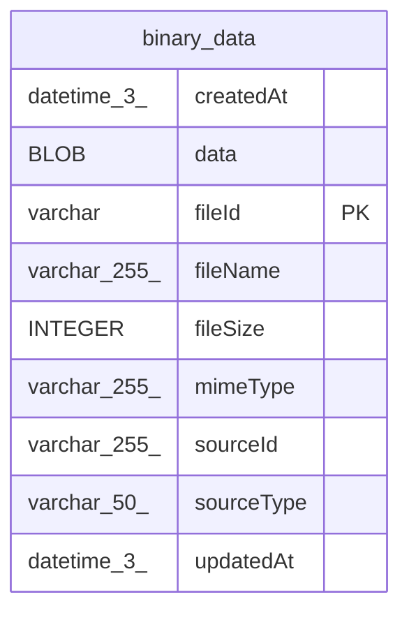

# binary_data

## Description

<details>
<summary><strong>Table Definition</strong></summary>

```sql
CREATE TABLE "binary_data" ("fileId" varchar PRIMARY KEY NOT NULL, "sourceType" varchar(50) NOT NULL, "sourceId" varchar(255) NOT NULL, "data" blob NOT NULL, "mimeType" varchar(255), "fileName" varchar(255), "fileSize" integer NOT NULL, "createdAt" datetime(3) NOT NULL DEFAULT (STRFTIME('%Y-%m-%d %H:%M:%f', 'NOW')), "updatedAt" datetime(3) NOT NULL DEFAULT (STRFTIME('%Y-%m-%d %H:%M:%f', 'NOW')), CONSTRAINT "CHK_binary_data_sourceType" CHECK ("sourceType" IN ('execution', 'chat_message_attachment', 'agent_file')))
```

</details>

## Columns

| Name | Type | Default | Nullable | Children | Parents | Comment |
| ---- | ---- | ------- | -------- | -------- | ------- | ------- |
| createdAt | datetime(3) | STRFTIME('%Y-%m-%d %H:%M:%f', 'NOW') | false |  |  |  |
| data | BLOB |  | false |  |  |  |
| fileId | varchar |  | false |  |  |  |
| fileName | varchar(255) |  | true |  |  |  |
| fileSize | INTEGER |  | false |  |  |  |
| mimeType | varchar(255) |  | true |  |  |  |
| sourceId | varchar(255) |  | false |  |  |  |
| sourceType | varchar(50) |  | false |  |  |  |
| updatedAt | datetime(3) | STRFTIME('%Y-%m-%d %H:%M:%f', 'NOW') | false |  |  |  |

## Constraints

| Name | Type | Definition |
| ---- | ---- | ---------- |
| - | CHECK | CHECK ("sourceType" IN ('execution', 'chat_message_attachment', 'agent_file')) |
| fileId | PRIMARY KEY | PRIMARY KEY (fileId) |
| sqlite_autoindex_binary_data_1 | PRIMARY KEY | PRIMARY KEY (fileId) |

## Indexes

| Name | Definition |
| ---- | ---------- |
| IDX_56900edc3cfd16612e2ef2c6a8 | CREATE INDEX "IDX_56900edc3cfd16612e2ef2c6a8" ON "binary_data" ("sourceType", "sourceId")  |
| sqlite_autoindex_binary_data_1 | PRIMARY KEY (fileId) |

## Relations



---

> Generated by [tbls](https://github.com/k1LoW/tbls)
