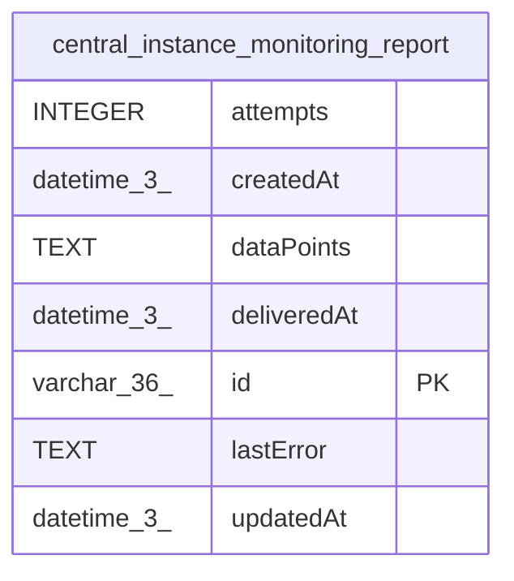

# central_instance_monitoring_report

## Description

<details>
<summary><strong>Table Definition</strong></summary>

```sql
CREATE TABLE "central_instance_monitoring_report" ("id" varchar(36) PRIMARY KEY NOT NULL, "dataPoints" text NOT NULL, "deliveredAt" datetime(3), "attempts" integer NOT NULL DEFAULT (0), "lastError" text, "createdAt" datetime(3) NOT NULL DEFAULT (STRFTIME('%Y-%m-%d %H:%M:%f', 'NOW')), "updatedAt" datetime(3) NOT NULL DEFAULT (STRFTIME('%Y-%m-%d %H:%M:%f', 'NOW')))
```

</details>

## Columns

| Name | Type | Default | Nullable | Children | Parents | Comment |
| ---- | ---- | ------- | -------- | -------- | ------- | ------- |
| attempts | INTEGER | 0 | false |  |  |  |
| createdAt | datetime(3) | STRFTIME('%Y-%m-%d %H:%M:%f', 'NOW') | false |  |  |  |
| dataPoints | TEXT |  | false |  |  |  |
| deliveredAt | datetime(3) |  | true |  |  |  |
| id | varchar(36) |  | false |  |  |  |
| lastError | TEXT |  | true |  |  |  |
| updatedAt | datetime(3) | STRFTIME('%Y-%m-%d %H:%M:%f', 'NOW') | false |  |  |  |

## Constraints

| Name | Type | Definition |
| ---- | ---- | ---------- |
| id | PRIMARY KEY | PRIMARY KEY (id) |
| sqlite_autoindex_central_instance_monitoring_report_1 | PRIMARY KEY | PRIMARY KEY (id) |

## Indexes

| Name | Definition |
| ---- | ---------- |
| sqlite_autoindex_central_instance_monitoring_report_1 | PRIMARY KEY (id) |

## Relations



---

> Generated by [tbls](https://github.com/k1LoW/tbls)
