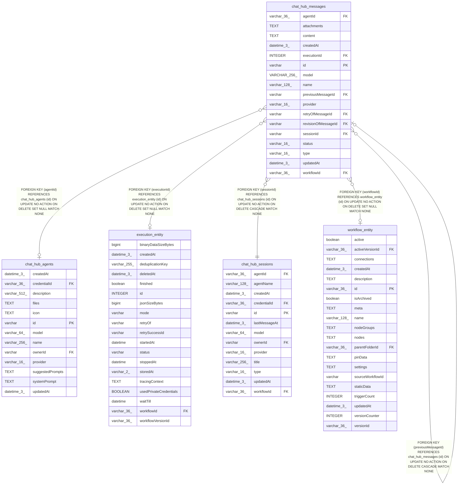

# chat_hub_messages

## Description

<details>
<summary><strong>Table Definition</strong></summary>

```sql
CREATE TABLE "chat_hub_messages" ("id" varchar PRIMARY KEY NOT NULL, "sessionId" varchar NOT NULL, "previousMessageId" varchar, "revisionOfMessageId" varchar, "retryOfMessageId" varchar, "type" varchar(16) NOT NULL, "name" varchar(128) NOT NULL, "content" text NOT NULL, "provider" varchar(16), "workflowId" varchar(36), "executionId" integer, "createdAt" datetime(3) NOT NULL DEFAULT (STRFTIME('%Y-%m-%d %H:%M:%f', 'NOW')), "updatedAt" datetime(3) NOT NULL DEFAULT (STRFTIME('%Y-%m-%d %H:%M:%f', 'NOW')), "agentId" varchar(36), "status" varchar(16) NOT NULL DEFAULT ('success'), "attachments" text, "model" VARCHAR(256), CONSTRAINT "FK_e22538eb50a71a17954cd7e076c" FOREIGN KEY ("sessionId") REFERENCES "chat_hub_sessions" ("id") ON DELETE CASCADE ON UPDATE NO ACTION, CONSTRAINT "FK_e5d1fa722c5a8d38ac204746662" FOREIGN KEY ("previousMessageId") REFERENCES "chat_hub_messages" ("id") ON DELETE CASCADE ON UPDATE NO ACTION, CONSTRAINT "FK_acf8926098f063cdbbad8497fd1" FOREIGN KEY ("workflowId") REFERENCES "workflow_entity" ("id") ON DELETE SET NULL ON UPDATE NO ACTION, CONSTRAINT "FK_25c9736e7f769f3a005eef4b372" FOREIGN KEY ("retryOfMessageId") REFERENCES "chat_hub_messages" ("id") ON DELETE CASCADE ON UPDATE NO ACTION, CONSTRAINT "FK_1f4998c8a7dec9e00a9ab15550e" FOREIGN KEY ("revisionOfMessageId") REFERENCES "chat_hub_messages" ("id") ON DELETE CASCADE ON UPDATE NO ACTION, CONSTRAINT "FK_6afb260449dd7a9b85355d4e0c9" FOREIGN KEY ("executionId") REFERENCES "execution_entity" ("id") ON DELETE SET NULL ON UPDATE NO ACTION, CONSTRAINT "FK_chat_hub_messages_agentId" FOREIGN KEY ("agentId") REFERENCES "chat_hub_agents" ("id") ON DELETE SET NULL)
```

</details>

## Columns

| Name | Type | Default | Nullable | Children | Parents | Comment |
| ---- | ---- | ------- | -------- | -------- | ------- | ------- |
| agentId | varchar(36) |  | true |  | [chat_hub_agents](chat_hub_agents.md) |  |
| attachments | TEXT |  | true |  |  |  |
| content | TEXT |  | false |  |  |  |
| createdAt | datetime(3) | STRFTIME('%Y-%m-%d %H:%M:%f', 'NOW') | false |  |  |  |
| executionId | INTEGER |  | true |  | [execution_entity](execution_entity.md) |  |
| id | varchar |  | false | [chat_hub_messages](chat_hub_messages.md) |  |  |
| model | VARCHAR(256) |  | true |  |  |  |
| name | varchar(128) |  | false |  |  |  |
| previousMessageId | varchar |  | true |  | [chat_hub_messages](chat_hub_messages.md) |  |
| provider | varchar(16) |  | true |  |  |  |
| retryOfMessageId | varchar |  | true |  | [chat_hub_messages](chat_hub_messages.md) |  |
| revisionOfMessageId | varchar |  | true |  | [chat_hub_messages](chat_hub_messages.md) |  |
| sessionId | varchar |  | false |  | [chat_hub_sessions](chat_hub_sessions.md) |  |
| status | varchar(16) | 'success' | false |  |  |  |
| type | varchar(16) |  | false |  |  |  |
| updatedAt | datetime(3) | STRFTIME('%Y-%m-%d %H:%M:%f', 'NOW') | false |  |  |  |
| workflowId | varchar(36) |  | true |  | [workflow_entity](workflow_entity.md) |  |

## Constraints

| Name | Type | Definition |
| ---- | ---- | ---------- |
| - (Foreign key ID: 0) | FOREIGN KEY | FOREIGN KEY (agentId) REFERENCES chat_hub_agents (id) ON UPDATE NO ACTION ON DELETE SET NULL MATCH NONE |
| - (Foreign key ID: 1) | FOREIGN KEY | FOREIGN KEY (executionId) REFERENCES execution_entity (id) ON UPDATE NO ACTION ON DELETE SET NULL MATCH NONE |
| - (Foreign key ID: 2) | FOREIGN KEY | FOREIGN KEY (revisionOfMessageId) REFERENCES chat_hub_messages (id) ON UPDATE NO ACTION ON DELETE CASCADE MATCH NONE |
| - (Foreign key ID: 3) | FOREIGN KEY | FOREIGN KEY (retryOfMessageId) REFERENCES chat_hub_messages (id) ON UPDATE NO ACTION ON DELETE CASCADE MATCH NONE |
| - (Foreign key ID: 4) | FOREIGN KEY | FOREIGN KEY (workflowId) REFERENCES workflow_entity (id) ON UPDATE NO ACTION ON DELETE SET NULL MATCH NONE |
| - (Foreign key ID: 5) | FOREIGN KEY | FOREIGN KEY (previousMessageId) REFERENCES chat_hub_messages (id) ON UPDATE NO ACTION ON DELETE CASCADE MATCH NONE |
| - (Foreign key ID: 6) | FOREIGN KEY | FOREIGN KEY (sessionId) REFERENCES chat_hub_sessions (id) ON UPDATE NO ACTION ON DELETE CASCADE MATCH NONE |
| id | PRIMARY KEY | PRIMARY KEY (id) |
| sqlite_autoindex_chat_hub_messages_1 | PRIMARY KEY | PRIMARY KEY (id) |

## Indexes

| Name | Definition |
| ---- | ---------- |
| IDX_chat_hub_messages_sessionId | CREATE INDEX "IDX_chat_hub_messages_sessionId"<br />			ON "chat_hub_messages"("sessionId") |
| sqlite_autoindex_chat_hub_messages_1 | PRIMARY KEY (id) |

## Relations



---

> Generated by [tbls](https://github.com/k1LoW/tbls)
