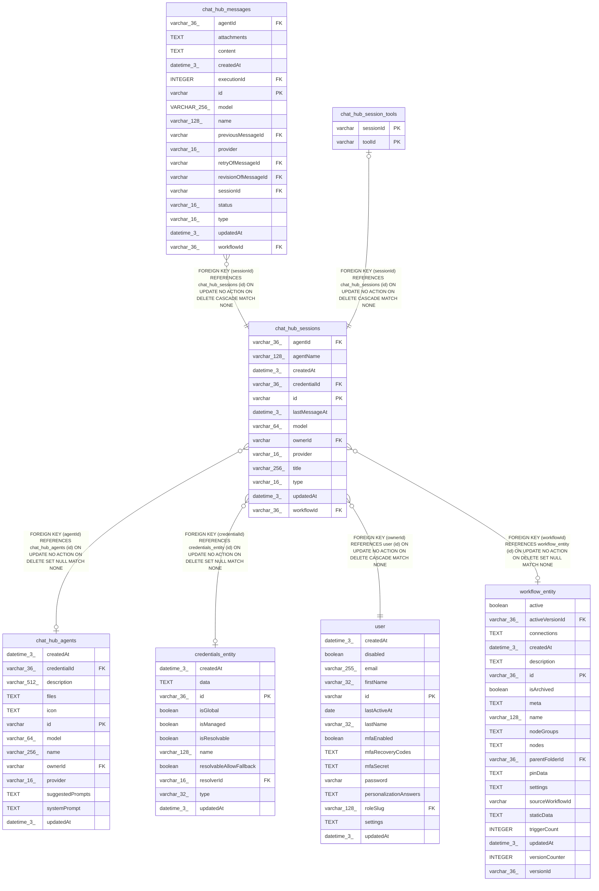

# chat_hub_sessions

## Description

<details>
<summary><strong>Table Definition</strong></summary>

```sql
CREATE TABLE "chat_hub_sessions" ("id" varchar PRIMARY KEY NOT NULL, "title" varchar(256) NOT NULL, "ownerId" varchar NOT NULL, "lastMessageAt" datetime(3) NOT NULL, "credentialId" varchar(36), "provider" varchar(16), "model" varchar(64), "workflowId" varchar(36), "createdAt" datetime(3) NOT NULL DEFAULT (STRFTIME('%Y-%m-%d %H:%M:%f', 'NOW')), "updatedAt" datetime(3) NOT NULL DEFAULT (STRFTIME('%Y-%m-%d %H:%M:%f', 'NOW')), "agentId" varchar(36), "agentName" varchar(128), "type" varchar(16) NOT NULL DEFAULT ('production'), CONSTRAINT "CHK_chat_hub_sessions_type" CHECK ("type" IN ('production', 'manual')), CONSTRAINT "FK_chat_hub_sessions_agentId" FOREIGN KEY ("agentId") REFERENCES "chat_hub_agents" ("id") ON DELETE SET NULL ON UPDATE NO ACTION, CONSTRAINT "FK_9f9293d9f552496c40e0d1a8f80" FOREIGN KEY ("workflowId") REFERENCES "workflow_entity" ("id") ON DELETE SET NULL ON UPDATE NO ACTION, CONSTRAINT "FK_7bc13b4c7e6afbfaf9be326c189" FOREIGN KEY ("credentialId") REFERENCES "credentials_entity" ("id") ON DELETE SET NULL ON UPDATE NO ACTION, CONSTRAINT "FK_e9ecf8ede7d989fcd18790fe36a" FOREIGN KEY ("ownerId") REFERENCES "user" ("id") ON DELETE CASCADE ON UPDATE NO ACTION)
```

</details>

## Columns

| Name | Type | Default | Nullable | Children | Parents | Comment |
| ---- | ---- | ------- | -------- | -------- | ------- | ------- |
| agentId | varchar(36) |  | true |  | [chat_hub_agents](chat_hub_agents.md) |  |
| agentName | varchar(128) |  | true |  |  |  |
| createdAt | datetime(3) | STRFTIME('%Y-%m-%d %H:%M:%f', 'NOW') | false |  |  |  |
| credentialId | varchar(36) |  | true |  | [credentials_entity](credentials_entity.md) |  |
| id | varchar |  | false | [chat_hub_messages](chat_hub_messages.md) [chat_hub_session_tools](chat_hub_session_tools.md) |  |  |
| lastMessageAt | datetime(3) |  | false |  |  |  |
| model | varchar(64) |  | true |  |  |  |
| ownerId | varchar |  | false |  | [user](user.md) |  |
| provider | varchar(16) |  | true |  |  |  |
| title | varchar(256) |  | false |  |  |  |
| type | varchar(16) | 'production' | false |  |  |  |
| updatedAt | datetime(3) | STRFTIME('%Y-%m-%d %H:%M:%f', 'NOW') | false |  |  |  |
| workflowId | varchar(36) |  | true |  | [workflow_entity](workflow_entity.md) |  |

## Constraints

| Name | Type | Definition |
| ---- | ---- | ---------- |
| - | CHECK | CHECK ("type" IN ('production', 'manual')) |
| - (Foreign key ID: 0) | FOREIGN KEY | FOREIGN KEY (ownerId) REFERENCES user (id) ON UPDATE NO ACTION ON DELETE CASCADE MATCH NONE |
| - (Foreign key ID: 1) | FOREIGN KEY | FOREIGN KEY (credentialId) REFERENCES credentials_entity (id) ON UPDATE NO ACTION ON DELETE SET NULL MATCH NONE |
| - (Foreign key ID: 2) | FOREIGN KEY | FOREIGN KEY (workflowId) REFERENCES workflow_entity (id) ON UPDATE NO ACTION ON DELETE SET NULL MATCH NONE |
| - (Foreign key ID: 3) | FOREIGN KEY | FOREIGN KEY (agentId) REFERENCES chat_hub_agents (id) ON UPDATE NO ACTION ON DELETE SET NULL MATCH NONE |
| id | PRIMARY KEY | PRIMARY KEY (id) |
| sqlite_autoindex_chat_hub_sessions_1 | PRIMARY KEY | PRIMARY KEY (id) |

## Indexes

| Name | Definition |
| ---- | ---------- |
| sqlite_autoindex_chat_hub_sessions_1 | PRIMARY KEY (id) |

## Relations



---

> Generated by [tbls](https://github.com/k1LoW/tbls)
