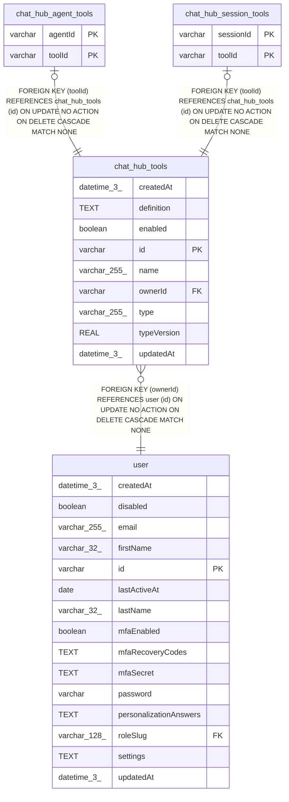

# chat_hub_tools

## Description

<details>
<summary><strong>Table Definition</strong></summary>

```sql
CREATE TABLE "chat_hub_tools" ("id" varchar PRIMARY KEY NOT NULL, "name" varchar(255) NOT NULL, "type" varchar(255) NOT NULL, "typeVersion" real NOT NULL, "ownerId" varchar NOT NULL, "definition" text NOT NULL, "enabled" boolean NOT NULL DEFAULT (true), "createdAt" datetime(3) NOT NULL DEFAULT (STRFTIME('%Y-%m-%d %H:%M:%f', 'NOW')), "updatedAt" datetime(3) NOT NULL DEFAULT (STRFTIME('%Y-%m-%d %H:%M:%f', 'NOW')), CONSTRAINT "FK_b8030b47af9213f1fd15450fb7f" FOREIGN KEY ("ownerId") REFERENCES "user" ("id") ON DELETE CASCADE)
```

</details>

## Columns

| Name | Type | Default | Nullable | Children | Parents | Comment |
| ---- | ---- | ------- | -------- | -------- | ------- | ------- |
| createdAt | datetime(3) | STRFTIME('%Y-%m-%d %H:%M:%f', 'NOW') | false |  |  |  |
| definition | TEXT |  | false |  |  |  |
| enabled | boolean | true | false |  |  |  |
| id | varchar |  | false | [chat_hub_agent_tools](chat_hub_agent_tools.md) [chat_hub_session_tools](chat_hub_session_tools.md) |  |  |
| name | varchar(255) |  | false |  |  |  |
| ownerId | varchar |  | false |  | [user](user.md) |  |
| type | varchar(255) |  | false |  |  |  |
| typeVersion | REAL |  | false |  |  |  |
| updatedAt | datetime(3) | STRFTIME('%Y-%m-%d %H:%M:%f', 'NOW') | false |  |  |  |

## Constraints

| Name | Type | Definition |
| ---- | ---- | ---------- |
| - (Foreign key ID: 0) | FOREIGN KEY | FOREIGN KEY (ownerId) REFERENCES user (id) ON UPDATE NO ACTION ON DELETE CASCADE MATCH NONE |
| id | PRIMARY KEY | PRIMARY KEY (id) |
| sqlite_autoindex_chat_hub_tools_1 | PRIMARY KEY | PRIMARY KEY (id) |

## Indexes

| Name | Definition |
| ---- | ---------- |
| IDX_4c72ebdb265d1775bf61147af0 | CREATE UNIQUE INDEX "IDX_4c72ebdb265d1775bf61147af0" ON "chat_hub_tools" ("ownerId", "name")  |
| sqlite_autoindex_chat_hub_tools_1 | PRIMARY KEY (id) |

## Relations



---

> Generated by [tbls](https://github.com/k1LoW/tbls)
