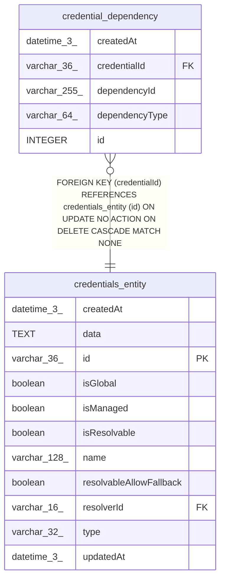

# credential_dependency

## Description

<details>
<summary><strong>Table Definition</strong></summary>

```sql
CREATE TABLE "credential_dependency" ("id" integer PRIMARY KEY NOT NULL, "credentialId" varchar(36) NOT NULL, "dependencyType" varchar(64) NOT NULL, "dependencyId" varchar(255) NOT NULL, "createdAt" datetime(3) NOT NULL DEFAULT (STRFTIME('%Y-%m-%d %H:%M:%f', 'NOW')), CONSTRAINT "FK_5ec8e8c8d3539f3696cf73b43bf" FOREIGN KEY ("credentialId") REFERENCES "credentials_entity" ("id") ON DELETE CASCADE)
```

</details>

## Columns

| Name | Type | Default | Nullable | Children | Parents | Comment |
| ---- | ---- | ------- | -------- | -------- | ------- | ------- |
| createdAt | datetime(3) | STRFTIME('%Y-%m-%d %H:%M:%f', 'NOW') | false |  |  |  |
| credentialId | varchar(36) |  | false |  | [credentials_entity](credentials_entity.md) |  |
| dependencyId | varchar(255) |  | false |  |  |  |
| dependencyType | varchar(64) |  | false |  |  |  |
| id | INTEGER |  | false |  |  |  |

## Constraints

| Name | Type | Definition |
| ---- | ---- | ---------- |
| - (Foreign key ID: 0) | FOREIGN KEY | FOREIGN KEY (credentialId) REFERENCES credentials_entity (id) ON UPDATE NO ACTION ON DELETE CASCADE MATCH NONE |
| id | PRIMARY KEY | PRIMARY KEY (id) |

## Indexes

| Name | Definition |
| ---- | ---------- |
| IDX_5ec8e8c8d3539f3696cf73b43b | CREATE INDEX "IDX_5ec8e8c8d3539f3696cf73b43b" ON "credential_dependency" ("credentialId")  |
| IDX_91ee85fa9619dd6776725e117b | CREATE INDEX "IDX_91ee85fa9619dd6776725e117b" ON "credential_dependency" ("dependencyType", "dependencyId")  |
| IDX_credential_dependency_credentialId_dependencyType_dependencyId | CREATE UNIQUE INDEX "IDX_credential_dependency_credentialId_dependencyType_dependencyId" ON "credential_dependency" ("credentialId", "dependencyType", "dependencyId")  |

## Relations



---

> Generated by [tbls](https://github.com/k1LoW/tbls)
