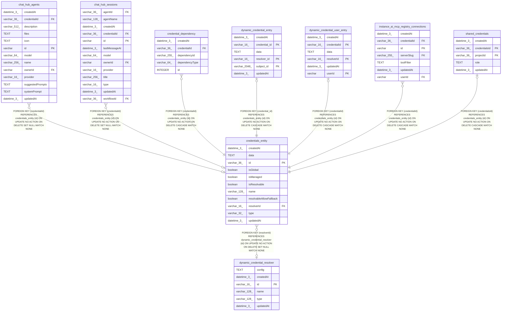

# credentials_entity

## Description

<details>
<summary><strong>Table Definition</strong></summary>

```sql
CREATE TABLE "credentials_entity" ("id" varchar(36) PRIMARY KEY NOT NULL, "name" varchar(128) NOT NULL, "data" text NOT NULL, "type" varchar(32) NOT NULL, "createdAt" datetime(3) NOT NULL DEFAULT (STRFTIME('%Y-%m-%d %H:%M:%f', 'NOW')), "updatedAt" datetime(3) NOT NULL DEFAULT (STRFTIME('%Y-%m-%d %H:%M:%f', 'NOW')), "isManaged" boolean NOT NULL DEFAULT (0), "isGlobal" boolean NOT NULL DEFAULT (0), "isResolvable" boolean NOT NULL DEFAULT (false), "resolvableAllowFallback" boolean NOT NULL DEFAULT (false), "resolverId" varchar(16), CONSTRAINT "credentials_entity_resolverId_foreign" FOREIGN KEY ("resolverId") REFERENCES "dynamic_credential_resolver" ("id") ON DELETE SET NULL)
```

</details>

## Columns

| Name | Type | Default | Nullable | Children | Parents | Comment |
| ---- | ---- | ------- | -------- | -------- | ------- | ------- |
| createdAt | datetime(3) | STRFTIME('%Y-%m-%d %H:%M:%f', 'NOW') | false |  |  |  |
| data | TEXT |  | false |  |  |  |
| id | varchar(36) |  | false | [chat_hub_agents](chat_hub_agents.md) [chat_hub_sessions](chat_hub_sessions.md) [credential_dependency](credential_dependency.md) [dynamic_credential_entry](dynamic_credential_entry.md) [dynamic_credential_user_entry](dynamic_credential_user_entry.md) [instance_ai_mcp_registry_connections](instance_ai_mcp_registry_connections.md) [shared_credentials](shared_credentials.md) |  |  |
| isGlobal | boolean | 0 | false |  |  |  |
| isManaged | boolean | 0 | false |  |  |  |
| isResolvable | boolean | false | false |  |  |  |
| name | varchar(128) |  | false |  |  |  |
| resolvableAllowFallback | boolean | false | false |  |  |  |
| resolverId | varchar(16) |  | true |  | [dynamic_credential_resolver](dynamic_credential_resolver.md) |  |
| type | varchar(32) |  | false |  |  |  |
| updatedAt | datetime(3) | STRFTIME('%Y-%m-%d %H:%M:%f', 'NOW') | false |  |  |  |

## Constraints

| Name | Type | Definition |
| ---- | ---- | ---------- |
| - (Foreign key ID: 0) | FOREIGN KEY | FOREIGN KEY (resolverId) REFERENCES dynamic_credential_resolver (id) ON UPDATE NO ACTION ON DELETE SET NULL MATCH NONE |
| id | PRIMARY KEY | PRIMARY KEY (id) |
| sqlite_autoindex_credentials_entity_1 | PRIMARY KEY | PRIMARY KEY (id) |

## Indexes

| Name | Definition |
| ---- | ---------- |
| IDX_credentials_entity_is_global | CREATE INDEX "IDX_credentials_entity_is_global" ON "credentials_entity" ("id") WHERE "isGlobal" = true |
| idx_credentials_entity_type | CREATE INDEX "idx_credentials_entity_type" ON "credentials_entity" ("type")  |
| sqlite_autoindex_credentials_entity_1 | PRIMARY KEY (id) |

## Relations



---

> Generated by [tbls](https://github.com/k1LoW/tbls)
