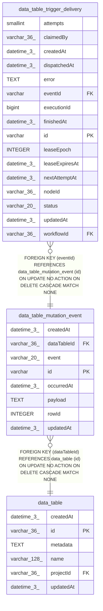

# data_table_mutation_event

## Description

<details>
<summary><strong>Table Definition</strong></summary>

```sql
CREATE TABLE "data_table_mutation_event" ("id" varchar PRIMARY KEY NOT NULL, "dataTableId" varchar(36) NOT NULL, "rowId" integer NOT NULL, "event" varchar(20) NOT NULL, "payload" text NOT NULL, "occurredAt" datetime(3) NOT NULL, "createdAt" datetime(3) NOT NULL DEFAULT (STRFTIME('%Y-%m-%d %H:%M:%f', 'NOW')), "updatedAt" datetime(3) NOT NULL DEFAULT (STRFTIME('%Y-%m-%d %H:%M:%f', 'NOW')), CONSTRAINT "CHK_data_table_mutation_event_event" CHECK ("event" IN ('rowInserted', 'rowDeleted', 'columnUpdated')), CONSTRAINT "FK_7c5ffce6d8884e133346c02cd4f" FOREIGN KEY ("dataTableId") REFERENCES "data_table" ("id") ON DELETE CASCADE)
```

</details>

## Columns

| Name | Type | Default | Nullable | Children | Parents | Comment |
| ---- | ---- | ------- | -------- | -------- | ------- | ------- |
| createdAt | datetime(3) | STRFTIME('%Y-%m-%d %H:%M:%f', 'NOW') | false |  |  |  |
| dataTableId | varchar(36) |  | false |  | [data_table](data_table.md) |  |
| event | varchar(20) |  | false |  |  |  |
| id | varchar |  | false | [data_table_trigger_delivery](data_table_trigger_delivery.md) |  |  |
| occurredAt | datetime(3) |  | false |  |  |  |
| payload | TEXT |  | false |  |  |  |
| rowId | INTEGER |  | false |  |  |  |
| updatedAt | datetime(3) | STRFTIME('%Y-%m-%d %H:%M:%f', 'NOW') | false |  |  |  |

## Constraints

| Name | Type | Definition |
| ---- | ---- | ---------- |
| - | CHECK | CHECK ("event" IN ('rowInserted', 'rowDeleted', 'columnUpdated')) |
| - (Foreign key ID: 0) | FOREIGN KEY | FOREIGN KEY (dataTableId) REFERENCES data_table (id) ON UPDATE NO ACTION ON DELETE CASCADE MATCH NONE |
| id | PRIMARY KEY | PRIMARY KEY (id) |
| sqlite_autoindex_data_table_mutation_event_1 | PRIMARY KEY | PRIMARY KEY (id) |

## Indexes

| Name | Definition |
| ---- | ---------- |
| IDX_360aead58201e2b383dd3f2eef | CREATE INDEX "IDX_360aead58201e2b383dd3f2eef" ON "data_table_mutation_event" ("dataTableId", "occurredAt")  |
| sqlite_autoindex_data_table_mutation_event_1 | PRIMARY KEY (id) |

## Relations



---

> Generated by [tbls](https://github.com/k1LoW/tbls)
