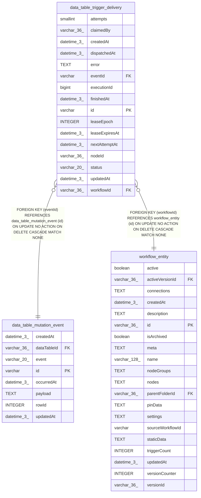

# data_table_trigger_delivery

## Description

<details>
<summary><strong>Table Definition</strong></summary>

```sql
CREATE TABLE "data_table_trigger_delivery" ("id" varchar PRIMARY KEY NOT NULL, "eventId" varchar NOT NULL, "workflowId" varchar(36) NOT NULL, "nodeId" varchar(36) NOT NULL, "executionId" bigint, "status" varchar(20) NOT NULL DEFAULT ('pending'), "attempts" smallint NOT NULL DEFAULT (0), "claimedBy" varchar(36), "leaseEpoch" integer NOT NULL DEFAULT (0), "leaseExpiresAt" datetime(3), "nextAttemptAt" datetime(3), "dispatchedAt" datetime(3), "finishedAt" datetime(3), "error" text, "createdAt" datetime(3) NOT NULL DEFAULT (STRFTIME('%Y-%m-%d %H:%M:%f', 'NOW')), "updatedAt" datetime(3) NOT NULL DEFAULT (STRFTIME('%Y-%m-%d %H:%M:%f', 'NOW')), CONSTRAINT "UQ_0af41babdfeb8a2bfb0d4124c34" UNIQUE ("eventId", "workflowId", "nodeId"), CONSTRAINT "CHK_data_table_trigger_delivery_status" CHECK ("status" IN ('pending', 'in_progress', 'completed', 'failed', 'cancelled')), CONSTRAINT "FK_5079e141c03d20351c77f448f3f" FOREIGN KEY ("eventId") REFERENCES "data_table_mutation_event" ("id") ON DELETE CASCADE, CONSTRAINT "FK_b86b6af91fde38c7ac54ddcb1f1" FOREIGN KEY ("workflowId") REFERENCES "workflow_entity" ("id") ON DELETE CASCADE)
```

</details>

## Columns

| Name | Type | Default | Nullable | Children | Parents | Comment |
| ---- | ---- | ------- | -------- | -------- | ------- | ------- |
| attempts | smallint | 0 | false |  |  |  |
| claimedBy | varchar(36) |  | true |  |  |  |
| createdAt | datetime(3) | STRFTIME('%Y-%m-%d %H:%M:%f', 'NOW') | false |  |  |  |
| dispatchedAt | datetime(3) |  | true |  |  |  |
| error | TEXT |  | true |  |  |  |
| eventId | varchar |  | false |  | [data_table_mutation_event](data_table_mutation_event.md) |  |
| executionId | bigint |  | true |  |  |  |
| finishedAt | datetime(3) |  | true |  |  |  |
| id | varchar |  | false |  |  |  |
| leaseEpoch | INTEGER | 0 | false |  |  |  |
| leaseExpiresAt | datetime(3) |  | true |  |  |  |
| nextAttemptAt | datetime(3) |  | true |  |  |  |
| nodeId | varchar(36) |  | false |  |  |  |
| status | varchar(20) | 'pending' | false |  |  |  |
| updatedAt | datetime(3) | STRFTIME('%Y-%m-%d %H:%M:%f', 'NOW') | false |  |  |  |
| workflowId | varchar(36) |  | false |  | [workflow_entity](workflow_entity.md) |  |

## Constraints

| Name | Type | Definition |
| ---- | ---- | ---------- |
| - | CHECK | CHECK ("status" IN ('pending', 'in_progress', 'completed', 'failed', 'cancelled')) |
| - (Foreign key ID: 0) | FOREIGN KEY | FOREIGN KEY (workflowId) REFERENCES workflow_entity (id) ON UPDATE NO ACTION ON DELETE CASCADE MATCH NONE |
| - (Foreign key ID: 1) | FOREIGN KEY | FOREIGN KEY (eventId) REFERENCES data_table_mutation_event (id) ON UPDATE NO ACTION ON DELETE CASCADE MATCH NONE |
| id | PRIMARY KEY | PRIMARY KEY (id) |
| sqlite_autoindex_data_table_trigger_delivery_1 | PRIMARY KEY | PRIMARY KEY (id) |
| sqlite_autoindex_data_table_trigger_delivery_2 | UNIQUE | UNIQUE (eventId, workflowId, nodeId) |

## Indexes

| Name | Definition |
| ---- | ---------- |
| IDX_07257c339f9efa6b57a09b7d0e | CREATE INDEX "IDX_07257c339f9efa6b57a09b7d0e" ON "data_table_trigger_delivery" ("status", "leaseExpiresAt", "id")  |
| IDX_722b26cfcf8ed1ca5273023d5c | CREATE INDEX "IDX_722b26cfcf8ed1ca5273023d5c" ON "data_table_trigger_delivery" ("status", "nextAttemptAt", "id")  |
| IDX_8760fa6fa0aba065fdddb262de | CREATE INDEX "IDX_8760fa6fa0aba065fdddb262de" ON "data_table_trigger_delivery" ("executionId")  |
| IDX_b86b6af91fde38c7ac54ddcb1f | CREATE INDEX "IDX_b86b6af91fde38c7ac54ddcb1f" ON "data_table_trigger_delivery" ("workflowId")  |
| sqlite_autoindex_data_table_trigger_delivery_1 | PRIMARY KEY (id) |
| sqlite_autoindex_data_table_trigger_delivery_2 | UNIQUE (eventId, workflowId, nodeId) |

## Relations



---

> Generated by [tbls](https://github.com/k1LoW/tbls)
