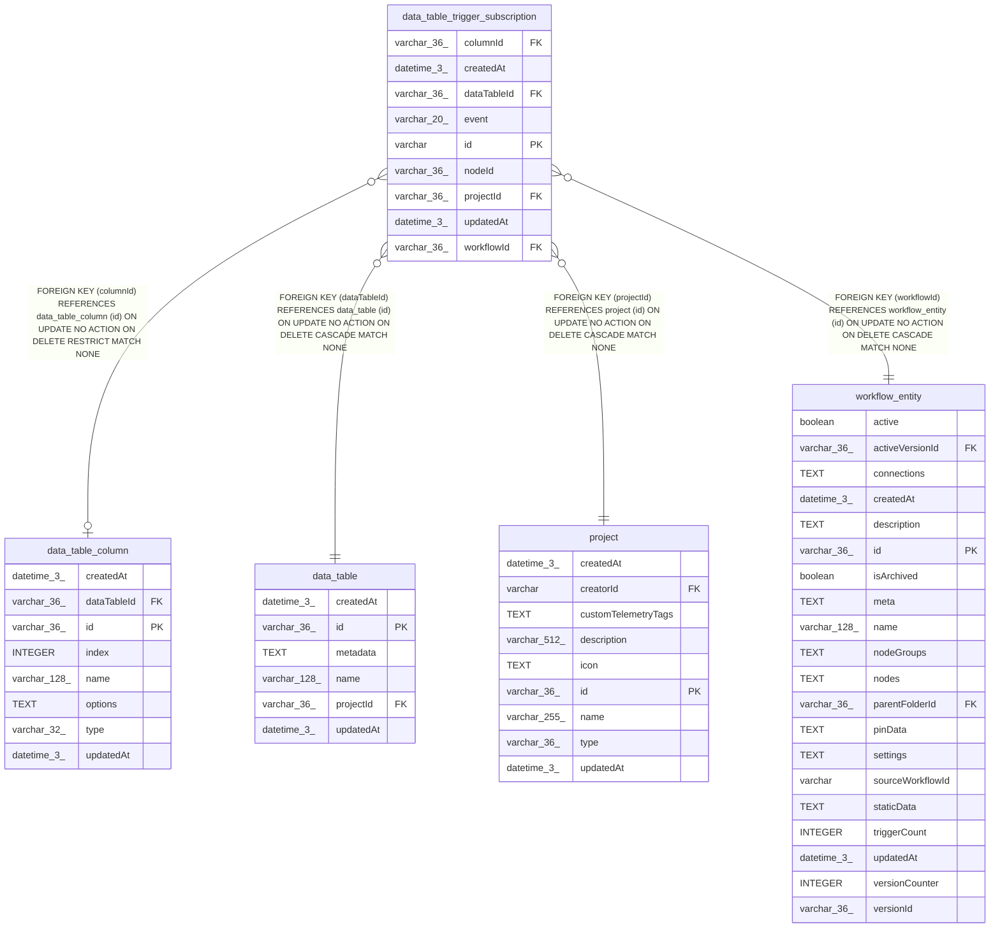

# data_table_trigger_subscription

## Description

<details>
<summary><strong>Table Definition</strong></summary>

```sql
CREATE TABLE "data_table_trigger_subscription" ("id" varchar PRIMARY KEY NOT NULL, "workflowId" varchar(36) NOT NULL, "nodeId" varchar(36) NOT NULL, "projectId" varchar(36) NOT NULL, "dataTableId" varchar(36) NOT NULL, "event" varchar(20) NOT NULL, "columnId" varchar(36), "createdAt" datetime(3) NOT NULL DEFAULT (STRFTIME('%Y-%m-%d %H:%M:%f', 'NOW')), "updatedAt" datetime(3) NOT NULL DEFAULT (STRFTIME('%Y-%m-%d %H:%M:%f', 'NOW')), CONSTRAINT "UQ_97e94809ff6e68b490fd48cffc4" UNIQUE ("workflowId", "nodeId"), CONSTRAINT "CHK_data_table_trigger_subscription_event" CHECK ("event" IN ('rowInserted', 'rowDeleted', 'columnUpdated')), CONSTRAINT "FK_4006d5dd027167fc517794c0954" FOREIGN KEY ("workflowId") REFERENCES "workflow_entity" ("id") ON DELETE CASCADE, CONSTRAINT "FK_d8909cbd3a595db56d8defd41a6" FOREIGN KEY ("projectId") REFERENCES "project" ("id") ON DELETE CASCADE, CONSTRAINT "FK_23f10731bb1e0cb94ffcb1c8db7" FOREIGN KEY ("dataTableId") REFERENCES "data_table" ("id") ON DELETE CASCADE, CONSTRAINT "FK_eece6d08ab66141283aaa2909f6" FOREIGN KEY ("columnId") REFERENCES "data_table_column" ("id") ON DELETE RESTRICT)
```

</details>

## Columns

| Name | Type | Default | Nullable | Children | Parents | Comment |
| ---- | ---- | ------- | -------- | -------- | ------- | ------- |
| columnId | varchar(36) |  | true |  | [data_table_column](data_table_column.md) |  |
| createdAt | datetime(3) | STRFTIME('%Y-%m-%d %H:%M:%f', 'NOW') | false |  |  |  |
| dataTableId | varchar(36) |  | false |  | [data_table](data_table.md) |  |
| event | varchar(20) |  | false |  |  |  |
| id | varchar |  | false |  |  |  |
| nodeId | varchar(36) |  | false |  |  |  |
| projectId | varchar(36) |  | false |  | [project](project.md) |  |
| updatedAt | datetime(3) | STRFTIME('%Y-%m-%d %H:%M:%f', 'NOW') | false |  |  |  |
| workflowId | varchar(36) |  | false |  | [workflow_entity](workflow_entity.md) |  |

## Constraints

| Name | Type | Definition |
| ---- | ---- | ---------- |
| - | CHECK | CHECK ("event" IN ('rowInserted', 'rowDeleted', 'columnUpdated')) |
| - (Foreign key ID: 0) | FOREIGN KEY | FOREIGN KEY (columnId) REFERENCES data_table_column (id) ON UPDATE NO ACTION ON DELETE RESTRICT MATCH NONE |
| - (Foreign key ID: 1) | FOREIGN KEY | FOREIGN KEY (dataTableId) REFERENCES data_table (id) ON UPDATE NO ACTION ON DELETE CASCADE MATCH NONE |
| - (Foreign key ID: 2) | FOREIGN KEY | FOREIGN KEY (projectId) REFERENCES project (id) ON UPDATE NO ACTION ON DELETE CASCADE MATCH NONE |
| - (Foreign key ID: 3) | FOREIGN KEY | FOREIGN KEY (workflowId) REFERENCES workflow_entity (id) ON UPDATE NO ACTION ON DELETE CASCADE MATCH NONE |
| id | PRIMARY KEY | PRIMARY KEY (id) |
| sqlite_autoindex_data_table_trigger_subscription_1 | PRIMARY KEY | PRIMARY KEY (id) |
| sqlite_autoindex_data_table_trigger_subscription_2 | UNIQUE | UNIQUE (workflowId, nodeId) |

## Indexes

| Name | Definition |
| ---- | ---------- |
| IDX_0930ce8ed36fea495b73df5a62 | CREATE INDEX "IDX_0930ce8ed36fea495b73df5a62" ON "data_table_trigger_subscription" ("dataTableId", "event", "columnId")  |
| IDX_d8909cbd3a595db56d8defd41a | CREATE INDEX "IDX_d8909cbd3a595db56d8defd41a" ON "data_table_trigger_subscription" ("projectId")  |
| IDX_eece6d08ab66141283aaa2909f | CREATE INDEX "IDX_eece6d08ab66141283aaa2909f" ON "data_table_trigger_subscription" ("columnId")  |
| sqlite_autoindex_data_table_trigger_subscription_1 | PRIMARY KEY (id) |
| sqlite_autoindex_data_table_trigger_subscription_2 | UNIQUE (workflowId, nodeId) |

## Relations



---

> Generated by [tbls](https://github.com/k1LoW/tbls)
