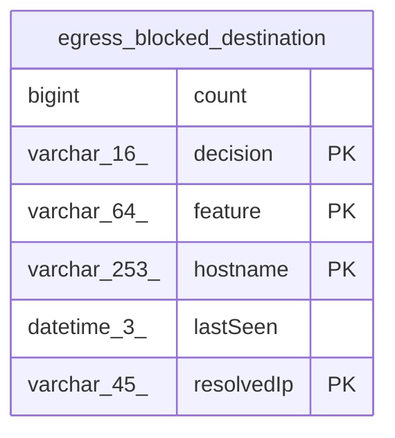

# egress_blocked_destination

## Description

<details>
<summary><strong>Table Definition</strong></summary>

```sql
CREATE TABLE "egress_blocked_destination" ("hostname" varchar(253) NOT NULL, "resolvedIp" varchar(45) NOT NULL, "feature" varchar(64) NOT NULL, "decision" varchar(16) NOT NULL, "count" bigint NOT NULL DEFAULT (0), "lastSeen" datetime(3) NOT NULL, PRIMARY KEY ("hostname", "resolvedIp", "feature", "decision"))
```

</details>

## Columns

| Name | Type | Default | Nullable | Children | Parents | Comment |
| ---- | ---- | ------- | -------- | -------- | ------- | ------- |
| count | bigint | 0 | false |  |  |  |
| decision | varchar(16) |  | false |  |  |  |
| feature | varchar(64) |  | false |  |  |  |
| hostname | varchar(253) |  | false |  |  |  |
| lastSeen | datetime(3) |  | false |  |  |  |
| resolvedIp | varchar(45) |  | false |  |  |  |

## Constraints

| Name | Type | Definition |
| ---- | ---- | ---------- |
| decision | PRIMARY KEY | PRIMARY KEY (decision) |
| feature | PRIMARY KEY | PRIMARY KEY (feature) |
| hostname | PRIMARY KEY | PRIMARY KEY (hostname) |
| resolvedIp | PRIMARY KEY | PRIMARY KEY (resolvedIp) |
| sqlite_autoindex_egress_blocked_destination_1 | PRIMARY KEY | PRIMARY KEY (hostname, resolvedIp, feature, decision) |

## Indexes

| Name | Definition |
| ---- | ---------- |
| IDX_cdc8dd8ad6a79a437850a6045a | CREATE INDEX "IDX_cdc8dd8ad6a79a437850a6045a" ON "egress_blocked_destination" ("lastSeen")  |
| sqlite_autoindex_egress_blocked_destination_1 | PRIMARY KEY (hostname, resolvedIp, feature, decision) |

## Relations



---

> Generated by [tbls](https://github.com/k1LoW/tbls)
