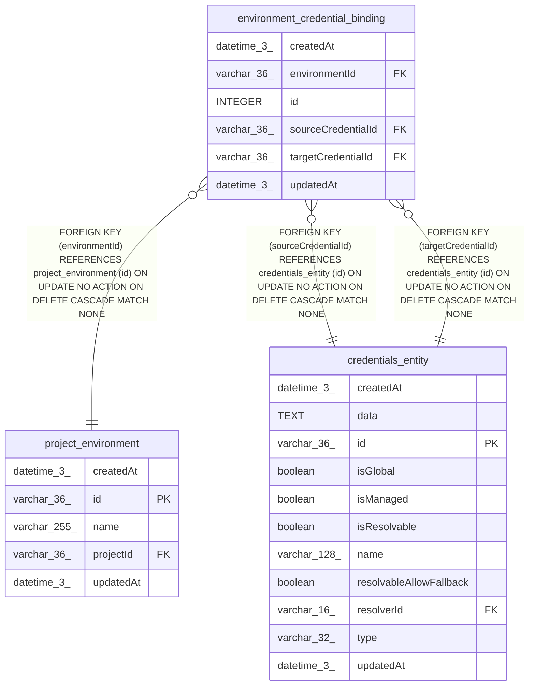

# environment_credential_binding

## Description

<details>
<summary><strong>Table Definition</strong></summary>

```sql
CREATE TABLE "environment_credential_binding" ("id" integer PRIMARY KEY AUTOINCREMENT NOT NULL, "environmentId" varchar(36) NOT NULL, "sourceCredentialId" varchar(36) NOT NULL, "targetCredentialId" varchar(36) NOT NULL, "createdAt" datetime(3) NOT NULL DEFAULT (STRFTIME('%Y-%m-%d %H:%M:%f', 'NOW')), "updatedAt" datetime(3) NOT NULL DEFAULT (STRFTIME('%Y-%m-%d %H:%M:%f', 'NOW')), CONSTRAINT "FK_0a768f1d90ef82cf3678e313759" FOREIGN KEY ("environmentId") REFERENCES "project_environment" ("id") ON DELETE CASCADE, CONSTRAINT "FK_2d49f32b49d32d94684cd6a05c3" FOREIGN KEY ("sourceCredentialId") REFERENCES "credentials_entity" ("id") ON DELETE CASCADE, CONSTRAINT "FK_0a175417bde5f5254b8c12cc242" FOREIGN KEY ("targetCredentialId") REFERENCES "credentials_entity" ("id") ON DELETE CASCADE)
```

</details>

## Columns

| Name | Type | Default | Nullable | Children | Parents | Comment |
| ---- | ---- | ------- | -------- | -------- | ------- | ------- |
| createdAt | datetime(3) | STRFTIME('%Y-%m-%d %H:%M:%f', 'NOW') | false |  |  |  |
| environmentId | varchar(36) |  | false |  | [project_environment](project_environment.md) |  |
| id | INTEGER |  | false |  |  |  |
| sourceCredentialId | varchar(36) |  | false |  | [credentials_entity](credentials_entity.md) |  |
| targetCredentialId | varchar(36) |  | false |  | [credentials_entity](credentials_entity.md) |  |
| updatedAt | datetime(3) | STRFTIME('%Y-%m-%d %H:%M:%f', 'NOW') | false |  |  |  |

## Constraints

| Name | Type | Definition |
| ---- | ---- | ---------- |
| - (Foreign key ID: 0) | FOREIGN KEY | FOREIGN KEY (targetCredentialId) REFERENCES credentials_entity (id) ON UPDATE NO ACTION ON DELETE CASCADE MATCH NONE |
| - (Foreign key ID: 1) | FOREIGN KEY | FOREIGN KEY (sourceCredentialId) REFERENCES credentials_entity (id) ON UPDATE NO ACTION ON DELETE CASCADE MATCH NONE |
| - (Foreign key ID: 2) | FOREIGN KEY | FOREIGN KEY (environmentId) REFERENCES project_environment (id) ON UPDATE NO ACTION ON DELETE CASCADE MATCH NONE |
| id | PRIMARY KEY | PRIMARY KEY (id) |

## Indexes

| Name | Definition |
| ---- | ---------- |
| IDX_0a768f1d90ef82cf3678e31375 | CREATE INDEX "IDX_0a768f1d90ef82cf3678e31375" ON "environment_credential_binding" ("environmentId")  |
| IDX_0b7ddcf4ee25bb1f126e3186a2 | CREATE UNIQUE INDEX "IDX_0b7ddcf4ee25bb1f126e3186a2" ON "environment_credential_binding" ("environmentId", "sourceCredentialId")  |

## Relations



---

> Generated by [tbls](https://github.com/k1LoW/tbls)
