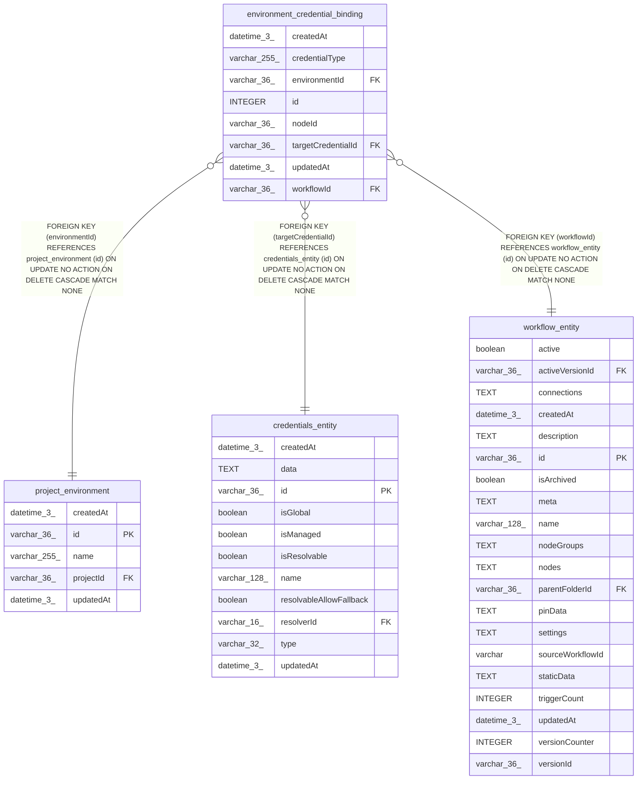

# environment_credential_binding

## Description

<details>
<summary><strong>Table Definition</strong></summary>

```sql
CREATE TABLE "environment_credential_binding" ("id" integer PRIMARY KEY AUTOINCREMENT NOT NULL, "workflowId" varchar(36) NOT NULL, "environmentId" varchar(36) NOT NULL, "nodeId" varchar(36) NOT NULL, "credentialType" varchar(255) NOT NULL, "targetCredentialId" varchar(36) NOT NULL, "createdAt" datetime(3) NOT NULL DEFAULT (STRFTIME('%Y-%m-%d %H:%M:%f', 'NOW')), "updatedAt" datetime(3) NOT NULL DEFAULT (STRFTIME('%Y-%m-%d %H:%M:%f', 'NOW')), CONSTRAINT "FK_8a3cd22704215a2ee7307b83ec9" FOREIGN KEY ("workflowId") REFERENCES "workflow_entity" ("id") ON DELETE CASCADE, CONSTRAINT "FK_0a768f1d90ef82cf3678e313759" FOREIGN KEY ("environmentId") REFERENCES "project_environment" ("id") ON DELETE CASCADE, CONSTRAINT "FK_0a175417bde5f5254b8c12cc242" FOREIGN KEY ("targetCredentialId") REFERENCES "credentials_entity" ("id") ON DELETE CASCADE)
```

</details>

## Columns

| Name | Type | Default | Nullable | Children | Parents | Comment |
| ---- | ---- | ------- | -------- | -------- | ------- | ------- |
| createdAt | datetime(3) | STRFTIME('%Y-%m-%d %H:%M:%f', 'NOW') | false |  |  |  |
| credentialType | varchar(255) |  | false |  |  |  |
| environmentId | varchar(36) |  | false |  | [project_environment](project_environment.md) |  |
| id | INTEGER |  | false |  |  |  |
| nodeId | varchar(36) |  | false |  |  |  |
| targetCredentialId | varchar(36) |  | false |  | [credentials_entity](credentials_entity.md) |  |
| updatedAt | datetime(3) | STRFTIME('%Y-%m-%d %H:%M:%f', 'NOW') | false |  |  |  |
| workflowId | varchar(36) |  | false |  | [workflow_entity](workflow_entity.md) |  |

## Constraints

| Name | Type | Definition |
| ---- | ---- | ---------- |
| - (Foreign key ID: 0) | FOREIGN KEY | FOREIGN KEY (targetCredentialId) REFERENCES credentials_entity (id) ON UPDATE NO ACTION ON DELETE CASCADE MATCH NONE |
| - (Foreign key ID: 1) | FOREIGN KEY | FOREIGN KEY (environmentId) REFERENCES project_environment (id) ON UPDATE NO ACTION ON DELETE CASCADE MATCH NONE |
| - (Foreign key ID: 2) | FOREIGN KEY | FOREIGN KEY (workflowId) REFERENCES workflow_entity (id) ON UPDATE NO ACTION ON DELETE CASCADE MATCH NONE |
| id | PRIMARY KEY | PRIMARY KEY (id) |

## Indexes

| Name | Definition |
| ---- | ---------- |
| IDX_c59dc9433e72e6ea7533b735c0 | CREATE UNIQUE INDEX "IDX_c59dc9433e72e6ea7533b735c0" ON "environment_credential_binding" ("workflowId", "environmentId", "nodeId", "credentialType")  |
| IDX_e6dcfc0dc8aef030779068ea44 | CREATE INDEX "IDX_e6dcfc0dc8aef030779068ea44" ON "environment_credential_binding" ("workflowId", "environmentId")  |

## Relations



---

> Generated by [tbls](https://github.com/k1LoW/tbls)
