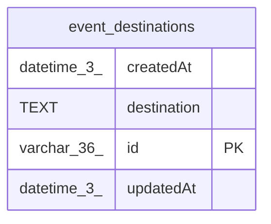

# event_destinations

## Description

<details>
<summary><strong>Table Definition</strong></summary>

```sql
CREATE TABLE "event_destinations" ("id"	varchar(36) PRIMARY KEY NOT NULL,"destination" text NOT NULL,"createdAt"	datetime(3) NOT NULL DEFAULT 'STRFTIME(''%Y-%m-%d %H:%M:%f'', ''NOW'')',"updatedAt"	datetime(3) NOT NULL DEFAULT 'STRFTIME(''%Y-%m-%d %H:%M:%f'', ''NOW'')')
```

</details>

## Columns

| Name | Type | Default | Nullable | Children | Parents | Comment |
| ---- | ---- | ------- | -------- | -------- | ------- | ------- |
| createdAt | datetime(3) | 'STRFTIME(''%Y-%m-%d %H:%M:%f'', ''NOW'')' | false |  |  |  |
| destination | TEXT |  | false |  |  |  |
| id | varchar(36) |  | false |  |  |  |
| updatedAt | datetime(3) | 'STRFTIME(''%Y-%m-%d %H:%M:%f'', ''NOW'')' | false |  |  |  |

## Constraints

| Name | Type | Definition |
| ---- | ---- | ---------- |
| id | PRIMARY KEY | PRIMARY KEY (id) |
| sqlite_autoindex_event_destinations_1 | PRIMARY KEY | PRIMARY KEY (id) |

## Indexes

| Name | Definition |
| ---- | ---------- |
| sqlite_autoindex_event_destinations_1 | PRIMARY KEY (id) |

## Relations



---

> Generated by [tbls](https://github.com/k1LoW/tbls)
