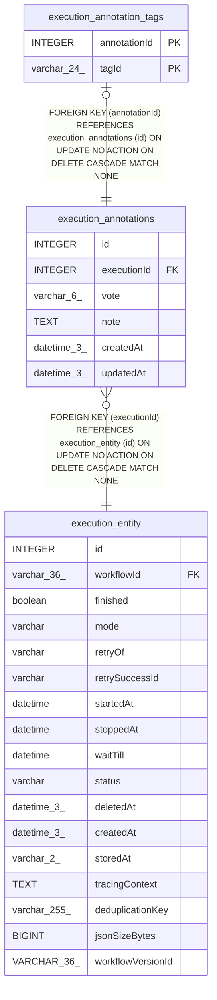

# execution_annotations

## Description

<details>
<summary><strong>Table Definition</strong></summary>

```sql
CREATE TABLE "execution_annotations" ("id" integer PRIMARY KEY AUTOINCREMENT NOT NULL, "executionId" integer NOT NULL, "vote" varchar(6), "note" text, "createdAt" datetime(3) NOT NULL DEFAULT (STRFTIME('%Y-%m-%d %H:%M:%f', 'NOW')), "updatedAt" datetime(3) NOT NULL DEFAULT (STRFTIME('%Y-%m-%d %H:%M:%f', 'NOW')), CONSTRAINT "FK_97f863fa83c4786f19565084960" FOREIGN KEY ("executionId") REFERENCES "execution_entity" ("id") ON DELETE CASCADE)
```

</details>

## Columns

| Name | Type | Default | Nullable | Children | Parents | Comment |
| ---- | ---- | ------- | -------- | -------- | ------- | ------- |
| id | INTEGER |  | false | [execution_annotation_tags](execution_annotation_tags.md) |  |  |
| executionId | INTEGER |  | false |  | [execution_entity](execution_entity.md) |  |
| vote | varchar(6) |  | true |  |  |  |
| note | TEXT |  | true |  |  |  |
| createdAt | datetime(3) | STRFTIME('%Y-%m-%d %H:%M:%f', 'NOW') | false |  |  |  |
| updatedAt | datetime(3) | STRFTIME('%Y-%m-%d %H:%M:%f', 'NOW') | false |  |  |  |

## Constraints

| Name | Type | Definition |
| ---- | ---- | ---------- |
| id | PRIMARY KEY | PRIMARY KEY (id) |
| - (Foreign key ID: 0) | FOREIGN KEY | FOREIGN KEY (executionId) REFERENCES execution_entity (id) ON UPDATE NO ACTION ON DELETE CASCADE MATCH NONE |

## Indexes

| Name | Definition |
| ---- | ---------- |
| IDX_97f863fa83c4786f1956508496 | CREATE UNIQUE INDEX "IDX_97f863fa83c4786f1956508496" ON "execution_annotations" ("executionId")  |

## Relations



---

> Generated by [tbls](https://github.com/k1LoW/tbls)
