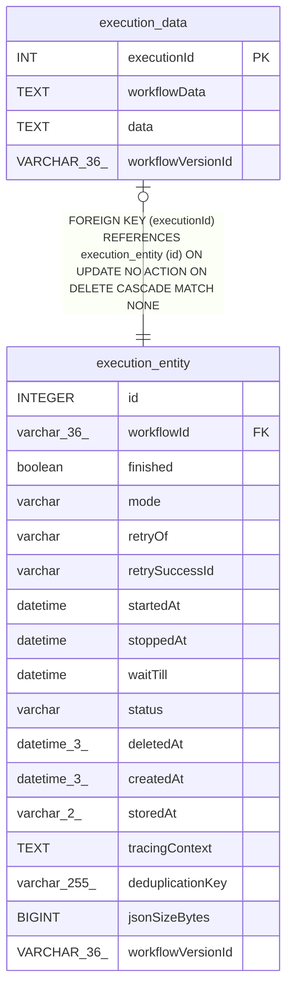

# execution_data

## Description

<details>
<summary><strong>Table Definition</strong></summary>

```sql
CREATE TABLE "execution_data" (
				"executionId" int PRIMARY KEY NOT NULL,
				"workflowData" text NOT NULL,
				"data" text NOT NULL, "workflowVersionId" VARCHAR(36),
				FOREIGN KEY("executionId") REFERENCES "execution_entity" ("id") ON DELETE CASCADE
			)
```

</details>

## Columns

| Name | Type | Default | Nullable | Children | Parents | Comment |
| ---- | ---- | ------- | -------- | -------- | ------- | ------- |
| executionId | INT |  | false |  | [execution_entity](execution_entity.md) |  |
| workflowData | TEXT |  | false |  |  |  |
| data | TEXT |  | false |  |  |  |
| workflowVersionId | VARCHAR(36) |  | true |  |  |  |

## Constraints

| Name | Type | Definition |
| ---- | ---- | ---------- |
| executionId | PRIMARY KEY | PRIMARY KEY (executionId) |
| - (Foreign key ID: 0) | FOREIGN KEY | FOREIGN KEY (executionId) REFERENCES execution_entity (id) ON UPDATE NO ACTION ON DELETE CASCADE MATCH NONE |
| sqlite_autoindex_execution_data_1 | PRIMARY KEY | PRIMARY KEY (executionId) |

## Indexes

| Name | Definition |
| ---- | ---------- |
| sqlite_autoindex_execution_data_1 | PRIMARY KEY (executionId) |

## Relations



---

> Generated by [tbls](https://github.com/k1LoW/tbls)
