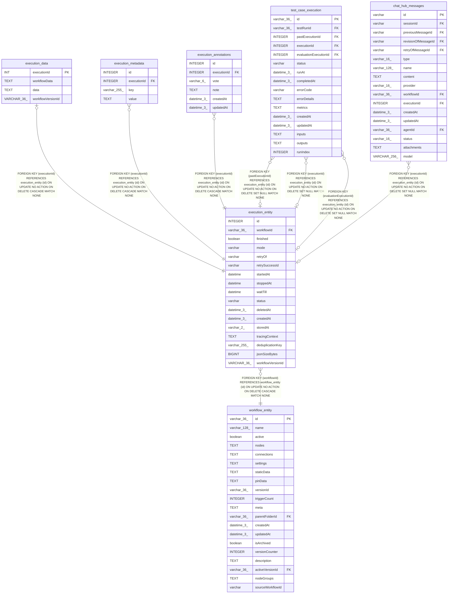

# execution_entity

## Description

<details>
<summary><strong>Table Definition</strong></summary>

```sql
CREATE TABLE "execution_entity" ("id" integer PRIMARY KEY AUTOINCREMENT NOT NULL, "workflowId" varchar(36) NOT NULL, "finished" boolean NOT NULL, "mode" varchar NOT NULL, "retryOf" varchar, "retrySuccessId" varchar, "startedAt" datetime, "stoppedAt" datetime, "waitTill" datetime, "status" varchar NOT NULL, "deletedAt" datetime(3), "createdAt" datetime(3) NOT NULL DEFAULT (STRFTIME('%Y-%m-%d %H:%M:%f', 'NOW')), "storedAt" varchar(2) NOT NULL DEFAULT ('db'), "tracingContext" text, "deduplicationKey" varchar(255), "jsonSizeBytes" BIGINT NOT NULL DEFAULT 0, "workflowVersionId" VARCHAR(36) DEFAULT NULL, CONSTRAINT "FK_c4d999a5e90784e8caccf5589de" FOREIGN KEY ("workflowId") REFERENCES "workflow_entity" ("id") ON DELETE CASCADE ON UPDATE NO ACTION)
```

</details>

## Columns

| Name | Type | Default | Nullable | Children | Parents | Comment |
| ---- | ---- | ------- | -------- | -------- | ------- | ------- |
| id | INTEGER |  | false | [execution_data](execution_data.md) [execution_metadata](execution_metadata.md) [execution_annotations](execution_annotations.md) [test_case_execution](test_case_execution.md) [chat_hub_messages](chat_hub_messages.md) |  |  |
| workflowId | varchar(36) |  | false |  | [workflow_entity](workflow_entity.md) |  |
| finished | boolean |  | false |  |  |  |
| mode | varchar |  | false |  |  |  |
| retryOf | varchar |  | true |  |  |  |
| retrySuccessId | varchar |  | true |  |  |  |
| startedAt | datetime |  | true |  |  |  |
| stoppedAt | datetime |  | true |  |  |  |
| waitTill | datetime |  | true |  |  |  |
| status | varchar |  | false |  |  |  |
| deletedAt | datetime(3) |  | true |  |  |  |
| createdAt | datetime(3) | STRFTIME('%Y-%m-%d %H:%M:%f', 'NOW') | false |  |  |  |
| storedAt | varchar(2) | 'db' | false |  |  |  |
| tracingContext | TEXT |  | true |  |  |  |
| deduplicationKey | varchar(255) |  | true |  |  |  |
| jsonSizeBytes | BIGINT | 0 | false |  |  |  |
| workflowVersionId | VARCHAR(36) | NULL | true |  |  |  |

## Constraints

| Name | Type | Definition |
| ---- | ---- | ---------- |
| id | PRIMARY KEY | PRIMARY KEY (id) |
| - (Foreign key ID: 0) | FOREIGN KEY | FOREIGN KEY (workflowId) REFERENCES workflow_entity (id) ON UPDATE NO ACTION ON DELETE CASCADE MATCH NONE |

## Indexes

| Name | Definition |
| ---- | ---------- |
| IDX_execution_entity_deduplicationKey | CREATE UNIQUE INDEX "IDX_execution_entity_deduplicationKey" ON "execution_entity" ("deduplicationKey") WHERE "deduplicationKey" IS NOT NULL |
| IDX_execution_entity_stoppedAt | CREATE INDEX "IDX_execution_entity_stoppedAt" ON "execution_entity" ("stoppedAt")  |
| IDX_execution_entity_deletedAt | CREATE INDEX "IDX_execution_entity_deletedAt" ON "execution_entity" ("deletedAt")  |

## Relations



---

> Generated by [tbls](https://github.com/k1LoW/tbls)
