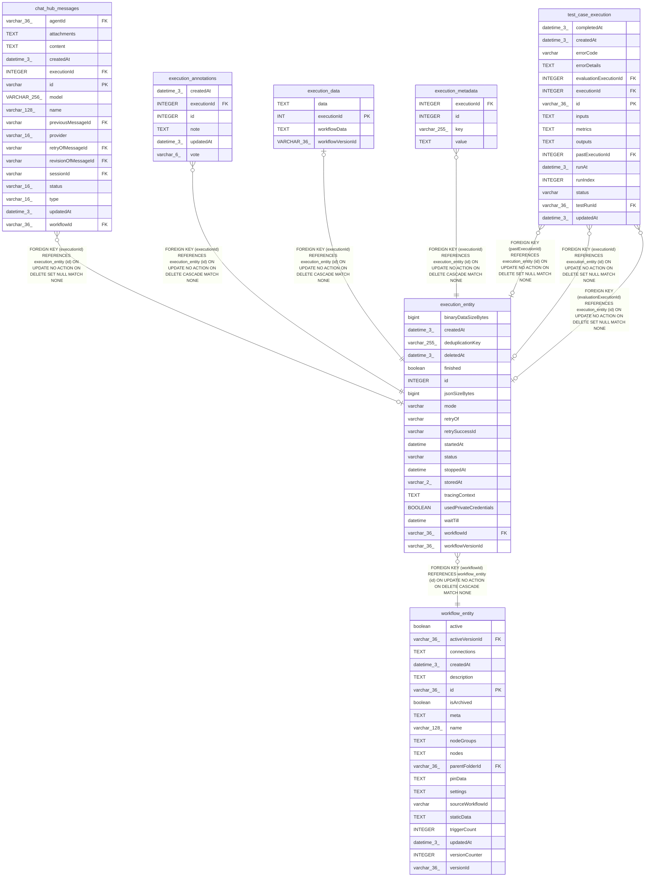

# execution_entity

## Description

<details>
<summary><strong>Table Definition</strong></summary>

```sql
CREATE TABLE "execution_entity" ("id" integer PRIMARY KEY AUTOINCREMENT NOT NULL, "workflowId" varchar(36) NOT NULL, "finished" boolean NOT NULL, "mode" varchar NOT NULL, "retryOf" varchar, "retrySuccessId" varchar, "startedAt" datetime, "stoppedAt" datetime, "waitTill" datetime, "status" varchar NOT NULL, "deletedAt" datetime(3), "createdAt" datetime(3) NOT NULL DEFAULT (STRFTIME('%Y-%m-%d %H:%M:%f', 'NOW')), "storedAt" varchar(2) NOT NULL DEFAULT ('db'), "tracingContext" text, "deduplicationKey" varchar(255), "jsonSizeBytes" bigint NOT NULL DEFAULT (0), "workflowVersionId" varchar(36) DEFAULT (NULL), "binaryDataSizeBytes" bigint NOT NULL DEFAULT (0), "usedPrivateCredentials" BOOLEAN NOT NULL DEFAULT FALSE, CONSTRAINT "CHK_execution_entity_storedAt" CHECK ("storedAt" IN ('db', 'fs', 's3', 'az')), CONSTRAINT "FK_c4d999a5e90784e8caccf5589de" FOREIGN KEY ("workflowId") REFERENCES "workflow_entity" ("id") ON DELETE CASCADE ON UPDATE NO ACTION)
```

</details>

## Columns

| Name | Type | Default | Nullable | Children | Parents | Comment |
| ---- | ---- | ------- | -------- | -------- | ------- | ------- |
| binaryDataSizeBytes | bigint | 0 | false |  |  |  |
| createdAt | datetime(3) | STRFTIME('%Y-%m-%d %H:%M:%f', 'NOW') | false |  |  |  |
| deduplicationKey | varchar(255) |  | true |  |  |  |
| deletedAt | datetime(3) |  | true |  |  |  |
| finished | boolean |  | false |  |  |  |
| id | INTEGER |  | false | [chat_hub_messages](chat_hub_messages.md) [execution_annotations](execution_annotations.md) [execution_data](execution_data.md) [execution_metadata](execution_metadata.md) [test_case_execution](test_case_execution.md) |  |  |
| jsonSizeBytes | bigint | 0 | false |  |  |  |
| mode | varchar |  | false |  |  |  |
| retryOf | varchar |  | true |  |  |  |
| retrySuccessId | varchar |  | true |  |  |  |
| startedAt | datetime |  | true |  |  |  |
| status | varchar |  | false |  |  |  |
| stoppedAt | datetime |  | true |  |  |  |
| storedAt | varchar(2) | 'db' | false |  |  |  |
| tracingContext | TEXT |  | true |  |  |  |
| usedPrivateCredentials | BOOLEAN | FALSE | false |  |  |  |
| waitTill | datetime |  | true |  |  |  |
| workflowId | varchar(36) |  | false |  | [workflow_entity](workflow_entity.md) |  |
| workflowVersionId | varchar(36) | NULL | true |  |  |  |

## Constraints

| Name | Type | Definition |
| ---- | ---- | ---------- |
| - | CHECK | CHECK ("storedAt" IN ('db', 'fs', 's3', 'az')) |
| - (Foreign key ID: 0) | FOREIGN KEY | FOREIGN KEY (workflowId) REFERENCES workflow_entity (id) ON UPDATE NO ACTION ON DELETE CASCADE MATCH NONE |
| id | PRIMARY KEY | PRIMARY KEY (id) |

## Indexes

| Name | Definition |
| ---- | ---------- |
| IDX_execution_entity_deduplicationKey | CREATE UNIQUE INDEX "IDX_execution_entity_deduplicationKey" ON "execution_entity" ("deduplicationKey") WHERE "deduplicationKey" IS NOT NULL |
| IDX_execution_entity_deletedAt | CREATE INDEX "IDX_execution_entity_deletedAt" ON "execution_entity" ("deletedAt")  |
| IDX_execution_entity_stoppedAt | CREATE INDEX "IDX_execution_entity_stoppedAt" ON "execution_entity" ("stoppedAt")  |

## Relations



---

> Generated by [tbls](https://github.com/k1LoW/tbls)
