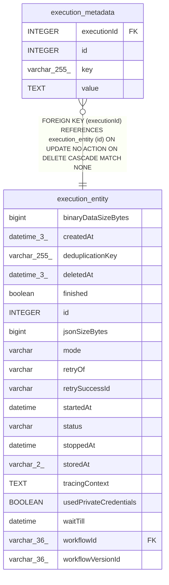

# execution_metadata

## Description

<details>
<summary><strong>Table Definition</strong></summary>

```sql
CREATE TABLE "execution_metadata" ("id" integer PRIMARY KEY AUTOINCREMENT NOT NULL, "executionId" integer NOT NULL, "key" varchar(255) NOT NULL, "value" text NOT NULL, CONSTRAINT "FK_31d0b4c93fb85ced26f6005cda3" FOREIGN KEY ("executionId") REFERENCES "execution_entity" ("id") ON DELETE CASCADE)
```

</details>

## Columns

| Name | Type | Default | Nullable | Children | Parents | Comment |
| ---- | ---- | ------- | -------- | -------- | ------- | ------- |
| executionId | INTEGER |  | false |  | [execution_entity](execution_entity.md) |  |
| id | INTEGER |  | false |  |  |  |
| key | varchar(255) |  | false |  |  |  |
| value | TEXT |  | false |  |  |  |

## Constraints

| Name | Type | Definition |
| ---- | ---- | ---------- |
| - (Foreign key ID: 0) | FOREIGN KEY | FOREIGN KEY (executionId) REFERENCES execution_entity (id) ON UPDATE NO ACTION ON DELETE CASCADE MATCH NONE |
| id | PRIMARY KEY | PRIMARY KEY (id) |

## Indexes

| Name | Definition |
| ---- | ---------- |
| IDX_cec8eea3bf49551482ccb4933e | CREATE UNIQUE INDEX "IDX_cec8eea3bf49551482ccb4933e" ON "execution_metadata" ("executionId", "key")  |

## Relations



---

> Generated by [tbls](https://github.com/k1LoW/tbls)
