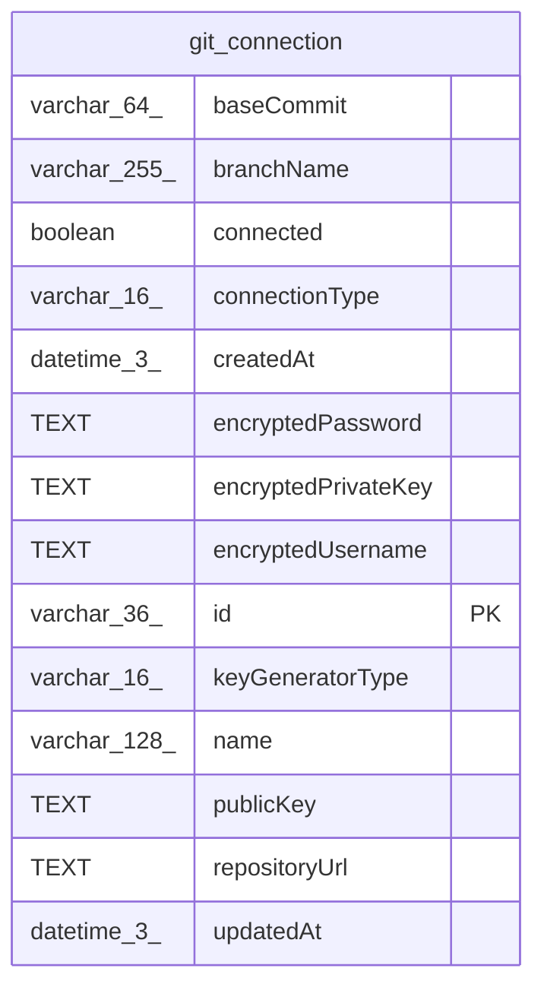

# git_connection

## Description

<details>
<summary><strong>Table Definition</strong></summary>

```sql
CREATE TABLE "git_connection" ("id" varchar(36) PRIMARY KEY NOT NULL, "name" varchar(128) NOT NULL, "repositoryUrl" text NOT NULL, "branchName" varchar(255), "connectionType" varchar(16) NOT NULL, "connected" boolean NOT NULL DEFAULT (false), "publicKey" text, "encryptedPrivateKey" text, "encryptedUsername" text, "encryptedPassword" text, "keyGeneratorType" varchar(16), "baseCommit" varchar(64), "createdAt" datetime(3) NOT NULL DEFAULT (STRFTIME('%Y-%m-%d %H:%M:%f', 'NOW')), "updatedAt" datetime(3) NOT NULL DEFAULT (STRFTIME('%Y-%m-%d %H:%M:%f', 'NOW')), CONSTRAINT "CHK_git_connection_connectionType" CHECK ("connectionType" IN ('ssh', 'https')), CONSTRAINT "CHK_git_connection_keyGeneratorType" CHECK ("keyGeneratorType" IN ('ed25519', 'rsa')))
```

</details>

## Columns

| Name | Type | Default | Nullable | Children | Parents | Comment |
| ---- | ---- | ------- | -------- | -------- | ------- | ------- |
| baseCommit | varchar(64) |  | true |  |  |  |
| branchName | varchar(255) |  | true |  |  |  |
| connected | boolean | false | false |  |  |  |
| connectionType | varchar(16) |  | false |  |  |  |
| createdAt | datetime(3) | STRFTIME('%Y-%m-%d %H:%M:%f', 'NOW') | false |  |  |  |
| encryptedPassword | TEXT |  | true |  |  |  |
| encryptedPrivateKey | TEXT |  | true |  |  |  |
| encryptedUsername | TEXT |  | true |  |  |  |
| id | varchar(36) |  | false |  |  |  |
| keyGeneratorType | varchar(16) |  | true |  |  |  |
| name | varchar(128) |  | false |  |  |  |
| publicKey | TEXT |  | true |  |  |  |
| repositoryUrl | TEXT |  | false |  |  |  |
| updatedAt | datetime(3) | STRFTIME('%Y-%m-%d %H:%M:%f', 'NOW') | false |  |  |  |

## Constraints

| Name | Type | Definition |
| ---- | ---- | ---------- |
| - | CHECK | CHECK ("connectionType" IN ('ssh', 'https')) |
| - | CHECK | CHECK ("keyGeneratorType" IN ('ed25519', 'rsa')) |
| id | PRIMARY KEY | PRIMARY KEY (id) |
| sqlite_autoindex_git_connection_1 | PRIMARY KEY | PRIMARY KEY (id) |

## Indexes

| Name | Definition |
| ---- | ---------- |
| sqlite_autoindex_git_connection_1 | PRIMARY KEY (id) |

## Relations



---

> Generated by [tbls](https://github.com/k1LoW/tbls)
