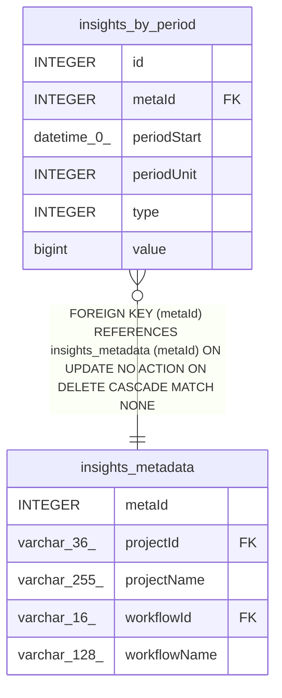

# insights_by_period

## Description

<details>
<summary><strong>Table Definition</strong></summary>

```sql
CREATE TABLE "insights_by_period" ("id" integer PRIMARY KEY NOT NULL, "metaId" integer NOT NULL, "type" integer NOT NULL, "value" bigint NOT NULL, "periodUnit" integer NOT NULL, "periodStart" datetime(0) DEFAULT (CURRENT_TIMESTAMP), CONSTRAINT "FK_e8881f2214df046dc2740260fe8" FOREIGN KEY ("metaId") REFERENCES "insights_metadata" ("metaId") ON DELETE CASCADE)
```

</details>

## Columns

| Name | Type | Default | Nullable | Children | Parents | Comment |
| ---- | ---- | ------- | -------- | -------- | ------- | ------- |
| id | INTEGER |  | false |  |  |  |
| metaId | INTEGER |  | false |  | [insights_metadata](insights_metadata.md) |  |
| periodStart | datetime(0) | CURRENT_TIMESTAMP | true |  |  |  |
| periodUnit | INTEGER |  | false |  |  |  |
| type | INTEGER |  | false |  |  |  |
| value | bigint |  | false |  |  |  |

## Constraints

| Name | Type | Definition |
| ---- | ---- | ---------- |
| - (Foreign key ID: 0) | FOREIGN KEY | FOREIGN KEY (metaId) REFERENCES insights_metadata (metaId) ON UPDATE NO ACTION ON DELETE CASCADE MATCH NONE |
| id | PRIMARY KEY | PRIMARY KEY (id) |

## Indexes

| Name | Definition |
| ---- | ---------- |
| IDX_a4da41795da1422f680c723e80 | CREATE UNIQUE INDEX "IDX_a4da41795da1422f680c723e80" ON "insights_by_period" ("periodStart", "type", "periodUnit", "metaId")  |

## Relations



---

> Generated by [tbls](https://github.com/k1LoW/tbls)
