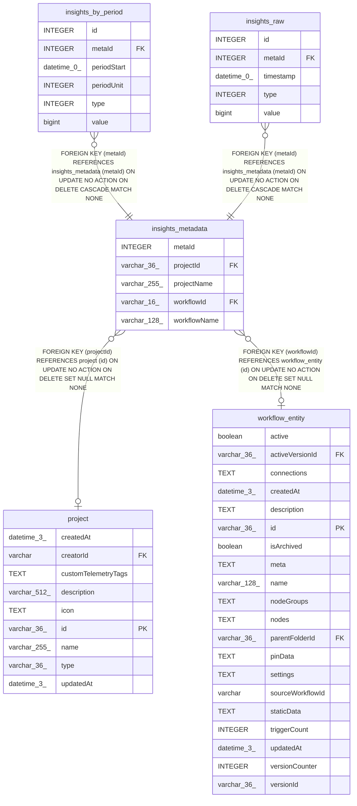

# insights_metadata

## Description

<details>
<summary><strong>Table Definition</strong></summary>

```sql
CREATE TABLE "insights_metadata" ("metaId" integer PRIMARY KEY NOT NULL, "workflowId" varchar(16), "projectId" varchar(36), "workflowName" varchar(128) NOT NULL, "projectName" varchar(255) NOT NULL, CONSTRAINT "FK_1d8ab99d5861c9388d2dc1cf733" FOREIGN KEY ("workflowId") REFERENCES "workflow_entity" ("id") ON DELETE SET NULL, CONSTRAINT "FK_2375a1eda085adb16b24615b69c" FOREIGN KEY ("projectId") REFERENCES "project" ("id") ON DELETE SET NULL)
```

</details>

## Columns

| Name | Type | Default | Nullable | Children | Parents | Comment |
| ---- | ---- | ------- | -------- | -------- | ------- | ------- |
| metaId | INTEGER |  | false | [insights_by_period](insights_by_period.md) [insights_raw](insights_raw.md) |  |  |
| projectId | varchar(36) |  | true |  | [project](project.md) |  |
| projectName | varchar(255) |  | false |  |  |  |
| workflowId | varchar(16) |  | true |  | [workflow_entity](workflow_entity.md) |  |
| workflowName | varchar(128) |  | false |  |  |  |

## Constraints

| Name | Type | Definition |
| ---- | ---- | ---------- |
| - (Foreign key ID: 0) | FOREIGN KEY | FOREIGN KEY (projectId) REFERENCES project (id) ON UPDATE NO ACTION ON DELETE SET NULL MATCH NONE |
| - (Foreign key ID: 1) | FOREIGN KEY | FOREIGN KEY (workflowId) REFERENCES workflow_entity (id) ON UPDATE NO ACTION ON DELETE SET NULL MATCH NONE |
| metaId | PRIMARY KEY | PRIMARY KEY (metaId) |

## Indexes

| Name | Definition |
| ---- | ---------- |
| IDX_1d8ab99d5861c9388d2dc1cf73 | CREATE UNIQUE INDEX "IDX_1d8ab99d5861c9388d2dc1cf73" ON "insights_metadata" ("workflowId")  |

## Relations



---

> Generated by [tbls](https://github.com/k1LoW/tbls)
