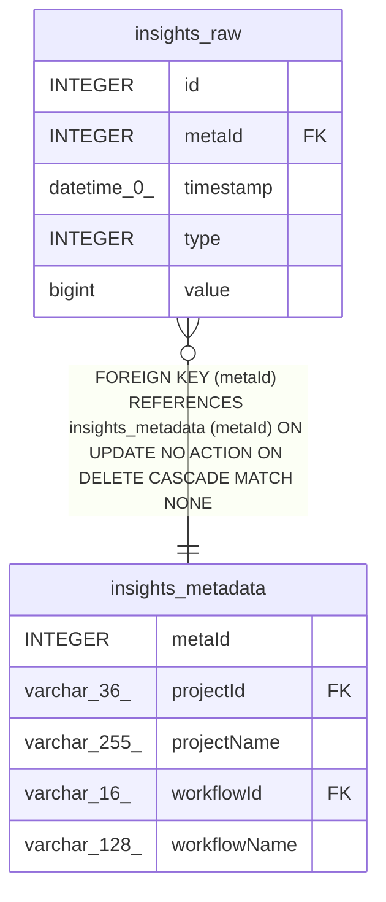

# insights_raw

## Description

<details>
<summary><strong>Table Definition</strong></summary>

```sql
CREATE TABLE "insights_raw" ("id" integer PRIMARY KEY NOT NULL, "metaId" integer NOT NULL, "type" integer NOT NULL, "value" bigint NOT NULL, "timestamp" datetime(0) NOT NULL DEFAULT (CURRENT_TIMESTAMP), CONSTRAINT "FK_d66d942bc9907488832eb0eed81" FOREIGN KEY ("metaId") REFERENCES "insights_metadata" ("metaId") ON DELETE CASCADE)
```

</details>

## Columns

| Name | Type | Default | Nullable | Children | Parents | Comment |
| ---- | ---- | ------- | -------- | -------- | ------- | ------- |
| id | INTEGER |  | false |  |  |  |
| metaId | INTEGER |  | false |  | [insights_metadata](insights_metadata.md) |  |
| timestamp | datetime(0) | CURRENT_TIMESTAMP | false |  |  |  |
| type | INTEGER |  | false |  |  |  |
| value | bigint |  | false |  |  |  |

## Constraints

| Name | Type | Definition |
| ---- | ---- | ---------- |
| - (Foreign key ID: 0) | FOREIGN KEY | FOREIGN KEY (metaId) REFERENCES insights_metadata (metaId) ON UPDATE NO ACTION ON DELETE CASCADE MATCH NONE |
| id | PRIMARY KEY | PRIMARY KEY (id) |

## Indexes

| Name | Definition |
| ---- | ---------- |
| IDX_insights_raw_timestamp_id | CREATE INDEX "IDX_insights_raw_timestamp_id" ON "insights_raw" ("timestamp", "id")  |

## Relations



---

> Generated by [tbls](https://github.com/k1LoW/tbls)
