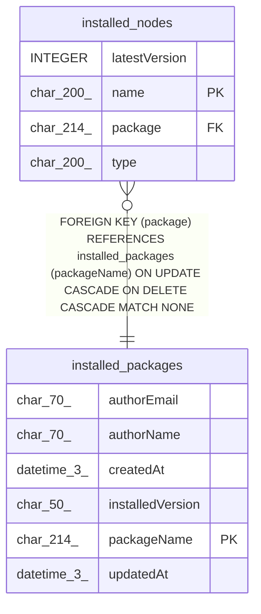

# installed_nodes

## Description

<details>
<summary><strong>Table Definition</strong></summary>

```sql
CREATE TABLE "installed_nodes" ("name"	char(200) NOT NULL,"type"	char(200) NOT NULL,"latestVersion"	INTEGER DEFAULT 1,"package"	char(214) NOT NULL,PRIMARY KEY("name"),FOREIGN KEY("package") REFERENCES "installed_packages"("packageName") ON DELETE CASCADE ON UPDATE CASCADE)
```

</details>

## Columns

| Name | Type | Default | Nullable | Children | Parents | Comment |
| ---- | ---- | ------- | -------- | -------- | ------- | ------- |
| latestVersion | INTEGER | 1 | true |  |  |  |
| name | char(200) |  | false |  |  |  |
| package | char(214) |  | false |  | [installed_packages](installed_packages.md) |  |
| type | char(200) |  | false |  |  |  |

## Constraints

| Name | Type | Definition |
| ---- | ---- | ---------- |
| - (Foreign key ID: 0) | FOREIGN KEY | FOREIGN KEY (package) REFERENCES installed_packages (packageName) ON UPDATE CASCADE ON DELETE CASCADE MATCH NONE |
| name | PRIMARY KEY | PRIMARY KEY (name) |
| sqlite_autoindex_installed_nodes_1 | PRIMARY KEY | PRIMARY KEY (name) |

## Indexes

| Name | Definition |
| ---- | ---------- |
| sqlite_autoindex_installed_nodes_1 | PRIMARY KEY (name) |

## Relations



---

> Generated by [tbls](https://github.com/k1LoW/tbls)
