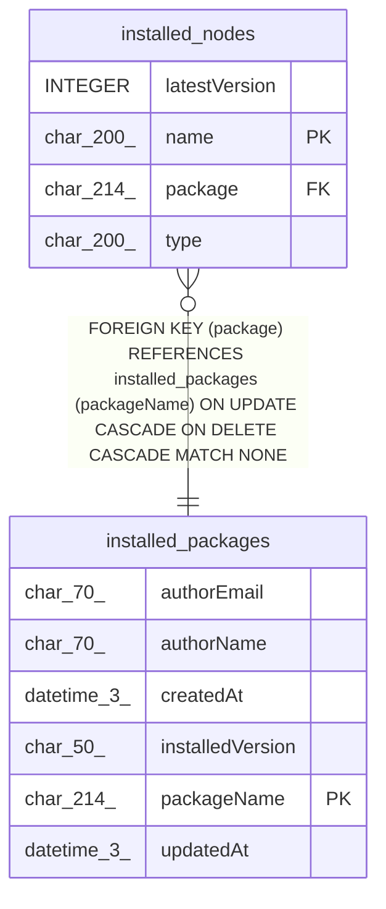

# installed_packages

## Description

<details>
<summary><strong>Table Definition</strong></summary>

```sql
CREATE TABLE "installed_packages" ("packageName"	char(214) NOT NULL,"installedVersion"	char(50) NOT NULL,"authorName"	char(70) NULL,"authorEmail"	char(70) NULL,"createdAt"	datetime(3) NOT NULL DEFAULT 'STRFTIME(''%Y-%m-%d %H:%M:%f'', ''NOW'')',"updatedAt"	datetime(3) NOT NULL DEFAULT 'STRFTIME(''%Y-%m-%d %H:%M:%f'', ''NOW'')',PRIMARY KEY("packageName"))
```

</details>

## Columns

| Name | Type | Default | Nullable | Children | Parents | Comment |
| ---- | ---- | ------- | -------- | -------- | ------- | ------- |
| authorEmail | char(70) |  | true |  |  |  |
| authorName | char(70) |  | true |  |  |  |
| createdAt | datetime(3) | 'STRFTIME(''%Y-%m-%d %H:%M:%f'', ''NOW'')' | false |  |  |  |
| installedVersion | char(50) |  | false |  |  |  |
| packageName | char(214) |  | false | [installed_nodes](installed_nodes.md) |  |  |
| updatedAt | datetime(3) | 'STRFTIME(''%Y-%m-%d %H:%M:%f'', ''NOW'')' | false |  |  |  |

## Constraints

| Name | Type | Definition |
| ---- | ---- | ---------- |
| packageName | PRIMARY KEY | PRIMARY KEY (packageName) |
| sqlite_autoindex_installed_packages_1 | PRIMARY KEY | PRIMARY KEY (packageName) |

## Indexes

| Name | Definition |
| ---- | ---------- |
| sqlite_autoindex_installed_packages_1 | PRIMARY KEY (packageName) |

## Relations



---

> Generated by [tbls](https://github.com/k1LoW/tbls)
