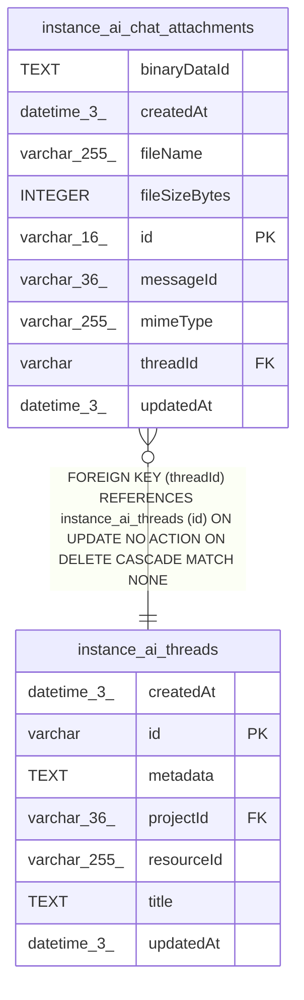

# instance_ai_chat_attachments

## Description

<details>
<summary><strong>Table Definition</strong></summary>

```sql
CREATE TABLE "instance_ai_chat_attachments" ("id" varchar(16) PRIMARY KEY NOT NULL, "threadId" varchar NOT NULL, "messageId" varchar(36), "binaryDataId" text NOT NULL, "fileName" varchar(255) NOT NULL, "mimeType" varchar(255) NOT NULL, "fileSizeBytes" integer NOT NULL, "createdAt" datetime(3) NOT NULL DEFAULT (STRFTIME('%Y-%m-%d %H:%M:%f', 'NOW')), "updatedAt" datetime(3) NOT NULL DEFAULT (STRFTIME('%Y-%m-%d %H:%M:%f', 'NOW')), CONSTRAINT "FK_a34dafe1cb4d3bce8e4d327d43b" FOREIGN KEY ("threadId") REFERENCES "instance_ai_threads" ("id") ON DELETE CASCADE)
```

</details>

## Columns

| Name | Type | Default | Nullable | Children | Parents | Comment |
| ---- | ---- | ------- | -------- | -------- | ------- | ------- |
| binaryDataId | TEXT |  | false |  |  |  |
| createdAt | datetime(3) | STRFTIME('%Y-%m-%d %H:%M:%f', 'NOW') | false |  |  |  |
| fileName | varchar(255) |  | false |  |  |  |
| fileSizeBytes | INTEGER |  | false |  |  |  |
| id | varchar(16) |  | false |  |  |  |
| messageId | varchar(36) |  | true |  |  |  |
| mimeType | varchar(255) |  | false |  |  |  |
| threadId | varchar |  | false |  | [instance_ai_threads](instance_ai_threads.md) |  |
| updatedAt | datetime(3) | STRFTIME('%Y-%m-%d %H:%M:%f', 'NOW') | false |  |  |  |

## Constraints

| Name | Type | Definition |
| ---- | ---- | ---------- |
| - (Foreign key ID: 0) | FOREIGN KEY | FOREIGN KEY (threadId) REFERENCES instance_ai_threads (id) ON UPDATE NO ACTION ON DELETE CASCADE MATCH NONE |
| id | PRIMARY KEY | PRIMARY KEY (id) |
| sqlite_autoindex_instance_ai_chat_attachments_1 | PRIMARY KEY | PRIMARY KEY (id) |

## Indexes

| Name | Definition |
| ---- | ---------- |
| IDX_a34dafe1cb4d3bce8e4d327d43 | CREATE INDEX "IDX_a34dafe1cb4d3bce8e4d327d43" ON "instance_ai_chat_attachments" ("threadId")  |
| sqlite_autoindex_instance_ai_chat_attachments_1 | PRIMARY KEY (id) |

## Relations



---

> Generated by [tbls](https://github.com/k1LoW/tbls)
