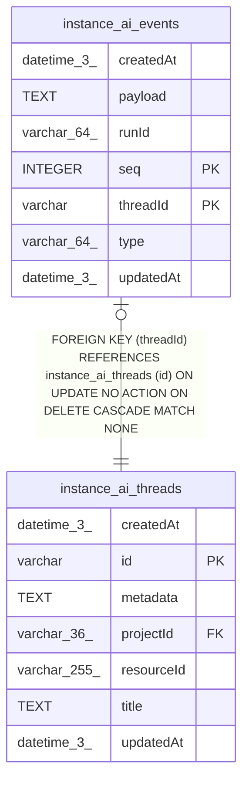

# instance_ai_events

## Description

<details>
<summary><strong>Table Definition</strong></summary>

```sql
CREATE TABLE "instance_ai_events" ("threadId" varchar NOT NULL, "seq" integer NOT NULL, "runId" varchar(64) NOT NULL, "type" varchar(64) NOT NULL, "payload" text NOT NULL, "createdAt" datetime(3) NOT NULL DEFAULT (STRFTIME('%Y-%m-%d %H:%M:%f', 'NOW')), "updatedAt" datetime(3) NOT NULL DEFAULT (STRFTIME('%Y-%m-%d %H:%M:%f', 'NOW')), CONSTRAINT "FK_35909c5576a4a6c1d6a6fb71caa" FOREIGN KEY ("threadId") REFERENCES "instance_ai_threads" ("id") ON DELETE CASCADE, PRIMARY KEY ("threadId", "seq"))
```

</details>

## Columns

| Name | Type | Default | Nullable | Children | Parents | Comment |
| ---- | ---- | ------- | -------- | -------- | ------- | ------- |
| createdAt | datetime(3) | STRFTIME('%Y-%m-%d %H:%M:%f', 'NOW') | false |  |  |  |
| payload | TEXT |  | false |  |  |  |
| runId | varchar(64) |  | false |  |  |  |
| seq | INTEGER |  | false |  |  |  |
| threadId | varchar |  | false |  | [instance_ai_threads](instance_ai_threads.md) |  |
| type | varchar(64) |  | false |  |  |  |
| updatedAt | datetime(3) | STRFTIME('%Y-%m-%d %H:%M:%f', 'NOW') | false |  |  |  |

## Constraints

| Name | Type | Definition |
| ---- | ---- | ---------- |
| - (Foreign key ID: 0) | FOREIGN KEY | FOREIGN KEY (threadId) REFERENCES instance_ai_threads (id) ON UPDATE NO ACTION ON DELETE CASCADE MATCH NONE |
| seq | PRIMARY KEY | PRIMARY KEY (seq) |
| sqlite_autoindex_instance_ai_events_1 | PRIMARY KEY | PRIMARY KEY (threadId, seq) |
| threadId | PRIMARY KEY | PRIMARY KEY (threadId) |

## Indexes

| Name | Definition |
| ---- | ---------- |
| IDX_32cdd799675715fb1d2a8683e9 | CREATE INDEX "IDX_32cdd799675715fb1d2a8683e9" ON "instance_ai_events" ("threadId", "runId")  |
| sqlite_autoindex_instance_ai_events_1 | PRIMARY KEY (threadId, seq) |

## Relations



---

> Generated by [tbls](https://github.com/k1LoW/tbls)
