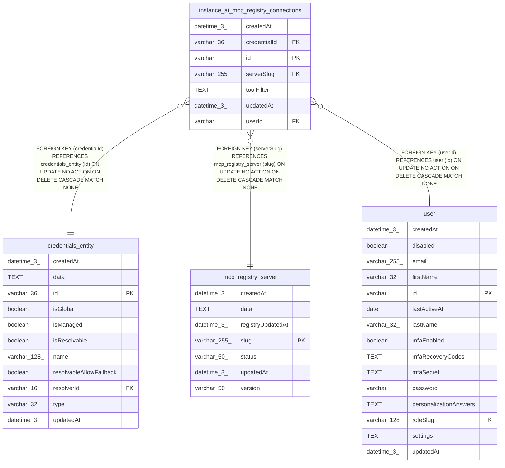

# instance_ai_mcp_registry_connections

## Description

<details>
<summary><strong>Table Definition</strong></summary>

```sql
CREATE TABLE "instance_ai_mcp_registry_connections" ("id" varchar PRIMARY KEY NOT NULL, "credentialId" varchar(36) NOT NULL, "serverSlug" varchar(255) NOT NULL, "toolFilter" text, "userId" varchar NOT NULL, "createdAt" datetime(3) NOT NULL DEFAULT (STRFTIME('%Y-%m-%d %H:%M:%f', 'NOW')), "updatedAt" datetime(3) NOT NULL DEFAULT (STRFTIME('%Y-%m-%d %H:%M:%f', 'NOW')), CONSTRAINT "FK_1e826120e7e53ebc4681f026de8" FOREIGN KEY ("credentialId") REFERENCES "credentials_entity" ("id") ON DELETE CASCADE, CONSTRAINT "FK_1d25707354d2012da256eb2ec0a" FOREIGN KEY ("serverSlug") REFERENCES "mcp_registry_server" ("slug") ON DELETE CASCADE, CONSTRAINT "FK_8b42c08a531d76410980c639a5b" FOREIGN KEY ("userId") REFERENCES "user" ("id") ON DELETE CASCADE)
```

</details>

## Columns

| Name | Type | Default | Nullable | Children | Parents | Comment |
| ---- | ---- | ------- | -------- | -------- | ------- | ------- |
| createdAt | datetime(3) | STRFTIME('%Y-%m-%d %H:%M:%f', 'NOW') | false |  |  |  |
| credentialId | varchar(36) |  | false |  | [credentials_entity](credentials_entity.md) |  |
| id | varchar |  | false |  |  |  |
| serverSlug | varchar(255) |  | false |  | [mcp_registry_server](mcp_registry_server.md) |  |
| toolFilter | TEXT |  | true |  |  |  |
| updatedAt | datetime(3) | STRFTIME('%Y-%m-%d %H:%M:%f', 'NOW') | false |  |  |  |
| userId | varchar |  | false |  | [user](user.md) |  |

## Constraints

| Name | Type | Definition |
| ---- | ---- | ---------- |
| - (Foreign key ID: 0) | FOREIGN KEY | FOREIGN KEY (userId) REFERENCES user (id) ON UPDATE NO ACTION ON DELETE CASCADE MATCH NONE |
| - (Foreign key ID: 1) | FOREIGN KEY | FOREIGN KEY (serverSlug) REFERENCES mcp_registry_server (slug) ON UPDATE NO ACTION ON DELETE CASCADE MATCH NONE |
| - (Foreign key ID: 2) | FOREIGN KEY | FOREIGN KEY (credentialId) REFERENCES credentials_entity (id) ON UPDATE NO ACTION ON DELETE CASCADE MATCH NONE |
| id | PRIMARY KEY | PRIMARY KEY (id) |
| sqlite_autoindex_instance_ai_mcp_registry_connections_1 | PRIMARY KEY | PRIMARY KEY (id) |

## Indexes

| Name | Definition |
| ---- | ---------- |
| IDX_16db3adb7b19df1ee55ff06b27 | CREATE UNIQUE INDEX "IDX_16db3adb7b19df1ee55ff06b27" ON "instance_ai_mcp_registry_connections" ("userId", "serverSlug", "credentialId")  |
| sqlite_autoindex_instance_ai_mcp_registry_connections_1 | PRIMARY KEY (id) |

## Relations



---

> Generated by [tbls](https://github.com/k1LoW/tbls)
