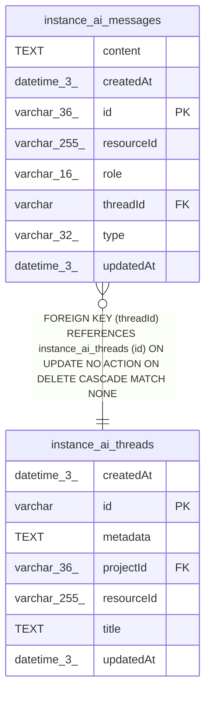

# instance_ai_messages

## Description

<details>
<summary><strong>Table Definition</strong></summary>

```sql
CREATE TABLE "instance_ai_messages" ("id" varchar(36) PRIMARY KEY NOT NULL, "threadId" varchar NOT NULL, "content" text NOT NULL, "role" varchar(16) NOT NULL, "type" varchar(32), "resourceId" varchar(255), "createdAt" datetime(3) NOT NULL DEFAULT (STRFTIME('%Y-%m-%d %H:%M:%f', 'NOW')), "updatedAt" datetime(3) NOT NULL DEFAULT (STRFTIME('%Y-%m-%d %H:%M:%f', 'NOW')), CONSTRAINT "FK_1eeb64cb9d66a927988de759e6e" FOREIGN KEY ("threadId") REFERENCES "instance_ai_threads" ("id") ON DELETE CASCADE)
```

</details>

## Columns

| Name | Type | Default | Nullable | Children | Parents | Comment |
| ---- | ---- | ------- | -------- | -------- | ------- | ------- |
| content | TEXT |  | false |  |  |  |
| createdAt | datetime(3) | STRFTIME('%Y-%m-%d %H:%M:%f', 'NOW') | false |  |  |  |
| id | varchar(36) |  | false |  |  |  |
| resourceId | varchar(255) |  | true |  |  |  |
| role | varchar(16) |  | false |  |  |  |
| threadId | varchar |  | false |  | [instance_ai_threads](instance_ai_threads.md) |  |
| type | varchar(32) |  | true |  |  |  |
| updatedAt | datetime(3) | STRFTIME('%Y-%m-%d %H:%M:%f', 'NOW') | false |  |  |  |

## Constraints

| Name | Type | Definition |
| ---- | ---- | ---------- |
| - (Foreign key ID: 0) | FOREIGN KEY | FOREIGN KEY (threadId) REFERENCES instance_ai_threads (id) ON UPDATE NO ACTION ON DELETE CASCADE MATCH NONE |
| id | PRIMARY KEY | PRIMARY KEY (id) |
| sqlite_autoindex_instance_ai_messages_1 | PRIMARY KEY | PRIMARY KEY (id) |

## Indexes

| Name | Definition |
| ---- | ---------- |
| IDX_1eeb64cb9d66a927988de759e6 | CREATE INDEX "IDX_1eeb64cb9d66a927988de759e6" ON "instance_ai_messages" ("threadId")  |
| IDX_76e212c6867fbaa06bf0decd6f | CREATE INDEX "IDX_76e212c6867fbaa06bf0decd6f" ON "instance_ai_messages" ("resourceId")  |
| sqlite_autoindex_instance_ai_messages_1 | PRIMARY KEY (id) |

## Relations



---

> Generated by [tbls](https://github.com/k1LoW/tbls)
