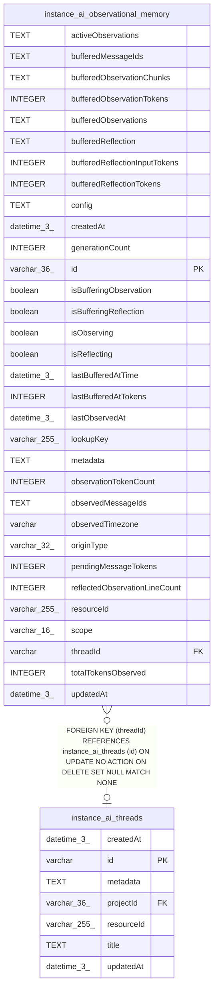

# instance_ai_observational_memory

## Description

<details>
<summary><strong>Table Definition</strong></summary>

```sql
CREATE TABLE "instance_ai_observational_memory" ("id" varchar(36) PRIMARY KEY NOT NULL, "lookupKey" varchar(255) NOT NULL, "scope" varchar(16) NOT NULL, "threadId" varchar, "resourceId" varchar(255) NOT NULL, "activeObservations" text NOT NULL DEFAULT (''), "originType" varchar(32) NOT NULL, "config" text NOT NULL, "generationCount" integer NOT NULL DEFAULT (0), "lastObservedAt" datetime(3), "pendingMessageTokens" integer NOT NULL DEFAULT (0), "totalTokensObserved" integer NOT NULL DEFAULT (0), "observationTokenCount" integer NOT NULL DEFAULT (0), "isObserving" boolean NOT NULL DEFAULT (false), "isReflecting" boolean NOT NULL DEFAULT (false), "observedMessageIds" text, "observedTimezone" varchar, "bufferedObservations" text, "bufferedObservationTokens" integer, "bufferedMessageIds" text, "bufferedReflection" text, "bufferedReflectionTokens" integer, "bufferedReflectionInputTokens" integer, "reflectedObservationLineCount" integer, "bufferedObservationChunks" text, "isBufferingObservation" boolean NOT NULL DEFAULT (false), "isBufferingReflection" boolean NOT NULL DEFAULT (false), "lastBufferedAtTokens" integer NOT NULL DEFAULT (0), "lastBufferedAtTime" datetime(3), "metadata" text, "createdAt" datetime(3) NOT NULL DEFAULT (STRFTIME('%Y-%m-%d %H:%M:%f', 'NOW')), "updatedAt" datetime(3) NOT NULL DEFAULT (STRFTIME('%Y-%m-%d %H:%M:%f', 'NOW')), CONSTRAINT "FK_34018c303885cd37093458e6409" FOREIGN KEY ("threadId") REFERENCES "instance_ai_threads" ("id") ON DELETE SET NULL)
```

</details>

## Columns

| Name | Type | Default | Nullable | Children | Parents | Comment |
| ---- | ---- | ------- | -------- | -------- | ------- | ------- |
| activeObservations | TEXT | '' | false |  |  |  |
| bufferedMessageIds | TEXT |  | true |  |  |  |
| bufferedObservationChunks | TEXT |  | true |  |  |  |
| bufferedObservationTokens | INTEGER |  | true |  |  |  |
| bufferedObservations | TEXT |  | true |  |  |  |
| bufferedReflection | TEXT |  | true |  |  |  |
| bufferedReflectionInputTokens | INTEGER |  | true |  |  |  |
| bufferedReflectionTokens | INTEGER |  | true |  |  |  |
| config | TEXT |  | false |  |  |  |
| createdAt | datetime(3) | STRFTIME('%Y-%m-%d %H:%M:%f', 'NOW') | false |  |  |  |
| generationCount | INTEGER | 0 | false |  |  |  |
| id | varchar(36) |  | false |  |  |  |
| isBufferingObservation | boolean | false | false |  |  |  |
| isBufferingReflection | boolean | false | false |  |  |  |
| isObserving | boolean | false | false |  |  |  |
| isReflecting | boolean | false | false |  |  |  |
| lastBufferedAtTime | datetime(3) |  | true |  |  |  |
| lastBufferedAtTokens | INTEGER | 0 | false |  |  |  |
| lastObservedAt | datetime(3) |  | true |  |  |  |
| lookupKey | varchar(255) |  | false |  |  |  |
| metadata | TEXT |  | true |  |  |  |
| observationTokenCount | INTEGER | 0 | false |  |  |  |
| observedMessageIds | TEXT |  | true |  |  |  |
| observedTimezone | varchar |  | true |  |  |  |
| originType | varchar(32) |  | false |  |  |  |
| pendingMessageTokens | INTEGER | 0 | false |  |  |  |
| reflectedObservationLineCount | INTEGER |  | true |  |  |  |
| resourceId | varchar(255) |  | false |  |  |  |
| scope | varchar(16) |  | false |  |  |  |
| threadId | varchar |  | true |  | [instance_ai_threads](instance_ai_threads.md) |  |
| totalTokensObserved | INTEGER | 0 | false |  |  |  |
| updatedAt | datetime(3) | STRFTIME('%Y-%m-%d %H:%M:%f', 'NOW') | false |  |  |  |

## Constraints

| Name | Type | Definition |
| ---- | ---- | ---------- |
| - (Foreign key ID: 0) | FOREIGN KEY | FOREIGN KEY (threadId) REFERENCES instance_ai_threads (id) ON UPDATE NO ACTION ON DELETE SET NULL MATCH NONE |
| id | PRIMARY KEY | PRIMARY KEY (id) |
| sqlite_autoindex_instance_ai_observational_memory_1 | PRIMARY KEY | PRIMARY KEY (id) |

## Indexes

| Name | Definition |
| ---- | ---------- |
| IDX_92f13cb6bc694227e069447f7b | CREATE INDEX "IDX_92f13cb6bc694227e069447f7b" ON "instance_ai_observational_memory" ("lookupKey")  |
| IDX_a680ac96aae02dc887bbaac512 | CREATE UNIQUE INDEX "IDX_a680ac96aae02dc887bbaac512" ON "instance_ai_observational_memory" ("scope", "threadId", "resourceId")  |
| sqlite_autoindex_instance_ai_observational_memory_1 | PRIMARY KEY (id) |

## Relations



---

> Generated by [tbls](https://github.com/k1LoW/tbls)
