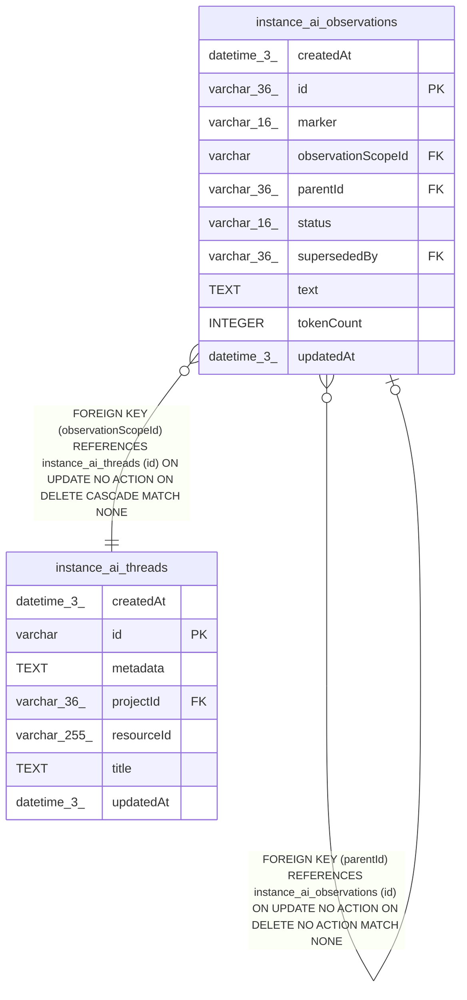

# instance_ai_observations

## Description

<details>
<summary><strong>Table Definition</strong></summary>

```sql
CREATE TABLE "instance_ai_observations" ("id" varchar(36) PRIMARY KEY NOT NULL, "observationScopeId" varchar NOT NULL, "marker" varchar(16) NOT NULL, "text" text NOT NULL, "parentId" varchar(36), "tokenCount" integer NOT NULL DEFAULT (0), "status" varchar(16) NOT NULL, "supersededBy" varchar(36), "createdAt" datetime(3) NOT NULL DEFAULT (STRFTIME('%Y-%m-%d %H:%M:%f', 'NOW')), "updatedAt" datetime(3) NOT NULL DEFAULT (STRFTIME('%Y-%m-%d %H:%M:%f', 'NOW')), CONSTRAINT "CHK_instance_ai_observations_marker" CHECK ("marker" IN ('critical', 'important', 'info', 'completion')), CONSTRAINT "CHK_instance_ai_observations_status" CHECK ("status" IN ('active', 'superseded', 'dropped')), CONSTRAINT "FK_d54fc84a6c8ac91b5e0db0378a4" FOREIGN KEY ("observationScopeId") REFERENCES "instance_ai_threads" ("id") ON DELETE CASCADE, CONSTRAINT "FK_daef2195a4a846eb70eed15e039" FOREIGN KEY ("parentId") REFERENCES "instance_ai_observations" ("id"), CONSTRAINT "FK_a80e0ee839a2f10ba4b86e19998" FOREIGN KEY ("supersededBy") REFERENCES "instance_ai_observations" ("id"))
```

</details>

## Columns

| Name | Type | Default | Nullable | Children | Parents | Comment |
| ---- | ---- | ------- | -------- | -------- | ------- | ------- |
| createdAt | datetime(3) | STRFTIME('%Y-%m-%d %H:%M:%f', 'NOW') | false |  |  |  |
| id | varchar(36) |  | false | [instance_ai_observations](instance_ai_observations.md) |  |  |
| marker | varchar(16) |  | false |  |  |  |
| observationScopeId | varchar |  | false |  | [instance_ai_threads](instance_ai_threads.md) |  |
| parentId | varchar(36) |  | true |  | [instance_ai_observations](instance_ai_observations.md) |  |
| status | varchar(16) |  | false |  |  |  |
| supersededBy | varchar(36) |  | true |  | [instance_ai_observations](instance_ai_observations.md) |  |
| text | TEXT |  | false |  |  |  |
| tokenCount | INTEGER | 0 | false |  |  |  |
| updatedAt | datetime(3) | STRFTIME('%Y-%m-%d %H:%M:%f', 'NOW') | false |  |  |  |

## Constraints

| Name | Type | Definition |
| ---- | ---- | ---------- |
| - | CHECK | CHECK ("marker" IN ('critical', 'important', 'info', 'completion')) |
| - | CHECK | CHECK ("status" IN ('active', 'superseded', 'dropped')) |
| - (Foreign key ID: 0) | FOREIGN KEY | FOREIGN KEY (supersededBy) REFERENCES instance_ai_observations (id) ON UPDATE NO ACTION ON DELETE NO ACTION MATCH NONE |
| - (Foreign key ID: 1) | FOREIGN KEY | FOREIGN KEY (parentId) REFERENCES instance_ai_observations (id) ON UPDATE NO ACTION ON DELETE NO ACTION MATCH NONE |
| - (Foreign key ID: 2) | FOREIGN KEY | FOREIGN KEY (observationScopeId) REFERENCES instance_ai_threads (id) ON UPDATE NO ACTION ON DELETE CASCADE MATCH NONE |
| id | PRIMARY KEY | PRIMARY KEY (id) |
| sqlite_autoindex_instance_ai_observations_1 | PRIMARY KEY | PRIMARY KEY (id) |

## Indexes

| Name | Definition |
| ---- | ---------- |
| IDX_0d5db648188d338df7fb2a8064 | CREATE INDEX "IDX_0d5db648188d338df7fb2a8064" ON "instance_ai_observations" ("observationScopeId", "status", "createdAt", "id")  |
| IDX_a80e0ee839a2f10ba4b86e1999 | CREATE INDEX "IDX_a80e0ee839a2f10ba4b86e1999" ON "instance_ai_observations" ("supersededBy")  |
| IDX_daef2195a4a846eb70eed15e03 | CREATE INDEX "IDX_daef2195a4a846eb70eed15e03" ON "instance_ai_observations" ("parentId")  |
| sqlite_autoindex_instance_ai_observations_1 | PRIMARY KEY (id) |

## Relations



---

> Generated by [tbls](https://github.com/k1LoW/tbls)
