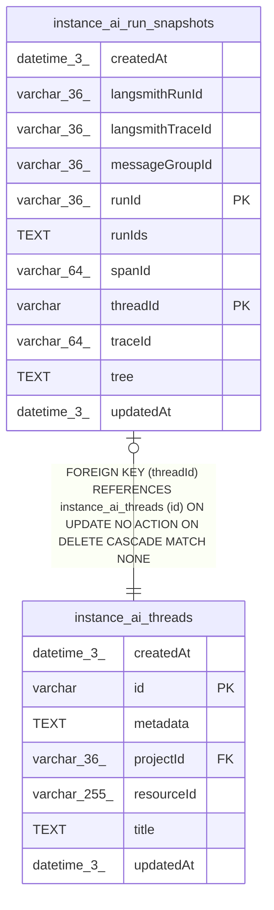

# instance_ai_run_snapshots

## Description

<details>
<summary><strong>Table Definition</strong></summary>

```sql
CREATE TABLE "instance_ai_run_snapshots" ("threadId" varchar NOT NULL, "runId" varchar(36) NOT NULL, "messageGroupId" varchar(36), "runIds" text, "tree" text NOT NULL, "createdAt" datetime(3) NOT NULL DEFAULT (STRFTIME('%Y-%m-%d %H:%M:%f', 'NOW')), "updatedAt" datetime(3) NOT NULL DEFAULT (STRFTIME('%Y-%m-%d %H:%M:%f', 'NOW')), "langsmithRunId" varchar(36), "langsmithTraceId" varchar(36), "traceId" varchar(64), "spanId" varchar(64), CONSTRAINT "FK_2f63fa21d09d7918f347ddbdf70" FOREIGN KEY ("threadId") REFERENCES "instance_ai_threads" ("id") ON DELETE CASCADE ON UPDATE NO ACTION, PRIMARY KEY ("threadId", "runId"))
```

</details>

## Columns

| Name | Type | Default | Nullable | Children | Parents | Comment |
| ---- | ---- | ------- | -------- | -------- | ------- | ------- |
| createdAt | datetime(3) | STRFTIME('%Y-%m-%d %H:%M:%f', 'NOW') | false |  |  |  |
| langsmithRunId | varchar(36) |  | true |  |  |  |
| langsmithTraceId | varchar(36) |  | true |  |  |  |
| messageGroupId | varchar(36) |  | true |  |  |  |
| runId | varchar(36) |  | false |  |  |  |
| runIds | TEXT |  | true |  |  |  |
| spanId | varchar(64) |  | true |  |  |  |
| threadId | varchar |  | false |  | [instance_ai_threads](instance_ai_threads.md) |  |
| traceId | varchar(64) |  | true |  |  |  |
| tree | TEXT |  | false |  |  |  |
| updatedAt | datetime(3) | STRFTIME('%Y-%m-%d %H:%M:%f', 'NOW') | false |  |  |  |

## Constraints

| Name | Type | Definition |
| ---- | ---- | ---------- |
| - (Foreign key ID: 0) | FOREIGN KEY | FOREIGN KEY (threadId) REFERENCES instance_ai_threads (id) ON UPDATE NO ACTION ON DELETE CASCADE MATCH NONE |
| runId | PRIMARY KEY | PRIMARY KEY (runId) |
| sqlite_autoindex_instance_ai_run_snapshots_1 | PRIMARY KEY | PRIMARY KEY (threadId, runId) |
| threadId | PRIMARY KEY | PRIMARY KEY (threadId) |

## Indexes

| Name | Definition |
| ---- | ---------- |
| IDX_d3a2bc880e7a8626802e5474ad | CREATE INDEX "IDX_d3a2bc880e7a8626802e5474ad" ON "instance_ai_run_snapshots" ("threadId", "createdAt")  |
| IDX_d926c16c2ad9728cb9a81790c0 | CREATE INDEX "IDX_d926c16c2ad9728cb9a81790c0" ON "instance_ai_run_snapshots" ("threadId", "messageGroupId")  |
| sqlite_autoindex_instance_ai_run_snapshots_1 | PRIMARY KEY (threadId, runId) |

## Relations



---

> Generated by [tbls](https://github.com/k1LoW/tbls)
