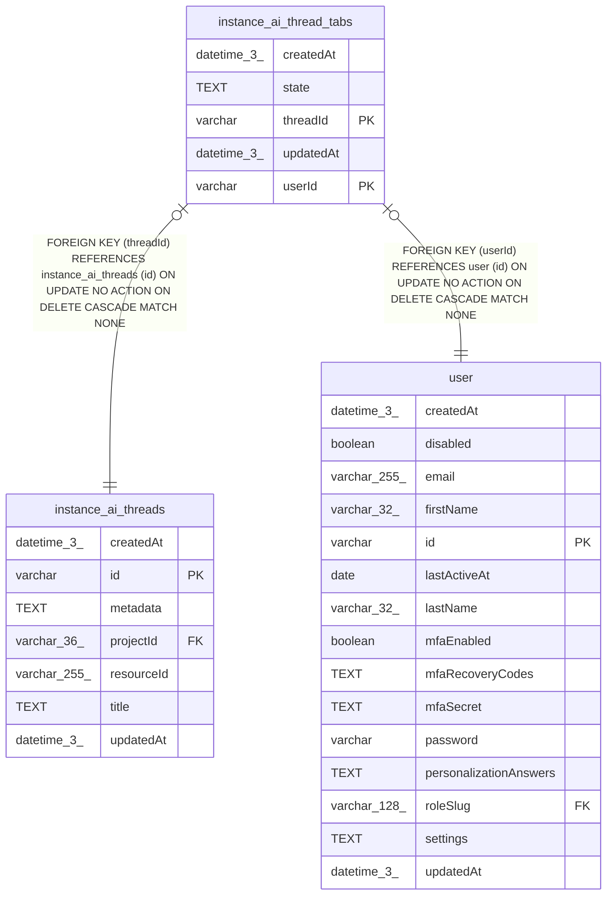

# instance_ai_thread_tabs

## Description

<details>
<summary><strong>Table Definition</strong></summary>

```sql
CREATE TABLE "instance_ai_thread_tabs" ("threadId" varchar NOT NULL, "userId" varchar NOT NULL, "state" text NOT NULL, "createdAt" datetime(3) NOT NULL DEFAULT (STRFTIME('%Y-%m-%d %H:%M:%f', 'NOW')), "updatedAt" datetime(3) NOT NULL DEFAULT (STRFTIME('%Y-%m-%d %H:%M:%f', 'NOW')), CONSTRAINT "FK_1087a0774e95922e3b5c9af8dd0" FOREIGN KEY ("threadId") REFERENCES "instance_ai_threads" ("id") ON DELETE CASCADE, CONSTRAINT "FK_4109834dc3cb1c77748ed11e13a" FOREIGN KEY ("userId") REFERENCES "user" ("id") ON DELETE CASCADE, PRIMARY KEY ("threadId", "userId"))
```

</details>

## Columns

| Name | Type | Default | Nullable | Children | Parents | Comment |
| ---- | ---- | ------- | -------- | -------- | ------- | ------- |
| createdAt | datetime(3) | STRFTIME('%Y-%m-%d %H:%M:%f', 'NOW') | false |  |  |  |
| state | TEXT |  | false |  |  |  |
| threadId | varchar |  | false |  | [instance_ai_threads](instance_ai_threads.md) |  |
| updatedAt | datetime(3) | STRFTIME('%Y-%m-%d %H:%M:%f', 'NOW') | false |  |  |  |
| userId | varchar |  | false |  | [user](user.md) |  |

## Constraints

| Name | Type | Definition |
| ---- | ---- | ---------- |
| - (Foreign key ID: 0) | FOREIGN KEY | FOREIGN KEY (userId) REFERENCES user (id) ON UPDATE NO ACTION ON DELETE CASCADE MATCH NONE |
| - (Foreign key ID: 1) | FOREIGN KEY | FOREIGN KEY (threadId) REFERENCES instance_ai_threads (id) ON UPDATE NO ACTION ON DELETE CASCADE MATCH NONE |
| sqlite_autoindex_instance_ai_thread_tabs_1 | PRIMARY KEY | PRIMARY KEY (threadId, userId) |
| threadId | PRIMARY KEY | PRIMARY KEY (threadId) |
| userId | PRIMARY KEY | PRIMARY KEY (userId) |

## Indexes

| Name | Definition |
| ---- | ---------- |
| IDX_4109834dc3cb1c77748ed11e13 | CREATE INDEX "IDX_4109834dc3cb1c77748ed11e13" ON "instance_ai_thread_tabs" ("userId")  |
| sqlite_autoindex_instance_ai_thread_tabs_1 | PRIMARY KEY (threadId, userId) |

## Relations



---

> Generated by [tbls](https://github.com/k1LoW/tbls)
