# instance_ai_threads

## Description

<details>
<summary><strong>Table Definition</strong></summary>

```sql
CREATE TABLE "instance_ai_threads" ("id" varchar PRIMARY KEY NOT NULL, "resourceId" varchar(255) NOT NULL, "projectId" varchar(36) NOT NULL, "title" text NOT NULL DEFAULT (''), "metadata" text, "createdAt" datetime(3) NOT NULL DEFAULT (STRFTIME('%Y-%m-%d %H:%M:%f', 'NOW')), "updatedAt" datetime(3) NOT NULL DEFAULT (STRFTIME('%Y-%m-%d %H:%M:%f', 'NOW')), CONSTRAINT "FK_instance_ai_threads_projectId" FOREIGN KEY ("projectId") REFERENCES "project" ("id") ON DELETE CASCADE)
```

</details>

## Columns

| Name | Type | Default | Nullable | Children | Parents | Comment |
| ---- | ---- | ------- | -------- | -------- | ------- | ------- |
| createdAt | datetime(3) | STRFTIME('%Y-%m-%d %H:%M:%f', 'NOW') | false |  |  |  |
| id | varchar |  | false | [ai_builder_temporary_workflow](ai_builder_temporary_workflow.md) [instance_ai_checkpoints](instance_ai_checkpoints.md) [instance_ai_events](instance_ai_events.md) [instance_ai_iteration_logs](instance_ai_iteration_logs.md) [instance_ai_messages](instance_ai_messages.md) [instance_ai_observation_cursors](instance_ai_observation_cursors.md) [instance_ai_observation_locks](instance_ai_observation_locks.md) [instance_ai_observational_memory](instance_ai_observational_memory.md) [instance_ai_observations](instance_ai_observations.md) [instance_ai_pending_confirmations](instance_ai_pending_confirmations.md) [instance_ai_run_snapshots](instance_ai_run_snapshots.md) [instance_ai_thread_grants](instance_ai_thread_grants.md) |  |  |
| metadata | TEXT |  | true |  |  |  |
| projectId | varchar(36) |  | false |  | [project](project.md) |  |
| resourceId | varchar(255) |  | false |  |  |  |
| title | TEXT | '' | false |  |  |  |
| updatedAt | datetime(3) | STRFTIME('%Y-%m-%d %H:%M:%f', 'NOW') | false |  |  |  |

## Constraints

| Name | Type | Definition |
| ---- | ---- | ---------- |
| - (Foreign key ID: 0) | FOREIGN KEY | FOREIGN KEY (projectId) REFERENCES project (id) ON UPDATE NO ACTION ON DELETE CASCADE MATCH NONE |
| id | PRIMARY KEY | PRIMARY KEY (id) |
| sqlite_autoindex_instance_ai_threads_1 | PRIMARY KEY | PRIMARY KEY (id) |

## Indexes

| Name | Definition |
| ---- | ---------- |
| IDX_instance_ai_threads_projectId | CREATE INDEX "IDX_instance_ai_threads_projectId" ON "instance_ai_threads" ("projectId")  |
| IDX_instance_ai_threads_resourceId | CREATE INDEX "IDX_instance_ai_threads_resourceId" ON "instance_ai_threads" ("resourceId")  |
| sqlite_autoindex_instance_ai_threads_1 | PRIMARY KEY (id) |

## Relations

```mermaid
erDiagram

"ai_builder_temporary_workflow" }o--|| "instance_ai_threads" : "FOREIGN KEY (threadId) REFERENCES instance_ai_threads (id) ON UPDATE NO ACTION ON DELETE CASCADE MATCH NONE"
"instance_ai_checkpoints" }o--|| "instance_ai_threads" : "FOREIGN KEY (threadId) REFERENCES instance_ai_threads (id) ON UPDATE NO ACTION ON DELETE CASCADE MATCH NONE"
"instance_ai_events" |o--|| "instance_ai_threads" : "FOREIGN KEY (threadId) REFERENCES instance_ai_threads (id) ON UPDATE NO ACTION ON DELETE CASCADE MATCH NONE"
"instance_ai_iteration_logs" }o--|| "instance_ai_threads" : "FOREIGN KEY (threadId) REFERENCES instance_ai_threads (id) ON UPDATE NO ACTION ON DELETE CASCADE MATCH NONE"
"instance_ai_messages" }o--|| "instance_ai_threads" : "FOREIGN KEY (threadId) REFERENCES instance_ai_threads (id) ON UPDATE NO ACTION ON DELETE CASCADE MATCH NONE"
"instance_ai_observation_cursors" |o--|| "instance_ai_threads" : "FOREIGN KEY (observationScopeId) REFERENCES instance_ai_threads (id) ON UPDATE NO ACTION ON DELETE CASCADE MATCH NONE"
"instance_ai_observation_locks" |o--|| "instance_ai_threads" : "FOREIGN KEY (observationScopeId) REFERENCES instance_ai_threads (id) ON UPDATE NO ACTION ON DELETE CASCADE MATCH NONE"
"instance_ai_observational_memory" }o--o| "instance_ai_threads" : "FOREIGN KEY (threadId) REFERENCES instance_ai_threads (id) ON UPDATE NO ACTION ON DELETE SET NULL MATCH NONE"
"instance_ai_observations" }o--|| "instance_ai_threads" : "FOREIGN KEY (observationScopeId) REFERENCES instance_ai_threads (id) ON UPDATE NO ACTION ON DELETE CASCADE MATCH NONE"
"instance_ai_pending_confirmations" }o--|| "instance_ai_threads" : "FOREIGN KEY (threadId) REFERENCES instance_ai_threads (id) ON UPDATE NO ACTION ON DELETE CASCADE MATCH NONE"
"instance_ai_run_snapshots" |o--|| "instance_ai_threads" : "FOREIGN KEY (threadId) REFERENCES instance_ai_threads (id) ON UPDATE NO ACTION ON DELETE CASCADE MATCH NONE"
"instance_ai_thread_grants" |o--|| "instance_ai_threads" : "FOREIGN KEY (threadId) REFERENCES instance_ai_threads (id) ON UPDATE NO ACTION ON DELETE CASCADE MATCH NONE"
"instance_ai_threads" }o--|| "project" : "FOREIGN KEY (projectId) REFERENCES project (id) ON UPDATE NO ACTION ON DELETE CASCADE MATCH NONE"

"instance_ai_threads" {
  datetime_3_ createdAt
  varchar id PK
  TEXT metadata
  varchar_36_ projectId FK
  varchar_255_ resourceId
  TEXT title
  datetime_3_ updatedAt
}
"ai_builder_temporary_workflow" {
  datetime_3_ createdAt
  varchar threadId FK
  datetime_3_ updatedAt
  varchar_36_ workflowId PK
}
"instance_ai_checkpoints" {
  datetime_3_ createdAt
  datetime_3_ expiredAt
  varchar_255_ key PK
  varchar_255_ resourceId
  varchar_255_ runId
  TEXT state
  varchar threadId FK
  datetime_3_ updatedAt
}
"instance_ai_events" {
  datetime_3_ createdAt
  TEXT payload
  varchar_64_ runId
  INTEGER seq PK
  varchar threadId PK
  varchar_64_ type
  datetime_3_ updatedAt
}
"instance_ai_iteration_logs" {
  datetime_3_ createdAt
  TEXT entry
  varchar_36_ id PK
  varchar taskKey
  varchar threadId FK
  datetime_3_ updatedAt
}
"instance_ai_messages" {
  TEXT content
  datetime_3_ createdAt
  varchar_36_ id PK
  varchar_255_ resourceId
  varchar_16_ role
  varchar threadId FK
  varchar_32_ type
  datetime_3_ updatedAt
}
"instance_ai_observation_cursors" {
  datetime_3_ createdAt
  datetime_3_ lastObservedAt
  varchar_36_ lastObservedMessageId
  varchar observationScopeId PK
  datetime_3_ updatedAt
}
"instance_ai_observation_locks" {
  datetime_3_ createdAt
  datetime_3_ heldUntil
  varchar_64_ holderId
  varchar observationScopeId PK
  varchar_20_ taskKind PK
  datetime_3_ updatedAt
}
"instance_ai_observational_memory" {
  TEXT activeObservations
  TEXT bufferedMessageIds
  TEXT bufferedObservationChunks
  INTEGER bufferedObservationTokens
  TEXT bufferedObservations
  TEXT bufferedReflection
  INTEGER bufferedReflectionInputTokens
  INTEGER bufferedReflectionTokens
  TEXT config
  datetime_3_ createdAt
  INTEGER generationCount
  varchar_36_ id PK
  boolean isBufferingObservation
  boolean isBufferingReflection
  boolean isObserving
  boolean isReflecting
  datetime_3_ lastBufferedAtTime
  INTEGER lastBufferedAtTokens
  datetime_3_ lastObservedAt
  varchar_255_ lookupKey
  TEXT metadata
  INTEGER observationTokenCount
  TEXT observedMessageIds
  varchar observedTimezone
  varchar_32_ originType
  INTEGER pendingMessageTokens
  INTEGER reflectedObservationLineCount
  varchar_255_ resourceId
  varchar_16_ scope
  varchar threadId FK
  INTEGER totalTokensObserved
  datetime_3_ updatedAt
}
"instance_ai_observations" {
  datetime_3_ createdAt
  varchar_36_ id PK
  varchar_16_ marker
  varchar observationScopeId FK
  varchar_36_ parentId FK
  varchar_16_ status
  varchar_36_ supersededBy FK
  TEXT text
  INTEGER tokenCount
  datetime_3_ updatedAt
}
"instance_ai_pending_confirmations" {
  varchar_255_ checkpointKey FK
  varchar_36_ checkpointTaskId
  datetime_3_ createdAt
  datetime_3_ expiresAt
  varchar_16_ kind
  varchar_36_ messageGroupId
  varchar_36_ requestId PK
  varchar_36_ runId
  varchar threadId FK
  varchar_64_ toolCallId
  datetime_3_ updatedAt
  varchar userId FK
}
"instance_ai_run_snapshots" {
  datetime_3_ createdAt
  varchar_36_ langsmithRunId
  varchar_36_ langsmithTraceId
  varchar_36_ messageGroupId
  varchar_36_ runId PK
  TEXT runIds
  varchar_64_ spanId
  varchar threadId PK
  varchar_64_ traceId
  TEXT tree
  datetime_3_ updatedAt
}
"instance_ai_thread_grants" {
  datetime_3_ createdAt
  varchar_512_ grantKey PK
  varchar threadId PK
  datetime_3_ updatedAt
  varchar userId PK
}
"project" {
  datetime_3_ createdAt
  varchar creatorId FK
  TEXT customTelemetryTags
  varchar_512_ description
  TEXT icon
  varchar_36_ id PK
  varchar_255_ name
  varchar_36_ type
  datetime_3_ updatedAt
}
```



---

> Generated by [tbls](https://github.com/k1LoW/tbls)
