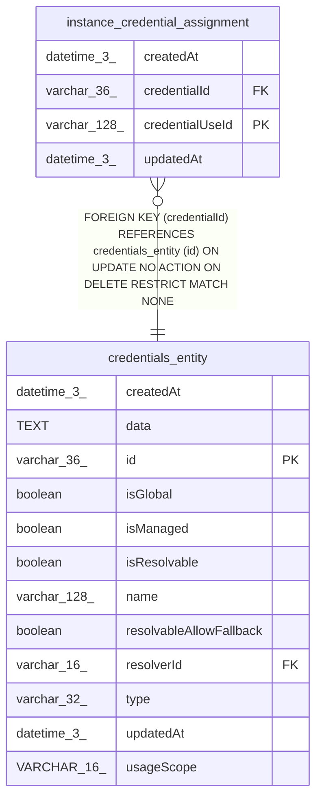

# instance_credential_assignment

## Description

<details>
<summary><strong>Table Definition</strong></summary>

```sql
CREATE TABLE "instance_credential_assignment" ("credentialUseId" varchar(128) PRIMARY KEY NOT NULL, "credentialId" varchar(36) NOT NULL, "createdAt" datetime(3) NOT NULL DEFAULT (STRFTIME('%Y-%m-%d %H:%M:%f', 'NOW')), "updatedAt" datetime(3) NOT NULL DEFAULT (STRFTIME('%Y-%m-%d %H:%M:%f', 'NOW')), CONSTRAINT "FK_instance_credential_assignment_credential" FOREIGN KEY ("credentialId") REFERENCES "credentials_entity" ("id") ON DELETE RESTRICT)
```

</details>

## Columns

| Name | Type | Default | Nullable | Children | Parents | Comment |
| ---- | ---- | ------- | -------- | -------- | ------- | ------- |
| createdAt | datetime(3) | STRFTIME('%Y-%m-%d %H:%M:%f', 'NOW') | false |  |  |  |
| credentialId | varchar(36) |  | false |  | [credentials_entity](credentials_entity.md) |  |
| credentialUseId | varchar(128) |  | false |  |  |  |
| updatedAt | datetime(3) | STRFTIME('%Y-%m-%d %H:%M:%f', 'NOW') | false |  |  |  |

## Constraints

| Name | Type | Definition |
| ---- | ---- | ---------- |
| - (Foreign key ID: 0) | FOREIGN KEY | FOREIGN KEY (credentialId) REFERENCES credentials_entity (id) ON UPDATE NO ACTION ON DELETE RESTRICT MATCH NONE |
| credentialUseId | PRIMARY KEY | PRIMARY KEY (credentialUseId) |
| sqlite_autoindex_instance_credential_assignment_1 | PRIMARY KEY | PRIMARY KEY (credentialUseId) |

## Indexes

| Name | Definition |
| ---- | ---------- |
| IDX_9626b8dc1bee96a86a3ee09d73 | CREATE INDEX "IDX_9626b8dc1bee96a86a3ee09d73" ON "instance_credential_assignment" ("credentialId")  |
| sqlite_autoindex_instance_credential_assignment_1 | PRIMARY KEY (credentialUseId) |

## Relations



---

> Generated by [tbls](https://github.com/k1LoW/tbls)
