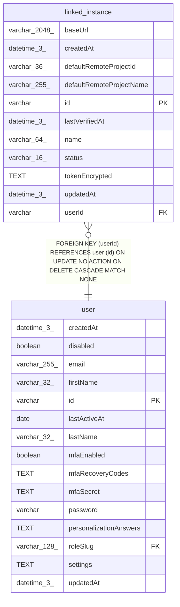

# linked_instance

## Description

<details>
<summary><strong>Table Definition</strong></summary>

```sql
CREATE TABLE "linked_instance" ("id" varchar PRIMARY KEY NOT NULL, "userId" varchar NOT NULL, "name" varchar(64) NOT NULL, "baseUrl" varchar(2048) NOT NULL, "tokenEncrypted" text NOT NULL, "status" varchar(16) NOT NULL DEFAULT ('unknown'), "lastVerifiedAt" datetime(3), "createdAt" datetime(3) NOT NULL DEFAULT (STRFTIME('%Y-%m-%d %H:%M:%f', 'NOW')), "updatedAt" datetime(3) NOT NULL DEFAULT (STRFTIME('%Y-%m-%d %H:%M:%f', 'NOW')), "defaultRemoteProjectId" varchar(36), "defaultRemoteProjectName" varchar(255), CONSTRAINT "CHK_linked_instance_status" CHECK (("status" IN ('online', 'offline', 'unauthorised', 'mcp-disabled', 'unknown'))), CONSTRAINT "FK_d4eb138413c145f8eef4e603d82" FOREIGN KEY ("userId") REFERENCES "user" ("id") ON DELETE CASCADE ON UPDATE NO ACTION)
```

</details>

## Columns

| Name | Type | Default | Nullable | Children | Parents | Comment |
| ---- | ---- | ------- | -------- | -------- | ------- | ------- |
| baseUrl | varchar(2048) |  | false |  |  |  |
| createdAt | datetime(3) | STRFTIME('%Y-%m-%d %H:%M:%f', 'NOW') | false |  |  |  |
| defaultRemoteProjectId | varchar(36) |  | true |  |  |  |
| defaultRemoteProjectName | varchar(255) |  | true |  |  |  |
| id | varchar |  | false |  |  |  |
| lastVerifiedAt | datetime(3) |  | true |  |  |  |
| name | varchar(64) |  | false |  |  |  |
| status | varchar(16) | 'unknown' | false |  |  |  |
| tokenEncrypted | TEXT |  | false |  |  |  |
| updatedAt | datetime(3) | STRFTIME('%Y-%m-%d %H:%M:%f', 'NOW') | false |  |  |  |
| userId | varchar |  | false |  | [user](user.md) |  |

## Constraints

| Name | Type | Definition |
| ---- | ---- | ---------- |
| - | CHECK | CHECK (("status" IN ('online', 'offline', 'unauthorised', 'mcp-disabled', 'unknown'))) |
| - (Foreign key ID: 0) | FOREIGN KEY | FOREIGN KEY (userId) REFERENCES user (id) ON UPDATE NO ACTION ON DELETE CASCADE MATCH NONE |
| id | PRIMARY KEY | PRIMARY KEY (id) |
| sqlite_autoindex_linked_instance_1 | PRIMARY KEY | PRIMARY KEY (id) |

## Indexes

| Name | Definition |
| ---- | ---------- |
| IDX_417e40f334835b7b5ec3a6fb02 | CREATE UNIQUE INDEX "IDX_417e40f334835b7b5ec3a6fb02" ON "linked_instance" ("userId", "baseUrl")  |
| IDX_d4eb138413c145f8eef4e603d8 | CREATE INDEX "IDX_d4eb138413c145f8eef4e603d8" ON "linked_instance" ("userId")  |
| sqlite_autoindex_linked_instance_1 | PRIMARY KEY (id) |

## Relations



---

> Generated by [tbls](https://github.com/k1LoW/tbls)
