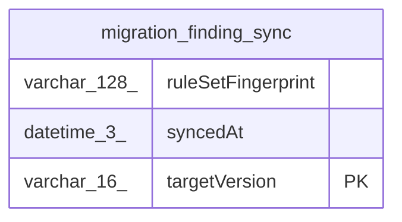

# migration_finding_sync

## Description

<details>
<summary><strong>Table Definition</strong></summary>

```sql
CREATE TABLE "migration_finding_sync" ("targetVersion" varchar(16) PRIMARY KEY NOT NULL, "syncedAt" datetime(3) NOT NULL, "ruleSetFingerprint" varchar(128) NOT NULL, CONSTRAINT "CHK_migration_finding_sync_targetVersion" CHECK ("targetVersion" IN ('v2', 'v3')))
```

</details>

## Columns

| Name | Type | Default | Nullable | Children | Parents | Comment |
| ---- | ---- | ------- | -------- | -------- | ------- | ------- |
| ruleSetFingerprint | varchar(128) |  | false |  |  |  |
| syncedAt | datetime(3) |  | false |  |  |  |
| targetVersion | varchar(16) |  | false |  |  |  |

## Constraints

| Name | Type | Definition |
| ---- | ---- | ---------- |
| - | CHECK | CHECK ("targetVersion" IN ('v2', 'v3')) |
| sqlite_autoindex_migration_finding_sync_1 | PRIMARY KEY | PRIMARY KEY (targetVersion) |
| targetVersion | PRIMARY KEY | PRIMARY KEY (targetVersion) |

## Indexes

| Name | Definition |
| ---- | ---------- |
| sqlite_autoindex_migration_finding_sync_1 | PRIMARY KEY (targetVersion) |

## Relations



---

> Generated by [tbls](https://github.com/k1LoW/tbls)
