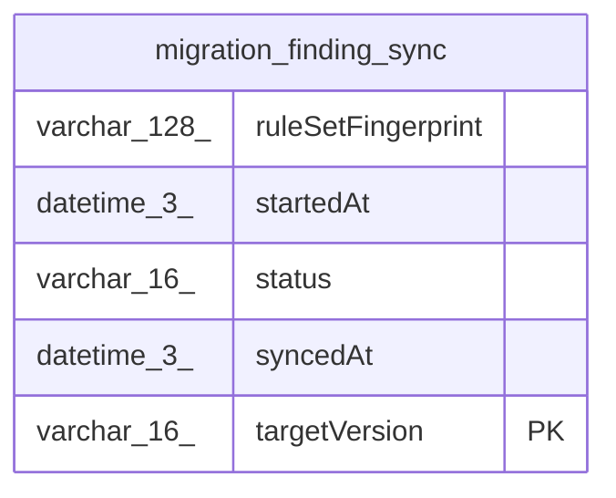

# migration_finding_sync

## Description

<details>
<summary><strong>Table Definition</strong></summary>

```sql
CREATE TABLE "migration_finding_sync" ("targetVersion" varchar(16) PRIMARY KEY NOT NULL, "syncedAt" datetime(3), "ruleSetFingerprint" varchar(128) NOT NULL, "status" varchar(16) NOT NULL DEFAULT ('complete'), "startedAt" datetime(3), CONSTRAINT "CHK_migration_finding_sync_targetVersion" CHECK ((("targetVersion" IN ('v2', 'v3')))), CONSTRAINT "CHK_migration_finding_sync_status" CHECK (("status" IN ('running', 'complete', 'failed'))))
```

</details>

## Columns

| Name | Type | Default | Nullable | Children | Parents | Comment |
| ---- | ---- | ------- | -------- | -------- | ------- | ------- |
| ruleSetFingerprint | varchar(128) |  | false |  |  |  |
| startedAt | datetime(3) |  | true |  |  |  |
| status | varchar(16) | 'complete' | false |  |  |  |
| syncedAt | datetime(3) |  | true |  |  |  |
| targetVersion | varchar(16) |  | false |  |  |  |

## Constraints

| Name | Type | Definition |
| ---- | ---- | ---------- |
| - | CHECK | CHECK ((("targetVersion" IN ('v2', 'v3')))) |
| - | CHECK | CHECK (("status" IN ('running', 'complete', 'failed'))) |
| sqlite_autoindex_migration_finding_sync_1 | PRIMARY KEY | PRIMARY KEY (targetVersion) |
| targetVersion | PRIMARY KEY | PRIMARY KEY (targetVersion) |

## Indexes

| Name | Definition |
| ---- | ---------- |
| sqlite_autoindex_migration_finding_sync_1 | PRIMARY KEY (targetVersion) |

## Relations


```mermaid
erDiagram


"migration_finding_sync" {
  varchar_128_ ruleSetFingerprint
  datetime_3_ startedAt
  varchar_16_ status
  datetime_3_ syncedAt
  varchar_16_ targetVersion PK
}
```

---

> Generated by [tbls](https://github.com/k1LoW/tbls)
