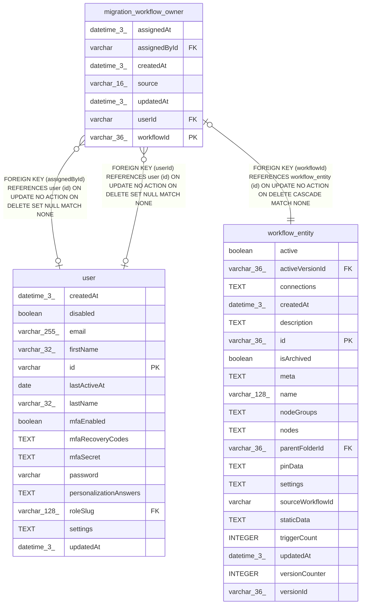

# migration_workflow_owner

## Description

<details>
<summary><strong>Table Definition</strong></summary>

```sql
CREATE TABLE "migration_workflow_owner" ("workflowId" varchar(36) PRIMARY KEY NOT NULL, "userId" varchar, "source" varchar(16) NOT NULL, "assignedById" varchar, "assignedAt" datetime(3), "createdAt" datetime(3) NOT NULL DEFAULT (STRFTIME('%Y-%m-%d %H:%M:%f', 'NOW')), "updatedAt" datetime(3) NOT NULL DEFAULT (STRFTIME('%Y-%m-%d %H:%M:%f', 'NOW')), CONSTRAINT "CHK_migration_workflow_owner_source" CHECK ("source" IN ('suggested', 'assigned')), CONSTRAINT "FK_59cde25bbb0edbb82286e4806d2" FOREIGN KEY ("workflowId") REFERENCES "workflow_entity" ("id") ON DELETE CASCADE, CONSTRAINT "FK_ca859918be95d42fa6f698791c3" FOREIGN KEY ("userId") REFERENCES "user" ("id") ON DELETE SET NULL, CONSTRAINT "FK_e6e5e4cab49ec23a544ffc9337a" FOREIGN KEY ("assignedById") REFERENCES "user" ("id") ON DELETE SET NULL)
```

</details>

## Columns

| Name | Type | Default | Nullable | Children | Parents | Comment |
| ---- | ---- | ------- | -------- | -------- | ------- | ------- |
| assignedAt | datetime(3) |  | true |  |  |  |
| assignedById | varchar |  | true |  | [user](user.md) |  |
| createdAt | datetime(3) | STRFTIME('%Y-%m-%d %H:%M:%f', 'NOW') | false |  |  |  |
| source | varchar(16) |  | false |  |  |  |
| updatedAt | datetime(3) | STRFTIME('%Y-%m-%d %H:%M:%f', 'NOW') | false |  |  |  |
| userId | varchar |  | true |  | [user](user.md) |  |
| workflowId | varchar(36) |  | false |  | [workflow_entity](workflow_entity.md) |  |

## Constraints

| Name | Type | Definition |
| ---- | ---- | ---------- |
| - | CHECK | CHECK ("source" IN ('suggested', 'assigned')) |
| - (Foreign key ID: 0) | FOREIGN KEY | FOREIGN KEY (assignedById) REFERENCES user (id) ON UPDATE NO ACTION ON DELETE SET NULL MATCH NONE |
| - (Foreign key ID: 1) | FOREIGN KEY | FOREIGN KEY (userId) REFERENCES user (id) ON UPDATE NO ACTION ON DELETE SET NULL MATCH NONE |
| - (Foreign key ID: 2) | FOREIGN KEY | FOREIGN KEY (workflowId) REFERENCES workflow_entity (id) ON UPDATE NO ACTION ON DELETE CASCADE MATCH NONE |
| sqlite_autoindex_migration_workflow_owner_1 | PRIMARY KEY | PRIMARY KEY (workflowId) |
| workflowId | PRIMARY KEY | PRIMARY KEY (workflowId) |

## Indexes

| Name | Definition |
| ---- | ---------- |
| IDX_ca859918be95d42fa6f698791c | CREATE INDEX "IDX_ca859918be95d42fa6f698791c" ON "migration_workflow_owner" ("userId")  |
| sqlite_autoindex_migration_workflow_owner_1 | PRIMARY KEY (workflowId) |

## Relations



---

> Generated by [tbls](https://github.com/k1LoW/tbls)
